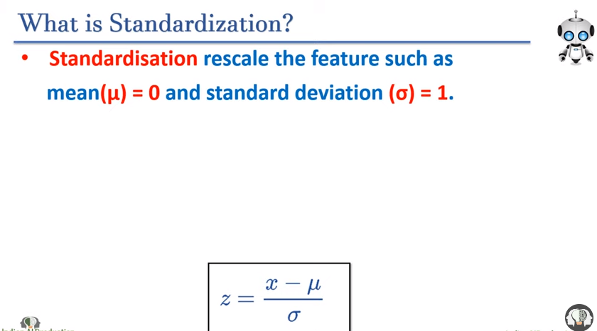

---

# Standardization & Normalization

---

[video_Link](https://www.youtube.com/watch?v=pXpZoRIQSL4&list=PLfP3JxW-T70GR0w3zVzG7tgIFI14FZxaj&index=22&ab_channel=IndianAIProduction)

 

# Why standardization?

`Standarization is a part of feature scaling.`

আমরা এইটা করে থাকি যাতে mean = 0 and standard_deviation = 1 হয় । 

