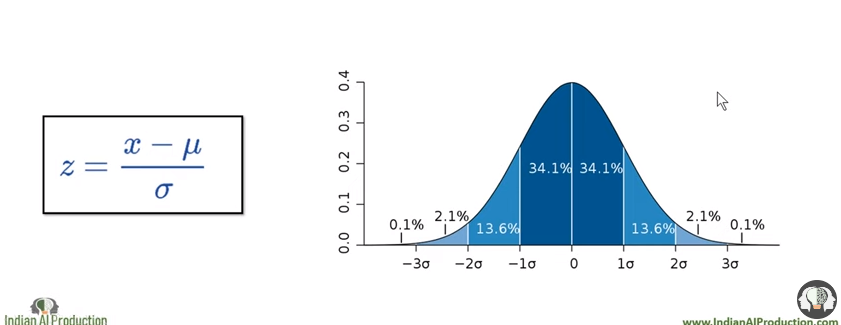

---

# Standardization & Normalization

---

[video_Link](https://www.youtube.com/watch?v=pXpZoRIQSL4&list=PLfP3JxW-T70GR0w3zVzG7tgIFI14FZxaj&index=22&ab_channel=IndianAIProduction)

 

# Why standardization?

`Standarization is a part of feature caling.`

- আমরা এইটা করে থাকি যাতে mean = 0 and standard_deviation = 1 হয় । 

- যদি orginal dataset এর distribution normal হয় তাহলে এর standardization এর distribution ও normal হবে । আর যদি orginal dataset এর distribution skewed হয় তাহলে এর standardization এর distribution ও skewed হবে । 

যখন  dataset এর curve উপরের মতো হবে তখন আমরা বলবো আমাদের dataset  normal distribution বা gaussian distribution ফলো করে ।

`statistic এ আমরা এইগুলো আরো ভালোভাবে দেখে এসেছি ।`

# Why Normalization?

- **X_min  ডাটাসেটের মিনিমাম ভ্যালু**
- **X_max  ডাটাসেটের ম্যাক্সিমাম ভ্যালু**
- আমাদের  orginal dataset এর distribution normal বা gaussian distributed না হয় তাহলে আমরা সাধারণত normalization করে থাকি ।

