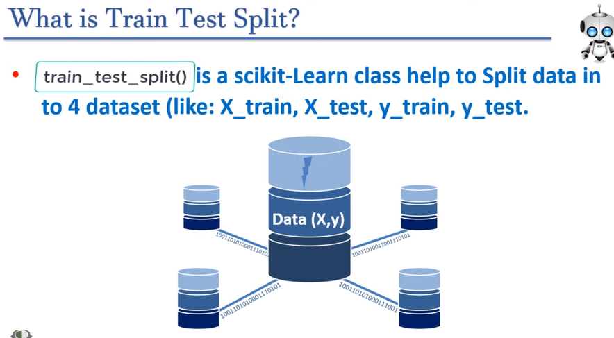

 

---

# train_test_split() in sk-learn

---

[video_link](https://www.youtube.com/watch?v=whCKoxfnMH4&list=PLfP3JxW-T70Hh7j17_NLzjZ8CejSPx40V&index=88&ab_channel=IndianAIProduction)

 

# why train_test_split()?

আমাদের যে machine learning algorithrm আছে । সেইটা কে train, test করার জন্য আমাদের যে data এর দরকার হয় । real world dataset এ তো train and test data আলাদা আলাদা করা থাকে না তাই আমরা sk-learn এর **train_test_split()** function ব্যবহার করে train and test ডাটা গুলোকে আলাদা করি । 

- **X_train =  independent feature**
- **X_test =  independent feature**
- **y_train =  dependent on X_train**
- **y_test =  dependent on X_test**

`আমরা আমাদের  ml মডেল পাবার পর X_test ডাটা দিয়ে যেই output পাই সেইটা y_test এর সাথে মিলিয়ে আমরা accuracy calculate মডেলের accuracy calculate  করি । `

