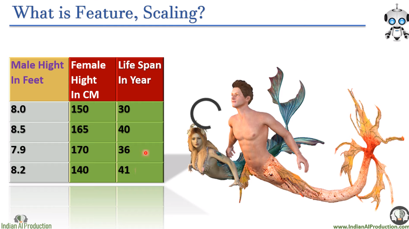
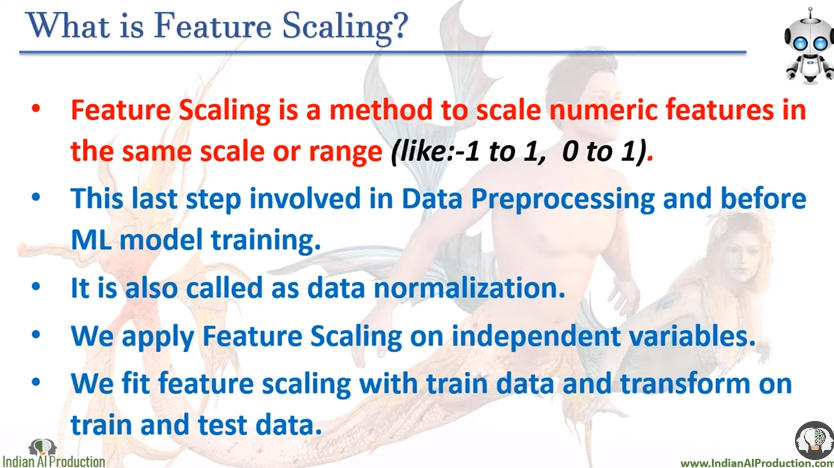

---

# Feature scaling:

---

## What is feature?

`In machine learning, a feature (also known as an attribute or predictor) refers to an individual measurable property or characteristic of the data that is used as input for the machine learning model. Features are essentially the variables or columns in the dataset that contain relevant information about the observations or instances being studied.`

ছবিতে male height in feet, female heigt in feet and life span in year এই ৩ টা হচ্ছে ৩ টা feature । 

**Scale:** Scale হচ্ছে (lowest value ~ column এর height value) । 

- In **male height in feet** column scale হচ্ছে (0 ~ 8.5) । 
- In **female height in feet** column এর scale হচ্ছে (0 ~ 170) । 
- In **Life span in year** column এর scale হচ্ছে (0 ~ 41) । 

# What is feature scaling?

- **Feature scaling** হচ্ছে একটা method যার মাধ্যমে আমরা numerical feature কে scale করে (0-1) বা (-1~1) এ নিয়ে যায় । আগের উপরের ছবিতে numerical feature গুলোর unit আলাদা আলাদা ছিল(feet,year) । 

- এইটা data preprocessing এর last step । 

- আমরা feature scaling independent variable এর উপর apply করি । 

- আর আমরা feature scaling train data এর উপর apply করি । আর train and test data এর উপর আমরা যেই feature scaling করলাম সেইটা apply করবো বা feature transform করবো। 

