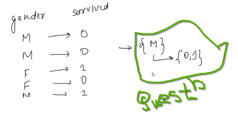

 
 

# `#01: Lecture:01 Basic: `

 
 

---
---
---
---

**Term:**
- Random Expriment
- Trial
- Outcome
- Sample Space
- Events
 

**Type of Events:**  
**Type of Probability:** 
**Random Variable:** 
**Mean of a Random Variable:** 
**Variance of a Random Variable:**

---
---
---
---

 
 

# `#02: Lecture:02: `

 
 

### `#2.1 Ven Diagram: `

 
 

### `#2.2 Contingency Table: `

 
 

### `#2.3 Joint Probability: `

**Joint Probability:** `দুইটা ঘটনা একই সাথে হওয়ার সম্ভবনা কত ? উদাহারণ হিসেবে(For titatnic dataset), যদি আমরা প্রথম ঘটনা হয়, যেখানে(X=pclass(1,2,3)) এবং দ্বিতীয় ঘটনা, যেখানে(Y=number_of_people_that_they_(0->means_survived, 1->means_died)) ।  `

প্রথমে আমরা, contingency table বানাবো । যদি, P(X=1,Y=0) এর জন্য joint probability বের করতে চাই, তাহলে, আমরা, contingency table থেকে (X=1,Y=0) এর value 80 কে total number of passenger(891) দিয়ে ভাগ দিব । 

**Joint Probability Distribution:** Probability distribution এ আমরা, উপরের ছবিতে ছক্কার ক্ষেত্রে এর যত possible output আসে আর এদের probability নিয়ে যে table বানিয়েছিলাম, তাকে Probability Distribution বলেছি । এইখানে, Joint Probability অনেকটা একই রকম । তাই, আমরা একেও আমরা, Joint Probability Distribution বলতে পারি ।  

 

### `#2.4 Marginal Probability: `

**Marginal Probability:** Marginal Probability কে Simple Probability আবার, Unconditional Probability বলে। Joint Probability দুইটা ঘটনা একই সাথে হওয়ার সম্ভবনা  অন্যদিকে, Marginal Probability তে আমরা একটা ঘটনা ঘটার সম্ভাবনা কত হবে, অন্যঘটনা গুলো যদি ignore করি । উদাহারণ হিসেবে(For titatnic dataset) নেওয়া যায় । pclass গণ্য না করে, কতজন মারা গেল আর কত জন survived করলো, সেইটা হিসাব করা হয়েছে, ALL(549,342) এ আমরা, কতজন মারা গেল আর কত জন survived করলো গণ্য না করে pclass এর উপর ভিত্তি করে ALL(216,184,491) এইগুলো হিসাব করা হয়েছে । probability বের করা জন্য আমরা toal number of passerger 891 দিয়ে ভাগ করেছি । 

 

### `#2.5 Conditional Probability: `
**Conditional Probability:** দুইটা ঘটনা A and B এর মধ্যে যদি B হয়ে যায় তাহলে, A হওয়ার সম্ভাবনা যাকে P(A|B) প্রকাশ করা হয় ।  

**Question:** `Three unbiased coins are tossed. What is the conditinal probability that at least two coins show heads, given that at least one coin shows heads?`

এখানে, দুইটা event আছে, 
event A = At leaset 2 heads
event B = At least 1 heads

ধরি, event B আগে হয়েছে । তাহলে, Sample Space থেকে যেখানে কোন head নেই সেই গুলো আমার sample space থেকে বাদ যাবে । যেমনঃ এখানে, TTT । Now, in our new sample space এ toal sample হলো ৭ টা । event A এর favourable এ sample হলো, 4 টা । অর্থাৎ, P(A|B) = 4/7 । 

একই ভাবে, নিচের প্রবলেম গুলো সমাধান করোঃ 

**Question: 01** `Two fair six-sided dice are rolled. What is the conditional probability that the sum of the numbers rolled is 7, given that the first die shows and odd number?`

**Hints:**
event A = sum is equal to seven .  
event B = first die shows odd Number. 

 
 

**Question:02** `Two fair six-sided dice are rolled, denoted as D1 and D2. What is the conditional probabiity that D1 equals 2, given that the sum of D1 and D2 is less than or euqal to 5.`

### `But, উপরের প্রসেসটা, complete করার জন্য আমাদের কাছে formula আছে । `

 

**Question:** `নিচের,  এর জন্য প্রবলেমটি সমাধান করো । `

 

**Solution:**

 

### `#2.6 Independent vs Dependent vs Mutually Exclusive Event: `

**Independent Event:** একসাথে, Die, Fliping a coin random expriment এ, Die এ যাই আসুক না কেন Coin এ Head আসার probability always 1/2  হবে । একটার উপর আরেকটা নির্ভর করতেছে না । 

For independent event (conditional probability),
P(A|B) = P(A)
P(B|A) = P(B)
P(AnB) = P(A) * P(B)

 

**Dependent Event:** ৫২ কার্ড থেকে, যখন, একটা একটা কার্ড নিব । তখন, সেই কার্ডটা গুলোর মধ্যে টেক্কা হওয়ার সম্ভবনা আগের কার্ড উঠানোর উপর নির্ভর করবে । কারণ, একটা কার্ড উঠানোর পর সেইটা আর back করিনি ।  

#### `আমরা এতক্ষন যা যা formula পড়েছি । সব গুলো, Dependent Event এর জন্য ।  `

**Mutually Exclusive:** যদি একটা ঘটনা ঘটে তাহলে অন্যটা ঘটবে না । যেমনঃ coin flipping এর ক্ষেত্রে আমরা যদি head পায় । তাহলে আমরা কখনো tail পাবো না । এই ঘটনা কে আমরা বলতেছি, Mutually exclusive event . 

 

## `IMPORTANT: (***) `
### `#2.7 Bayes Theorem: 

---
---

 
 

---
---

পাশের ডাটাসেটের জন্য, একটা Male এর ক্ষেত্রে, তিনি কি বাচবেন নাকি মারা যাবেন ?? 

**Solution:**
conditional probability of,  
P(1|M) `যদি male হয় তাহলে তার বার্চার সম্ভবনা কত?`  
P(0|M) `যদি male হয় তাহলে তার মরার সম্ভবনা কত?`  
যেইটার মান বেশি হবে সেইটা হবে উত্তর । 

