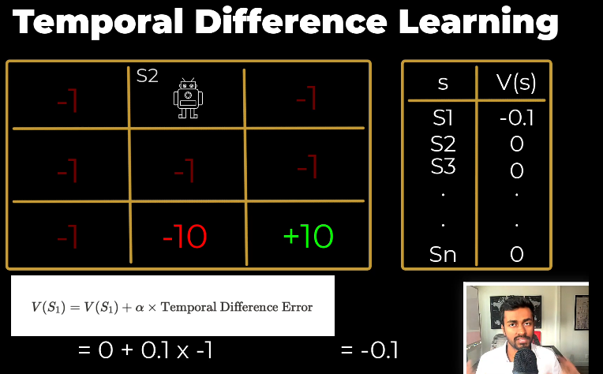

1. **MDP (Markov Decision Process) দিয়ে RL Problem Formulation**: 
   - Reinforcement Learning (RL) সমস্যাগুলোকে সাধারণত MDP (Markov Decision Process) দিয়ে মডেল করা হয়। MDP হলো একটি গাণিতিক ফ্রেমওয়ার্ক যেখানে একটি এজেন্ট (agent) একটি এনভায়রনমেন্টে (environment) ইন্টারঅ্যাক্ট করে এবং স্টেট (state), অ্যাকশন (action), রিওয়ার্ড (reward), এবং ট্রানজিশন প্রোবাবিলিটি (transition probability) এর মাধ্যমে সমস্যাটি ফর্মুলেট করা হয়।

2. **Bellman Equation**:
   - RL সমস্যার সমাধান করার জন্য Bellman Equation একটি গুরুত্বপূর্ণ গাণিতিক টুল। এটি আমাদেরকে অপটিমাল ভ্যালু ফাংশন (optimal value function) এবং অপটিমাল পলিসি (optimal policy) খুঁজে পেতে সাহায্য করে। Bellman Equation মূলত ডায়নামিক প্রোগ্রামিং (dynamic programming) এর উপর ভিত্তি করে তৈরি।

3. **Real-World Stochasticity**:
   - Pac-Man গেমের মতো সিমুলেটেড এনভায়রনমেন্টে এজেন্টের অ্যাকশনগুলো deterministic  হয়, অর্থাৎ এজেন্ট যদি উপরে যেতে চায়, তাহলে সে উপরে যাবে। কিন্তু,বাস্তবে environment stochastic, অর্থাৎ এজেন্টের অ্যাকশনের ফলাফল অনিশ্চিত হয়। উদাহরণস্বরূপ, একটি রোবট যদি উপরে যেতে চায়, তাহলে তা নানা বাহ্যিক ফ্যাক্টরের কারণে (যেমন ঘর্ষণ, বাতাসের প্রভাব ইত্যাদি) সফল নাও হতে পারে।

4. **RL Solution Approaches**:
   - এই স্টোকাস্টিসিটি (stochasticity) এবং অনিশ্চয়তার কারণে আমরা RL সমস্যার সমাধান করার জন্য তিনটি প্রধান পদ্ধতি ব্যবহার করি:
     - **Value-Based Methods**: এই পদ্ধতিতে আমরা ভ্যালু ফাংশন (value function) অনুমান করার চেষ্টা করি, যেমন Q-Learning বা Deep Q-Networks (DQN)।
     - **Policy-Based Methods**: এই পদ্ধতিতে সরাসরি পলিসি (policy) অনুমান করা হয়, যেমন Policy Gradient methods।
     - **Actor-Critic Methods**: এই পদ্ধতিটি ভ্যালু-বেসড এবং পলিসি-বেসড পদ্ধতির সংমিশ্রণ, যেখানে একটি Actor (পলিসি) এবং একটি Critic (ভ্যালু ফাংশন) একসাথে কাজ করে।

 
 

#  ` # এখন আমরা, Value-Based Methods থেকে যদি DQN  শিখতে চাই যেইটা সবশেষে, Q-Learning এবং নিউরাল নেটওয়ার্কের সংমিশ্রণ। এর আগে আমাদের কিছু জানা থাকা লাগবে । সেগুলো নিচে একটু বিস্তারিত ব্যাখা করা হলোঃ`

 
 

# `# Bellman Equation:`

Value-based method এ একটা value function থাকে, value function থেকে আমরা policy determine করি । তারপর সেই Policy আমাদের total reward maximize করে । `Value function এ আমরা input দেই এবং output পাই । input এর  উপর ভিত্তি করে একে দুই ভাগে ভাগ করা হয়েছে ।` 

- State Value Functions V(s)
- State Action Value Functions Q(s,a)

---
**State is the snapshot of the environment.**  
**Action is the decision taken by agent on environment.**

 

state value funciton একটা state s input হিসেবে নেয় আর output হিসেবে একটা number দেয়। যেইটা বলে দেয় যে, state s এ আমার agent এর কেমন লাগছে । 
অন্যদিকে  state-action value functions Q(s,a) takes state and action as input এবং একটা number output হিসেবে দেয় । যেইটা বলে দেয় যে, state s এ a action নিয়ে আসে আমার agent এর কেমন লাগছে । 

$R(S_1)$ reward when we transition to the state $(S_1)$ plus the maximum future value. But we know, in real world we have stochasticity. Let's introduce stochasticity in the formula, 

 

### 1. **Non-Stochastic Environment**:
   - নন-স্টোকাস্টিক এনভায়রনমেন্টে, এজেন্ট একটি স্টেট s থেকে একটি অ্যাকশন  a  নিলে, পরবর্তী স্টেট s' এবং reward(r) সম্পূর্ণভাবে deterministic হয়।
   - এই ক্ষেত্রে, স্টেট ভ্যালু ফাংশন V(s) এর ফর্মুলা হলো:
     
     $V(s) = R(s) + \max_a V(s')$
     - এখানে:
       - R(s) : স্টেট  s -এ প্রবেশ করার সময় প্রাপ্ত রিওয়ার্ড।
       - $\max_a V(s')$ : পরবর্তী স্টেট s' -এর ভ্যালু, যেখানে  s' নির্ধারিত।

### 2. **Stochastic Envirnoment**:
   - স্টোকাস্টিক এনভায়রনমেন্টে, এজেন্ট একটি স্টেট s থেকে একটি অ্যাকশন  a  নিলে, পরবর্তী স্টেট s' এবং রিওয়ার্ড r অনিশ্চিত (uncertain) হয়। এটি **ট্রানজিশন প্রোবাবিলিটি (transition probability)**  $P(s' \mid s, a)$ দ্বারা নির্ধারিত হয়।
   - এই অনিশ্চয়তা বিবেচনা করে, স্টেট ভ্যালু ফাংশন V(s) এর ফর্মুলা পরিবর্তিত হয়:
     
     $V(s) = R(s) + \max_a \left[ \sum_{s'} P(s' \mid s, a) \cdot V(s') \right]$
     - এখানে:
       - $P(s' \mid s, a)$ : স্টেট s এবং অ্যাকশন a -এর জন্য পরবর্তী স্টেট s' -এ যাওয়ার সম্ভাবনা।
       - $\sum_{s'} P(s' \mid s, a) \cdot V(s')$ : পরবর্তী সম্ভাব্য স্টেটগুলোর ভ্যালুর গড় (expected value)।

`See the MDP in details video that will clear the concept why Transitional probability. `
[link]()

### 3. **Discount factor $\gamma$ **:
   - **ডিসকাউন্ট ফ্যাক্টর $\gamma$** (যেখানে $0 \leq \gamma \leq 1 $) ভবিষ্যৎ রিওয়ার্ডের গুরুত্ব নির্ধারণ করে। এটি এজেন্টকে বর্তমান রিওয়ার্ডকে ভবিষ্যৎ রিওয়ার্ডের চেয়ে বেশি গুরুত্ব দেওয়ার সুযোগ দেয়।
   - ডিসকাউন্ট ফ্যাক্টর যোগ করার পর, স্টেট ভ্যালু ফাংশন \( V(s) \) এর ফর্মুলা হয়:
     $V(s) = R(s) + \max_a \left[ \sum_{s'} P(s' \mid s, a) \cdot \gamma V(s') \right]$
     - এখানে $\gamma V(s')$:  ভবিষ্যৎ স্টেটের ভ্যালুকে ডিসকাউন্ট করে বর্তমান ভ্যালুর সাথে যোগ করা হয়েছে।

### 4. **Joint Probability $p(s', r \mid s, a)$**:
   - স্টোকাস্টিক এনভায়রনমেন্টে, পরবর্তী স্টেট s' এবং রিওয়ার্ড r  উভয়ই অনিশ্চিত। তাই আমরা **যৌথ সম্ভাবনা (joint probability)** $p(s', r \mid s, a)$ ব্যবহার করি, যা স্টেট s  এবং অ্যাকশন  a -এর জন্য পরবর্তী স্টেট s'  এবং রিওয়ার্ড r -এর সম্ভাবনা নির্ধারণ করে।
   - এই যৌথ সম্ভাবনা ব্যবহার করে, অপটিমাল ভ্যালু ফাংশন $v_*(s)$ এর ফর্মুলা হয়:
     $v_*(s) = \max_a \sum_{s', r} p(s', r \mid s, a) \left[ r + \gamma v_*(s') \right]$
     - এখানে:
       - $p(s', r \mid s, a)$: স্টেট s  এবং অ্যাকশন a -এর জন্য পরবর্তী স্টেট  s'  এবং রিওয়ার্ড r -এর যৌথ সম্ভাবনা।
       -  $r + \gamma v_*(s')$ : বর্তমান রিওয়ার্ড r এবং ডিসকাউন্টেড ভবিষ্যৎ ভ্যালু $\gamma v_*(s')$ -এর যোগফল।

### 6. **কেন এই পরিবর্তন?**
   - **নন-স্টোকাস্টিক এনভায়রনমেন্ট**-এ সবকিছু নির্ধারিত, তাই ফর্মুলা সরল।
   - **স্টোকাস্টিক এনভায়রনমেন্ট**-এ অনিশ্চয়তা (uncertainty) যোগ হয়, তাই আমরা সম্ভাবনা (probability) এবং এক্সপেক্টেড ভ্যালু (expected value) ব্যবহার করি।
   - **ডিসকাউন্ট ফ্যাক্টর $\gamma$** যোগ করার মাধ্যমে আমরা ভবিষ্যৎ রিওয়ার্ডের গুরুত্ব কমিয়ে বর্তমান রিওয়ার্ডকে বেশি গুরুত্ব দিই।
   - **যৌথ সম্ভাবনা $p(s', r \mid s, a)$** ব্যবহার করার মাধ্যমে আমরা পরবর্তী স্টেট এবং রিওয়ার্ডের অনিশ্চয়তা একসাথে বিবেচনা করি।

 

 

### 1. **নন-স্টোকাস্টিক (Deterministic) এনভায়রনমেন্ট**:
   - নন-স্টোকাস্টিক এনভায়রনমেন্টে, এজেন্ট একটি স্টেট s  থেকে একটি অ্যাকশন a নিলে, পরবর্তী স্টেট s' এবং রিওয়ার্ড r  সম্পূর্ণভাবে নির্ধারিত (deterministic) হয়।
   - এই ক্ষেত্রে, **স্টেট-অ্যাকশন ভ্যালু ফাংশন $Q(s, a)$** এর ফর্মুলা হলো:
     
     $Q(s, a) = R(s, a) + \max_{a'} Q(s', a')$
     - এখানে:
       - $R(s, a)$ : স্টেট s -এ অ্যাকশন a -এর জন্য প্রাপ্ত রিওয়ার্ড।
       - $\max_{a'} Q(s', a')$ : পরবর্তী স্টেট s' -এ সর্বোচ্চ সম্ভাব্য অ্যাকশন a' -এর ভ্যালু।

### 2. **স্টোকাস্টিক (Stochastic) এনভায়রনমেন্ট**:
   - স্টোকাস্টিক এনভায়রনমেন্টে, এজেন্ট একটি স্টেট s থেকে একটি অ্যাকশন a  নিলে, পরবর্তী স্টেট s' এবং রিওয়ার্ড  r  অনিশ্চিত (uncertain) হয়। এটি **ট্রানজিশন প্রোবাবিলিটি (transition probability)** $P(s' \mid s, a)$ দ্বারা নির্ধারিত হয়।
   - এই অনিশ্চয়তা বিবেচনা করে, **স্টেট-অ্যাকশন ভ্যালু ফাংশন $Q(s, a)$** এর ফর্মুলা পরিবর্তিত হয়:
    
     $Q(s, a) = R(s, a) + \sum_{s'} P(s' \mid s, a) \cdot \max_{a'} Q(s', a')$
     - এখানে:
       - $P(s' \mid s, a)$ : স্টেট s এবং অ্যাকশন a -এর জন্য পরবর্তী স্টেট  s' -এ যাওয়ার সম্ভাবনা।
       - $\max_{a'} Q(s', a')$: পরবর্তী স্টেট s' -এ সর্বোচ্চ সম্ভাব্য অ্যাকশন  a' -এর ভ্যালু।

### 3. **ডিসকাউন্ট ফ্যাক্টর $\gamma$**:
   - **ডিসকাউন্ট ফ্যাক্টর $\gamma$** (যেখানে  $0 \leq \gamma \leq 1$ ভবিষ্যৎ রিওয়ার্ডের গুরুত্ব নির্ধারণ করে। এটি এজেন্টকে বর্তমান রিওয়ার্ডকে ভবিষ্যৎ রিওয়ার্ডের চেয়ে বেশি গুরুত্ব দেওয়ার সুযোগ দেয়।
   - ডিসকাউন্ট ফ্যাক্টর যোগ করার পর, **স্টেট-অ্যাকশন ভ্যালু ফাংশন $Q(s, a)$** এর ফর্মুলা হয়:
     $Q(s, a) = R(s, a) + \sum_{s'} P(s' \mid s, a) \cdot \gamma \max_{a'} Q(s', a')$
     - এখানে $\gamma \max_{a'} Q(s', a')$: ভবিষ্যৎ স্টেটের ভ্যালুকে ডিসকাউন্ট করে বর্তমান ভ্যালুর সাথে যোগ করা হয়েছে।

### 4. **Joint Probability $p(s', r \mid s, a)$**:
   - স্টোকাস্টিক এনভায়রনমেন্টে, পরবর্তী স্টেট s' এবং রিওয়ার্ড r উভয়ই অনিশ্চিত। তাই আমরা **যৌথ সম্ভাবনা (joint probability)** $p(s', r \mid s, a)$ ব্যবহার করি, যা স্টেট s এবং অ্যাকশন a -এর জন্য পরবর্তী স্টেট s' এবং রিওয়ার্ড r -এর সম্ভাবনা নির্ধারণ করে।
   - এই যৌথ সম্ভাবনা ব্যবহার করে, **স্টেট-অ্যাকশন ভ্যালু ফাংশন $Q(s, a)$** এর ফর্মুলা হয়:
    $Q(s, a) = \sum_{s', r} p(s', r \mid s, a) \left[ r + \gamma \max_{a'} Q(s', a') \right]$
     - এখানে:
       - $p(s', r \mid s, a)$ : স্টেট s  এবং অ্যাকশন a -এর জন্য পরবর্তী স্টেট s' এবং রিওয়ার্ড r -এর যৌথ সম্ভাবনা।
       - $r + \gamma \max_{a'} Q(s', a')$ : বর্তমান রিওয়ার্ড  r এবং ডিসকাউন্টেড ভবিষ্যৎ ভ্যালু $\gamma \max_{a'} Q(s', a')$ -এর যোগফল।

### 5. **কেন এই পরিবর্তন?**
   - **নন-স্টোকাস্টিক এনভায়রনমেন্ট**-এ সবকিছু নির্ধারিত, তাই ফর্মুলা সরল।
   - **স্টোকাস্টিক এনভায়রনমেন্ট**-এ অনিশ্চয়তা (uncertainty) যোগ হয়, তাই আমরা সম্ভাবনা (probability) এবং এক্সপেক্টেড ভ্যালু (expected value) ব্যবহার করি।
   - **ডিসকাউন্ট ফ্যাক্টর $\gamma$** যোগ করার মাধ্যমে আমরা ভবিষ্যৎ রিওয়ার্ডের গুরুত্ব কমিয়ে বর্তমান রিওয়ার্ডকে বেশি গুরুত্ব দিই।
   - **যৌথ সম্ভাবনা $p(s', r \mid s, a)$** ব্যবহার করার মাধ্যমে আমরা পরবর্তী স্টেট এবং রিওয়ার্ডের অনিশ্চয়তা একসাথে বিবেচনা করি।

 

# `# Temporal Difference:`

## `আমরা temporal difference দিয়ে, bellman equation কে কাজে লাগিয়ে একটা agent এর জন্য  state value function এর মান গুলো বের করবো ।`

Value-Based Methods-এ Bellman Equation এবং Temporal Difference (TD) Learning উভয়ই ব্যবহার করা হয়।
**Temporal Difference Learning is a method that value-based reinforcement learning algorithms, use to iteratively learn state value functions or state-action value functions.**

### 1. **Temporal Difference (TD) Learning কি?**
   - **TD Learning** হলো Reinforcement Learning (RL)-এর একটি অ্যালগরিদম, যা এজেন্টকে প্রতিটি টাইম স্টেপে (time step) ভ্যালু ফাংশন (Value Function) বা Q-ফাংশন (Q-Function) আপডেট করতে সাহায্য করে।
   - এটি **Bellman Equation**-এর উপর ভিত্তি করে কাজ করে এবং **বুটস্ট্র্যাপিং (bootstrapping)** ব্যবহার করে, অর্থাৎ এজেন্ট তার বর্তমান ভ্যালু অনুমানকে আপডেট করার জন্য ভবিষ্যৎ ভ্যালুর অনুমান ব্যবহার করে।
   - TD Learning-এর মূল উদ্দেশ্য হলো ভ্যালু ফাংশন বা Q-ফাংশনকে এমনভাবে আপডেট করা যাতে এটি **Total Expected Reward**-কে ম্যাক্সিমাইজ করে।

### 2. **TD Learning-এর মূল ধারণা**:
   - TD Learning এজেন্টকে প্রতিটি টাইম স্টেপে একটি **TD Error** গণনা করতে সাহায্য করে, যা হলো বর্তমান ভ্যালু অনুমান এবং TD টার্গেট (target) এর মধ্যে পার্থক্য।
   - **TD Error**-এর ফর্মুলা হলো:
     $\text{TD Error} = R_{t+1} + \gamma V(S_{t+1}) - V(S_t)$
     - এখানে:
       - $R_{t+1}$: পরবর্তী টাইম স্টেপে প্রাপ্ত রিওয়ার্ড।
       - $\gamma$ : ডিসকাউন্ট ফ্যাক্টর (ভবিষ্যৎ রিওয়ার্ডের গুরুত্ব নির্ধারণ করে)।
       - $V(S_{t+1})$ : পরবর্তী স্টেটের ভ্যালু অনুমান।
       - $V(S_t)$ : বর্তমান স্টেটের ভ্যালু অনুমান।
       - **V(s) State Value Function, উপরে আমরা, non-stochastic, stochastic and এর জন্য bellman eqution দেখেছিলাম তার সব গুলো প্রযোয্য ।**

   - এই TD Error ব্যবহার করে, এজেন্ট তার ভ্যালু ফাংশনকে আপডেট করে:
     $V(S_t) \leftarrow V(S_t) + \alpha \cdot \text{TD Error}$
     - এখানে $\alpha$ হলো লার্নিং রেট (learning rate)।

 

# 3. **Example of Temporal Difference :**

   - আপনার টেবিলে একটি স্টেট $S_1$ এবং তার ভ্যালু $V(S_1)$ দেওয়া আছে। এখানে  $V(S_1)$ হলো স্টেট $S_1$ -এর ভ্যালু অনুমান।
   - টেবিলে কিছু রিওয়ার্ড (-1, -1, -1, -10, +10) দেওয়া আছে, যা এজেন্ট বিভিন্ন টাইম স্টেপে পেতে পারে।
   - পাশের টেবিলটা হচ্ছে  state value function . 
 

ধরা যাক, এজেন্ট স্টেট $S_1$ -এ আছে এবং পরবর্তী স্টেটে যাওয়ার সময় রিওয়ার্ড $R(S_2) = -1$ পায়। তারপর এজেন্ট পরবর্তী স্টেটের ভ্যালু $V(S_2)$ ব্যবহার করে TD Error গণনা করে এবং তার ভ্যালু ফাংশন  $V(S_1)$ কে আপডেট করে।

`উপরের ছবিতে,এজেন্ট স্টেট $S_1$ -এ আছে এবং পরবর্তী স্টেটে যাওয়ার সময়,  আমরা প্রথমে, $V(S_1)_observed$ = R(S2) + V(S2) যেখানে, state 2 এর মান পাশের টেবিলে দেওয়া আছে । আর শুরুতে আমরা সব ভ্যালু গুলো শূন্য ধরে নিয়েছি । `

-  এর পর আমরা উপরের মতো, Temporal difference error বের করবো । 

- state 1 থেকে state 2 তে আসার ফলে, V(s1) state 1 এর ভ্যালু change হবে । আর, এই value উপরের মতো হবে । যেখানে, $\alpha$ হলো  learning rate . 

`আমরা একটা time step এর জন্য agent তার state value function update করলো । এইভাবে যদি +10 reward পেয়ে যায় তখন, আমার একটা episoid complete হবে । এইভাবে multiple episod এর জন্য আমরা state value function এর মান বের করে update করবো, যেই পযন্ত না state value function গুলো stable হচ্ছে । এরপর এই value গুলোকে কাজে লাগিয়ে আমাদের agent, policy make করে decetion নিয়ে তার প্রবলেম solve করে ।   । `

### 5. **TD Learning-এর সুবিধা**:
   - **অনলাইন লার্নিং**: TD Learning এজেন্টকে প্রতিটি টাইম স্টেপে আপডেট করতে সাহায্য করে, সম্পূর্ণ এপিসোড শেষ হওয়ার আগেই।
   - **কম ভ্যারিয়েন্স**: Monte Carlo Methods-এর চেয়ে TD Learning-এর ভ্যারিয়েন্স কম, কারণ এটি প্রতিটি টাইম স্টেপে আপডেট করে।
   - **বুটস্ট্র্যাপিং**: TD Learning ভবিষ্যৎ ভ্যালুর অনুমান ব্যবহার করে, যা এটিকে দ্রুত শেখার সুযোগ দেয়।

 
 

# `# Q-learning: `

## `আমরা temporal difference দিয়ে, bellman equation কে কাজে লাগিয়ে একটা agent এর জন্য  state value function এর মান গুলো বের করেছিলাম । আর, bellman equation এ আমরা, state value function and state action value function পড়েছিলাম । আমরা এখন, Q-learning এ state action value function বা q-value এর এর মান বের করবো । `

- We can image the q-values of an enviroment like a matrix, where in column we represtion, a state and in row we represent an action . And the cell value represent the Q-Value for that given state and action . 

## `Let consider a grid world:` 

`আমাদের agent এর target হচ্ছে, best possible way তে +10 reward collect করা । বা আমরা চাচ্ছি, আমাদের agent একটা optimum policy শিখুক। আমরা যাকে target policy বলতেছি । target policy বের করার জন্য আমাদের কাছে একটা Q-table আছে  ।  Q-table এর ভ্যালু গুলোকে আমরা (Arbitrary Value হলো গণিতে একটি ইচ্ছামূলক মান) দিয়ে পূরণ করেছি । অথবা,  অন্য কোন agent আগে যদি আমাদের এই environment visit করে থাকে, তার ভ্যালু গুলো পূরণ করা হয়েছে ।  `

$\gamma \max_{a} Q(s2, a)$ discounted maxmimum Q-value from the State6. 

`TimeStep: 1 is done !. এইভাবে যদি +10 reward পেয়ে যায় তখন, আমার একটা episoid complete হবে । এইভাবে multiple episod এর জন্য আমরা state action value function এর মান বের করে update করবো, যেই পযন্ত না  value action value function গুলোর মান stable হচ্ছে । এখানে, Target Policy হচ্ছে যেইটা আমরা শিখতেছি । আর, behavior policy হচ্ছে সেই policy যা দিয়ে agent, target policy learn করতেছে । `

 

# `Q-learning is an off-policy algorithrm.`

আমরা q-learning দেখেছিলাম, দুইধরনের policy আছে, একটা behavior policy and target policy । OFF-POLICY is the type of algorithrm where  BEHAVIOR POLICY is different from TARGET POLICY. BUT IN ON-POLICY they are same. 

**Why Q-learning is an off-policy algorithrm?**

Bellman Equation এ আমরা maximum বের করেছি  । আমরা, target policy চাচ্ছে আমি যেন  maximum Q value যেদিকে পাবো সেইদিকেই যাবো ।  কিন্তু, behavior policy দিয়ে আমরা environment terverse করতেছি । 

এখানে, 
- target policy  হচ্ছে greedy ।  
অন্যদিকে, 
- Behavior policy  হতে পারে random, e-greedy, greedy 

# `# SARSA: `

**If we apply q-learning with on-policy then it is called SARSA.**

**Summary:**
- Policy is a function that maps a state to action.
- Q-learning is an RL algorithm that learns a policy that maximizes total reward.
- Behavior Policy is used to take actions in environment.
- Target Policy is used to optimize decision making.
- Off Policy RL Algorithms can have different ehavior and target policies. They can decouple data collection and training.
- Off Policy RL Algorithms has the same policy for behavior and target policies. The agent takes actions and learns using the same policy.

 
 

# `# Monte Carlo in Reinforcement Learning:`

 

Monte carlo methods use simulations solve problems that may e difficult or impossible to solve analytically. 

### 

keypoints from this video:
- Unbias
- Bias

Monte Carlo Technique হলো একটি সম্ভাবনাভিত্তিক গণনামূলক পদ্ধতি যেটি random sampling এবং পরিসংখ্যান (statistics) ব্যবহার করে বিভিন্ন জটিল সমস্যার সমাধান করে। এই পদ্ধতির নামকরণ করা হয়েছে মোনাকোর বিখ্যাত ক্যাসিনো শহরের নামানুসারে, কারণ এতে randomness বা সম্ভাবনার ব্যবহার রয়েছে, যা জুয়া বা গেমিং-এর সাথে সম্পর্কিত।

**Advantage**                 **Disadvantage**
1. Versatile                   1. Computational Expensive

**Monte Carlo Technique used in RL mainly based on two purpouse:**
- Evaluate a policy 
- Imporove a policy 

