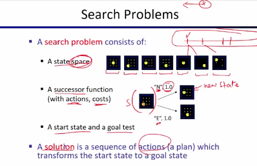

 

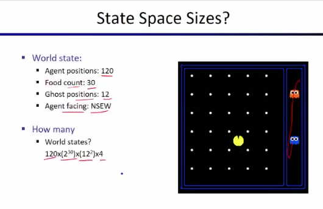

 

 

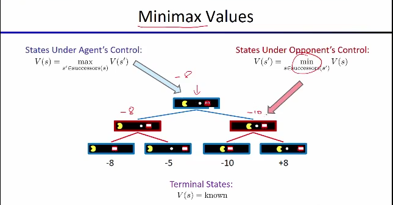

 

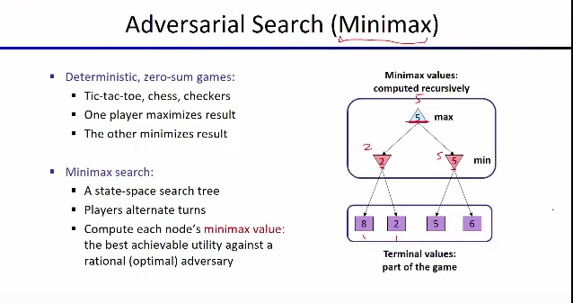

 

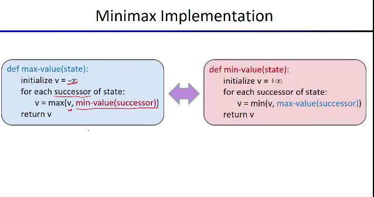

 

# `# Depth Limited Search:`

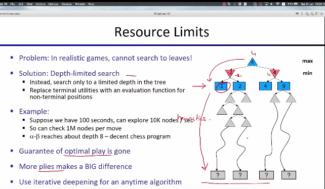

 

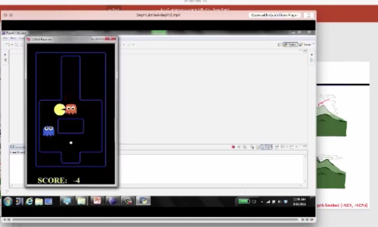

 

 

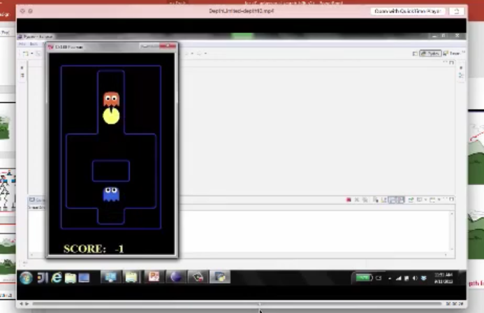

 

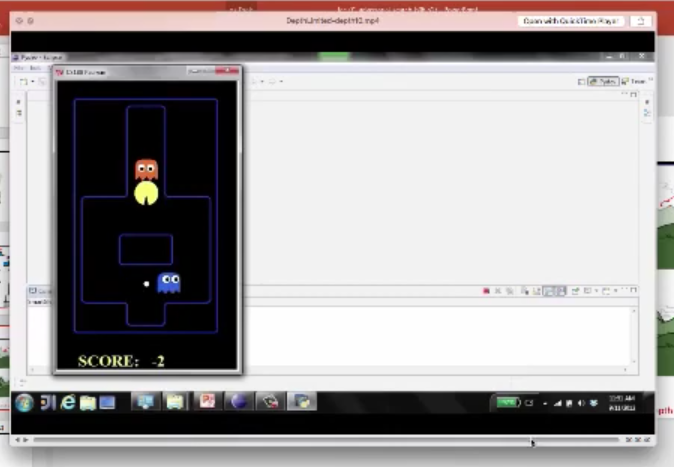

 

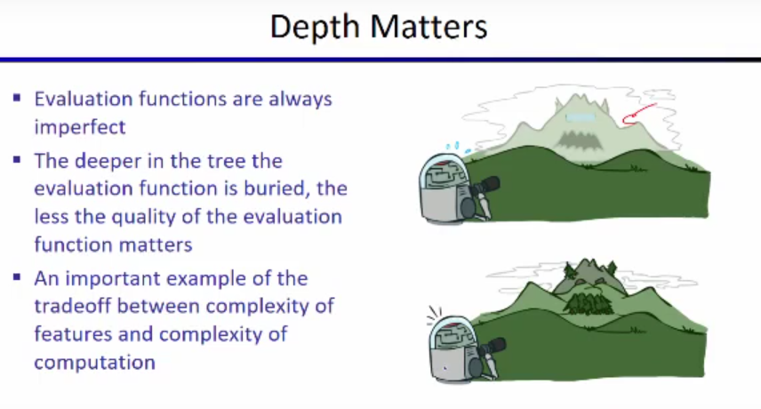

 

# `#Evalution Funcitons in Depth-limited-seach: ` 

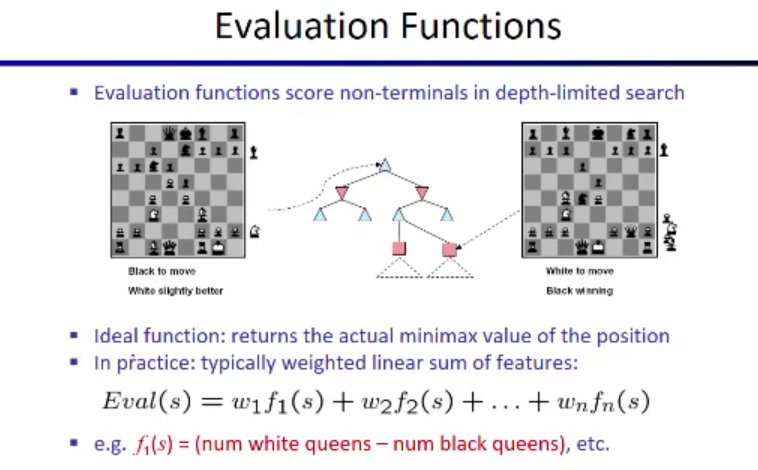

 

Evaluation Functions হলো এমন একটি ফাংশন যা (depth-limited-search) এর মধ্যবর্তী অবস্থার (non-terminal states) জন্য স্কোর নির্ধারণ করে। মূল্যায়ন ফাংশন সাধারণত বিভিন্ন বৈশিষ্ট্যের **ওজনযুক্ত লিনিয়ার সমষ্টি (weighted linear sum of features)** হিসেবে কাজ করে।  

$Eval(s)$ = $w_1 f_1(s) + w_2 f_2(s) + ... + w_n f_n(s)$

এখানে,  
- $f_i(s)$ হল **বোর্ডের বিভিন্ন বৈশিষ্ট্য** (যেমন, কতোটি রানী, কতোটি রাজা, কতোটি সৈন্য আছে ইত্যাদি)। like: $f_1(s)$ return, my opponant has queen or not । $f_2(s)$ return, my opponant has hourse or not । 
- $w_i$  হল **weights**, যা প্রতিটি বৈশিষ্ট্যের গুরুত্ব নির্ধারণ করে।  

✅ **উদাহরণ:**  

$f_1(s) = (\text{num white queens} - \text{num blcak queens})$
এটি বোঝায় যে যদি white queens বেশি থাকে, তাহলে **মূল্যায়ন স্কোর বেশি হবে**, অর্থাৎ অবস্থানটি white palyer এর জন্য ভালো।  

# `# Coordination of ghost in minmax:`

 

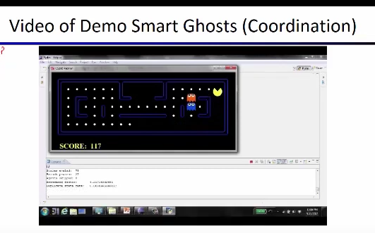

 

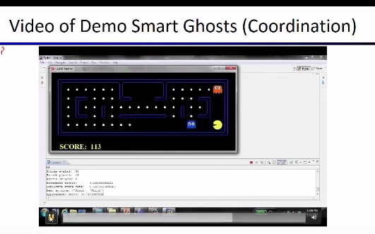

 

Adversarial Game Tree তে আমদের একটা  pacman  আর একটা ghost  ছিল । কিন্তু, যদি দুইটা ghost থাকে এবং এদের নিজেদের মধ্যে কোন Coordination না থাকা সত্বেও minmax এর কারণে এরা আলাদা হয়ে, ( above two picture ) এর মতো, pacman কে ধরে ফেলবে । Coordination না থাকা সত্বেও, যেহেতু দুইটা ghost ওই নিজেদের ভ্যালূকে minimize করে, এর জন্য এমন হয় । 

# `# Game Tree Pruning:`

Normally, আমাদের কাছে Tree টা অনেক বড় হয় । Game Tree Pruning এর মাধ্যমে আমরা Tree টাকে ছোট করবো । 

 

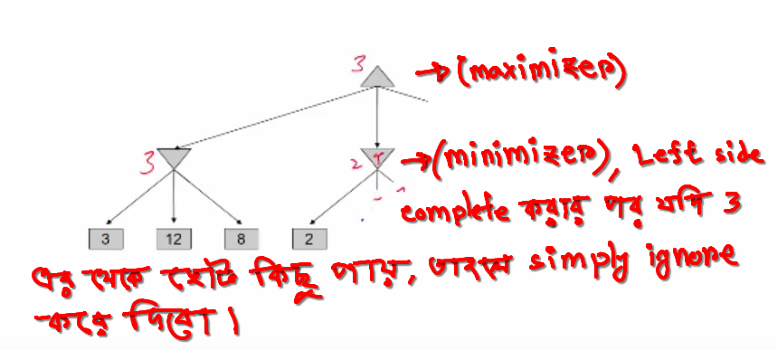

 

একে MiniMax Pruning বলে।  Pruning means কাটা । `Simillarly, we have Alpha-Beta Pruning.`

 

# `# Uncertain Outcomes:`

আমরা যখন real life কাজ করবো তখন, Uncertain Outcomes থাকবে । যেমনঃ আমরা যখন একটা EV নিয়ে কাজ করবো এমনো হতে পারে যে গাড়ির tier ফেটে যেতে পারে । কিন্তু,   pacman নিয়ে এই ধরনের কোন সমস্যা নেই । 

 

# `# Expectimax:`

 

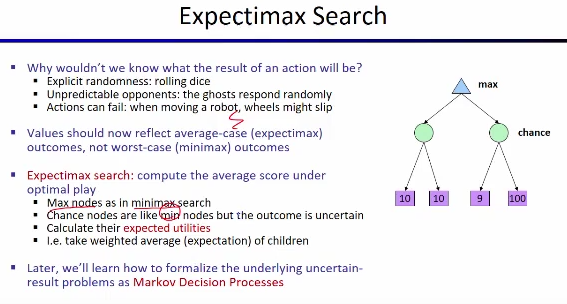

Here, MinMax এ আমরা MIN(10,10) = 10, MIN(9,100) = 9 নিতাম। কিন্তু, আমরা,  Expectimax এ আমরা average value নিবো, AVERAGE(10,10) = 10, AVERAGE(9,100) = 54.5 । তো এতে লাভ কি হবে  চলো নিচের ছবি গুলোর মাধ্যমে তা বুঝিঃ 

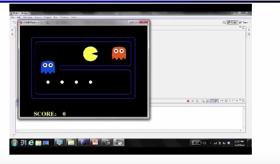

এখানে যদি আমরা minimax ব্যবহার করি, তাহলে pacman তার optimum solution খুজবে । যেহেতু, দুই পাশেই ghost আছে, তাই pacman যেই ghost টা কাছে তার কাছে ধরা দিবে । কারণ, আমরা চাই কম সময়ে  গেম শেষ করতে যেহেতু এটা সম্ভব না । আর অন্য ghost তার কাছে ধরা দিলে যেহেতু গেম টা শেষ করা যাবে না পাশাপাশি যতক্ষন  pacman বেচে থাকবে ততক্ষণ একটা negative value add হতে থাকবে তাই প্রথম  ghost এর কাছে যাবে । 

কিন্তু, আমরা যদি Expectimax ব্যবহার করি তাহলে, আমার pacman ভাববে যদি অন্য একটা ghost দূরে চলে যায় তাহলে তো সে বেচে যাবে । উপরে সেইটায় ঘটেছে । 

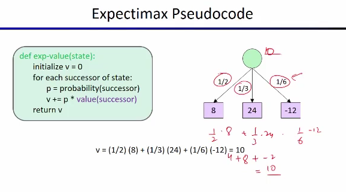

Formula, of Expectimax, V+= (probabilty * value ) ।   `আমরা, Expectimax এ pruning এর  concept কাজে লাগাতে পারি  না । Expectimax-এ প্রতিপক্ষ (Ghost) random সিদ্ধান্ত নেয় এবং প্রতিটি চালের সম্ভাব্যতা ব্যবহার করে সিদ্ধান্ত নেওয়া হয়। এর জন্য Pruning possible হয় না ।  ` 

**But, we can do Depth-Limited Expectimax.**

# `# Revision Math:`

## [Revise_Lecture_03_AND_Lecture_04](https://github.com/yasin-arafat-05/jupyterNotebook/blob/main/MathForML/Statistics/note/02_lecture.md) 

## [Revise_this](https://github.com/yasin-arafat-05/jupyterNotebook/blob/main/MathForML/probability/note.md)

 
 

# `# Conditional Probability and Exceptation:`

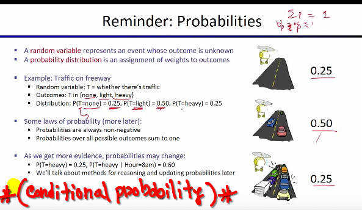

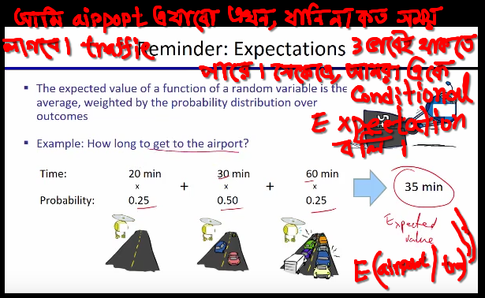

 
 

# `# Where we will use probability in pacman Game?`

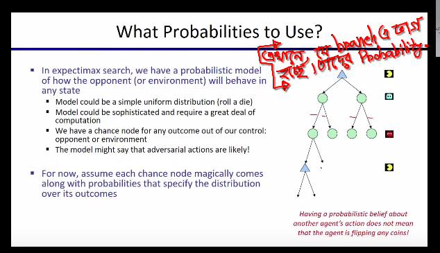

# `# Question: (with simple answer):`

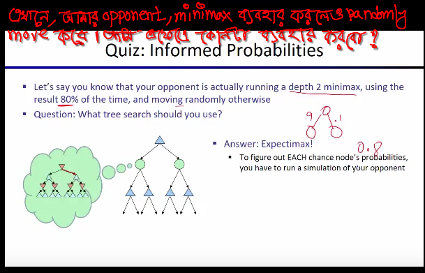

 
 

`In reality,` 

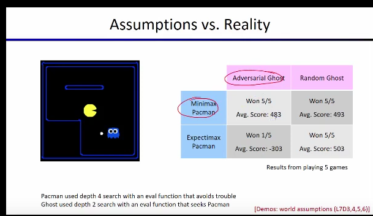

