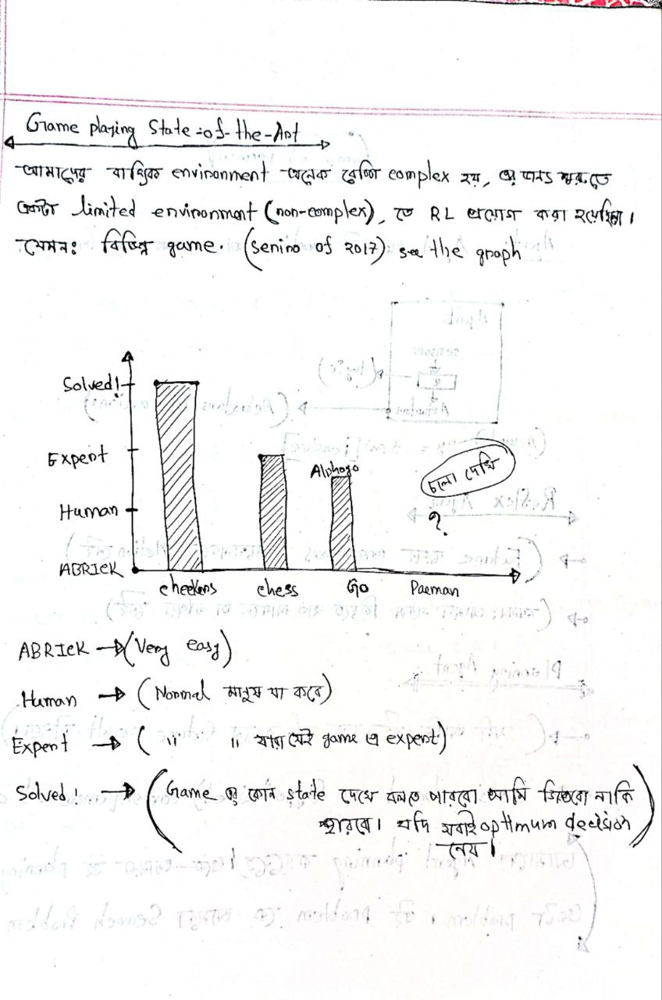
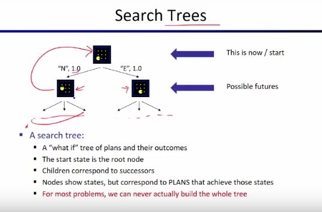

 

`Author: Yasin Arafat`   
`Email: yasinarafat.e2021@gmail.com`  

# #Topics: 
- #01: Research Releated কিছু কথা বার্তা 
- #02: How you can learn a machine
- #03: Introduction of Reinforcement Learning 

 

 

# `#01: Research Releated কিছু কথা বার্তা ।`

 

# `#02: How you can learn a machine:`

 

Machine Learning, এখানে, Learning মানে আমরা  machine কে শিখাবো । কিন্তু, machine কে কীভাবে শিখাবো ?  উদাহারণ, হিসেবে কল্পনা করি, মানুষ কীভাবে শিখে? আমরা স্কুল কলেজে গিয়ে স্যারদের কাছ থেকে learn করি ।  এখানে, sir কে আমরা supervisor বলতে পারি । কারণ, স্যার আমাদেরকে বলে দেয় এইটা এইভাবে হবে, আর এইটা এইভাবে হবে না । Machine কে আমরা এইভাবে শিখাতে পারি, যেভাবে স্যার আমাদের কে শিখান । এইটাকে Supervised machine learning বলে । যেমনঃ ধরো আমি একটা ml model বানাবো, আমি যেখানে, input হিসেবে একটা বিড়ালের ছবি দিলে আমার ml model বলে দিতে পারবে এইটা বিড়ালের ছবি, আর যদি গরু ছবি দেই তাহলে বলে দিবে এইটা একটা গরু । তো, আমার শুরুতে আমার model কে শিখিয়ে দিতে হবে যে এইযে দেখো এই folder এ বিড়ালের ছবি আছে বিড়াল দেখতে এমন হয়, আর এই folder এ গরুর ছবি আছে এইগুলো দেখতে এমন হয় ।  যারা আমার 3rd এর arduino project দেখেছিলো সেখানে আমি deep learning দিয়ে এই কাজ টায় করেছিলাম, এই যে ইয়াছিন দেখতে এমন, ইয়াছিন ছাড়া কেউ এলে দরজা খুলবে না [projectlink](https://www.linkedin.com/posts/yasin-arafat-35a52b315_intellinety-pytorch-tensorflow-activity-7257823500512501760-sD9x?utm_source=share&utm_medium=member_desktop&rcm=ACoAAE_9ejYBD9-G5nkth3yj_1D-sytmTMWr93A) আর IT curnival এও সেম project type এর প্রজেক্ট দিয়েছিলাম আমি হাত মুস্টিবব্দ করলে রাখলে আমার লাইট off হয়ে যেত আর হাত straight করলে light on হতো [projectlink](https://www.linkedin.com/posts/yasin-arafat-35a52b315_project-hand-controling-light-i-use-activity-7282368356391759872-0Ngr?utm_source=share&utm_medium=member_desktop&rcm=ACoAAE_9ejYBD9-G5nkth3yj_1D-sytmTMWr93A)। Simply, i use supervised machine learing to build this project.

তো, machine কে unsupervised  নামে আর একটা technique আছে যেইটা দিয়ে train করাতে পারি । যেখানে,  আমি যখন  data level করার দরকার হয় না । data level বলতে আগে যেখানে, বলে দিলাম এই folder এ বিড়ালের ছবি আছে, আর এই folder এ গরুর ছবি । এখানে, model behavior analysis করে, মনে করো, ইয়াছিন নামে একটা ছেলে আছে যে চুরি করে বেড়ায় আর আরাফার নামে একটা ছেলে আছে অনেক ভালো, নম্র ভদ্র । তো এদের দুইজনের আচার আচরণ কিন্তু এক হবে না, ইয়াছিন কে দেখেই বুঝা যাবে না এই ব্যাটা চোর । এখানে, unsupervised এ এমনই হয় আমরা এই দুইটা ছেলের behavior বলে দিবে এই এমন আচরণ এমন আর এই এমন আচরণ করে, unsupervised learning  data  cluser করে যে এই বৈশিষ্ট্য গুলো একটা চোরের মধ্যে থাক আর এই গুলোকে একটা ভালো মানুষের মধ্যে থাকে । আমরাদের email এ যে spam box আছে, সেইটা একই ভাবে কাজ করে mail দেখে আমার model বুঝতে পারে না তো এই ব্যবহার সুবিধার না তো কে inbox এ না পাঠিয়ে spam box এ পাঠায় দাও । 

আর একদম শেষের টা হচ্ছে, Reinforcement Learing । এইটা বাস্তব অভিজ্ঞতা উপর করে হয় । যেমনঃ তুমি যদি প্রথমবার প্রেম করে ছেকা খেয়ে বাকা হয়ে যাও তো দ্বিতীয় বার প্রেম করার আগে ১০ বার ভাবভা না আমার সাথে এই গুলো গুলো হয়েছে, তো তুমি তোমার পারিপাশ্বের সাপেক্ষে(environment) আর নিজের অবিজ্ঞতাকে (প্রথম বার অভিজ্ঞতা থাকায় ২য় বার ১০ বার ভাবতেছো ) কাজে লাগিয়ে তোমার decition নাও, `বিয়ের আগে প্রেম হারাম for muslim.` । তো, মোটামুটি আমরা machine কে এই তিন ভাবে learn করাতে পারি, supervised,unsupervised and reinforcement । 

 

# `#03 Introduction of Reinforcement Learning:`

 

Reinforcement Learning একটি শেখার পদ্ধতি যেখানে একটি **Agent** একটি **Environment** এর সাথে interact করে এবং **Action** নেয় ।  এর মাধ্যমে এটি **Reward** পায় এবং **New State** তে পরিবর্তিত হয়।    

1. **Agent**:  
   - Agent হল একটি **প্রোগ্রাম, মেশিন বা রোবট** যা শেখার চেষ্টা করে।  
   - এটি পরিবেশের সাথে interact করে এবং decision নেয়।  
   - Like, human is also an agent

2. **Environment**:  
   - এটি সেই স্থান যেখানে এজেন্ট কাজ করে।  
   - উদাহরণ: একটি গেম বোর্ড, রাস্তায় স্বয়ংক্রিয় গাড়ি, রোবটের চলার পথ ইত্যাদি।  
   - Human এর চারপাশে environment যেখানে, তার পচ্ছন্দ করা মানুষ টাও হচ্ছে environment। 

3. **Action**:  
   - এজেন্ট কিছু কাজ করে, যেমন **চাল চালানো(game), একটি step নেওয়া(robot), গাড়ির চাকা ঘুরানো(EV)** ইত্যাদি।  
   - এজেন্ট বিভিন্ন **action** নিয়ে শিখে কোনটি সেরা।  
   - Like, উপরে 2nd বার প্রেম করার আগে তুমি ১০ বার ভেবে action নিতেছো । 
   - Action টা তুমি পরিবেশের উপর নিতেছো, আর পরিবেশ তোমাকে একটা output দিচ্ছে , in the previous exampleyour favourite person ।

4. **Reward**:  
   - If agent do the right work for you,then the agent will get **পজিটিভ রিওয়ার্ড (+)**।  
   - Don't do the right work then agent get **নেগেটিভ রিওয়ার্ড (-)**।  
   - উদাহরণ:  
     - **গেম জেতা → + পুরস্কার**  
     - **গর্তে পড়ে যাওয়া → - শাস্তি**  

5. **New State**:  
   - এজেন্ট যখন কোনো কাজ করে, তখন এটি **New State** চলে যায়।  
   - Example: দাবার চাল দেওয়ার পর নতুন cheese board অবস্থা ।  

 

`আমরা তো মানুষ, তাই না? আসলেই ভাই আমরা মানুষ, বিশ্বাস করো । আমরা নিজেদেরকে agent এর সাথে তুলনা করতে পারি । কিন্তু, সমস্যা হচ্ছে, আমাদের আশেপাশের পরিবেশটা অনেক জটিল, কেন জটিল? মনে করো তুমি ১০০ টাকা নিয়ে পকেটে যাচ্ছো মিস্টি খেতে, তো রাস্তায় তোমার পুরানো কোন বন্ধুর সাথে দেখা হলো, তাকে তুমি ১০০ টাকার একটা বার্গার খায়িয়ে দিলে, ব্যাস হলো তোমার মিস্টি খাওয়া । এই যে আমাদের environment এর এই ধরনের behaviour এইটাকে আমরা stohastic environment বলি । Stochastic কারণ, আমরা একটা কাজ করতে চাচ্ছি কিন্তু আমরা sure না যে এই কাজ টায় করতে পারবো । আর একধরনের environment আছে, যেইটাকে আমরা deterministic enviroment বলি, যেমন, আমরা একটা গেম খেলতেছি,গাড়ি গেম, আমি যদি, গাড়িকে বামে নিতে চায় তো বামে যাচ্ছে, ডানে নিতে গেলে ডানে যাচ্ছে, এইটা deterministic কারণ আমি যা করাতে চাচ্ছি ঠিক তাই করাতে পারতেছি  । এর জন্য আমরা RL(Reinforment learning) শিখার জন্য deterministic enviroment নিয়ে কাজ করবো । যেমনঃ যেকোন গেম হতে পারে । `

 

`**আমরা RL শিখার প্রসেস এ, দেখবো, pacman নামে যে গেমটা আছে, সেইটা । **`

 

 

 

 

 

 

 

 

# `# Depth Limited Search:`

 

 

 

 

 

 

# `#Evalution Funcitons in Depth-limited-seach: ` 

 

Evaluation Functions হলো এমন একটি ফাংশন যা (depth-limited-search) এর মধ্যবর্তী অবস্থার (non-terminal states) জন্য স্কোর নির্ধারণ করে। মূল্যায়ন ফাংশন সাধারণত বিভিন্ন বৈশিষ্ট্যের **ওজনযুক্ত লিনিয়ার সমষ্টি (weighted linear sum of features)** হিসেবে কাজ করে।  

$Eval(s)$ = $w_1 f_1(s) + w_2 f_2(s) + ... + w_n f_n(s)$

এখানে,  
- $f_i(s)$ হল **বোর্ডের বিভিন্ন বৈশিষ্ট্য** (যেমন, কতোটি রানী, কতোটি রাজা, কতোটি সৈন্য আছে ইত্যাদি)। like: $f_1(s)$ return, my opponant has queen or not । $f_2(s)$ return, my opponant has hourse or not । 
- $w_i$  হল **weights**, যা প্রতিটি বৈশিষ্ট্যের গুরুত্ব নির্ধারণ করে।  

✅ **উদাহরণ:**  

$f_1(s) = (\text{num white queens} - \text{num blcak queens})$
এটি বোঝায় যে যদি white queens বেশি থাকে, তাহলে **মূল্যায়ন স্কোর বেশি হবে**, অর্থাৎ অবস্থানটি white palyer এর জন্য ভালো।  

# `# Coordination of ghost in minmax:`

 

 

 

Adversarial Game Tree তে আমদের একটা  pacman  আর একটা ghost  ছিল । কিন্তু, যদি দুইটা ghost থাকে এবং এদের নিজেদের মধ্যে কোন Coordination না থাকা সত্বেও minmax এর কারণে এরা আলাদা হয়ে, ( above two picture ) এর মতো, pacman কে ধরে ফেলবে । Coordination না থাকা সত্বেও, যেহেতু দুইটা ghost ওই নিজেদের ভ্যালূকে minimize করে, এর জন্য এমন হয় । 

# `# Game Tree Pruning:`

Normally, আমাদের কাছে Tree টা অনেক বড় হয় । Game Tree Pruning এর মাধ্যমে আমরা Tree টাকে ছোট করবো । 

 

 

একে MiniMax Pruning বলে।  Pruning means কাটা । `Simillarly, we have Alpha-Beta Pruning.`

 

# `# Uncertain Outcomes:`

আমরা যখন real life কাজ করবো তখন, Uncertain Outcomes থাকবে । যেমনঃ আমরা যখন একটা EV নিয়ে কাজ করবো এমনো হতে পারে যে গাড়ির tier ফেটে যেতে পারে । কিন্তু,   pacman নিয়ে এই ধরনের কোন সমস্যা নেই । 

 

# `# Expectimax:`

 

Here, MinMax এ আমরা MIN(10,10) = 10, MIN(9,100) = 9 নিতাম। কিন্তু, আমরা,  Expectimax এ আমরা average value নিবো, AVERAGE(10,10) = 10, AVERAGE(9,100) = 54.5 । তো এতে লাভ কি হবে  চলো নিচের ছবি গুলোর মাধ্যমে তা বুঝিঃ 

এখানে যদি আমরা minimax ব্যবহার করি, তাহলে pacman তার optimum solution খুজবে । যেহেতু, দুই পাশেই ghost আছে, তাই pacman যেই ghost টা কাছে তার কাছে ধরা দিবে । কারণ, আমরা চাই কম সময়ে  গেম শেষ করতে যেহেতু এটা সম্ভব না । আর অন্য ghost তার কাছে ধরা দিলে যেহেতু গেম টা শেষ করা যাবে না পাশাপাশি যতক্ষন  pacman বেচে থাকবে ততক্ষণ একটা negative value add হতে থাকবে তাই প্রথম  ghost এর কাছে যাবে । 

কিন্তু, আমরা যদি Expectimax ব্যবহার করি তাহলে, আমার pacman ভাববে যদি অন্য একটা ghost দূরে চলে যায় তাহলে তো সে বেচে যাবে । উপরে সেইটায় ঘটেছে । 

Formula, of Expectimax, V+= (probabilty * value ) ।   `আমরা, Expectimax এ pruning এর  concept কাজে লাগাতে পারি  না । Expectimax-এ প্রতিপক্ষ (Ghost) random সিদ্ধান্ত নেয় এবং প্রতিটি চালের সম্ভাব্যতা ব্যবহার করে সিদ্ধান্ত নেওয়া হয়। এর জন্য Pruning possible হয় না ।  ` 

**But, we can do Depth-Limited Expectimax.**

# `# Revision Math:`

## [Revise_Lecture_03_AND_Lecture_04](https://github.com/yasin-arafat-05/jupyterNotebook/blob/main/MathForML/Statistics/note/02_lecture.md) 

## [Revise_this](https://github.com/yasin-arafat-05/jupyterNotebook/blob/main/MathForML/probability/note.md)

 
 

# `# Conditional Probability and Exceptation:`

 
 

# `# Where we will use probability in pacman Game?`

# `# Question: (with simple answer):`

 
 

`In reality,` 

 

# `# Utilites `

Questions:
- Where do utilites come from?
- How do we know such utilities event exist?
- How do we know averaging event makes sense?
- What if our behavior(preferences) can't be described by utilites? 

যেখানে আমরা, agent এর utilites(trees) ঠিক মতো বলতে পারতেছি না, যেখানে, agent এর  behaviour বলাটা অনেক কঠিন হবে । এইভাবে হাত, পা নাড়াতে হয়  etc.   

  

 

১টা খাবার পর আমার আস্তে আস্তে utilites কমতে থাকবে কারণ আমার পেট ভরতে থাকবে । যখন, আমার পেট ভরে যাবে তখন আমি যদি জোর করেও আইস্কিম খায়, আমি তেমন বেশি utilites পাবো না কারণ, আমার পেট ভরা। Utilites অনেক complex একটা জিনিস । আমি কোন কাজ করার পর, কেমন খুশি হচ্ছি সেইটায় হচ্ছে আমার utilites। এই complex জিনিসটা বুঝার জন্য আমরা Preferences সম্পকে জানবো । 

 

# `# Preferences `

 

কোন agent এই ধরনের prefference কে follow করলে তাকে rational agent বলে । 

Example: of not a rational agent.

 

আমাদের কাছে কোন utilites হবে কি না । তার উত্তর দেয় হচ্ছে এই  MEU principle . 

 

