 

`Author: Yasin Arafat`   
`Email: yasinarafat.e2021@gmail.com`  

# #Topics: 

### **CHAPTER: 01**
- #01: Research Releated কিছু কথা বার্তা 
- #02: How you can learn a machine
- #03: Introduction of Reinforcement Learning 
- #04: Problem Solving Agent
- #05: Uniformed Search Algorithms
- #06:Informed Search Algorithms

### **CHAPTER: 02**
- #07 Classical Search vs Local search:

### **CHAPTER: 03**
- Adversarial Search 
   - Zero Sum
   - General Game 
- Some Basic Notation
   - Function
   - Power Set
   - Cross Product
- Adversarial Search(MiniMax)
- Depth Limited Search
- Coordination of ghost in MiniMax
- Game Tree Pruning
- Uncertain Outcome
- Expectimax
- Conditional Probability and Expectation
- Utilities
- Preference 
- Rational Preference

### **CHAPTER: 04**
- MEU
- Policy 
- Optimum Policy
- Search Trees For (MDP)
- Markov Decision Process(MDP)
- Bellman Equation
   - Deterministic Enviroment
   - Stochastic Environment
- Temporal Difference
- Q-Learning
- Off-Policy and On-Policy
- SARSA
- Monte Carlo 

 
 
 

---

 
 
 

# `#CHAPTER:01`

 
 

# `#01: Research Releated কিছু কথা বার্তা ।`

 
 

# `#02: How you can learn a machine:`

 
 

Machine Learning, এখানে, Learning মানে আমরা  machine কে শিখাবো । কিন্তু, machine কে কীভাবে শিখাবো ?  উদাহারণ, হিসেবে কল্পনা করি, মানুষ কীভাবে শিখে? আমরা স্কুল কলেজে গিয়ে স্যারদের কাছ থেকে learn করি ।  এখানে, sir কে আমরা supervisor বলতে পারি । কারণ, স্যার আমাদেরকে বলে দেয় এইটা এইভাবে হবে, আর এইটা এইভাবে হবে না । Machine কে আমরা এইভাবে শিখাতে পারি, যেভাবে স্যার আমাদের কে শিখান । এইটাকে Supervised machine learning বলে । যেমনঃ ধরো আমি একটা ml model বানাবো, আমি যেখানে, input হিসেবে একটা বিড়ালের ছবি দিলে আমার ml model বলে দিতে পারবে এইটা বিড়ালের ছবি, আর যদি গরু ছবি দেই তাহলে বলে দিবে এইটা একটা গরু । তো, আমার শুরুতে আমার model কে শিখিয়ে দিতে হবে যে এইযে দেখো এই folder এ বিড়ালের ছবি আছে বিড়াল দেখতে এমন হয়, আর এই folder এ গরুর ছবি আছে এইগুলো দেখতে এমন হয় ।  যারা আমার 3rd এর arduino project দেখেছিলো সেখানে আমি deep learning দিয়ে এই কাজ টায় করেছিলাম, এই যে ইয়াছিন দেখতে এমন, ইয়াছিন ছাড়া কেউ এলে দরজা খুলবে না [projectlink](https://www.linkedin.com/posts/yasin-arafat-35a52b315_intellinety-pytorch-tensorflow-activity-7257823500512501760-sD9x?utm_source=share&utm_medium=member_desktop&rcm=ACoAAE_9ejYBD9-G5nkth3yj_1D-sytmTMWr93A) আর IT curnival এও সেম project type এর প্রজেক্ট দিয়েছিলাম আমি হাত মুস্টিবব্দ করলে রাখলে আমার লাইট off হয়ে যেত আর হাত straight করলে light on হতো [projectlink](https://www.linkedin.com/posts/yasin-arafat-35a52b315_project-hand-controling-light-i-use-activity-7282368356391759872-0Ngr?utm_source=share&utm_medium=member_desktop&rcm=ACoAAE_9ejYBD9-G5nkth3yj_1D-sytmTMWr93A)। Simply, i use supervised machine learing to build this project.

তো, machine কে unsupervised  নামে আর একটা technique আছে যেইটা দিয়ে train করাতে পারি । যেখানে,  আমি যখন  data level করার দরকার হয় না । data level বলতে আগে যেখানে, বলে দিলাম এই folder এ বিড়ালের ছবি আছে, আর এই folder এ গরুর ছবি । এখানে, model behavior analysis করে, মনে করো, ইয়াছিন নামে একটা ছেলে আছে যে চুরি করে বেড়ায় আর আরাফার নামে একটা ছেলে আছে অনেক ভালো, নম্র ভদ্র । তো এদের দুইজনের আচার আচরণ কিন্তু এক হবে না, ইয়াছিন কে দেখেই বুঝা যাবে না এই ব্যাটা চোর । এখানে, unsupervised এ এমনই হয় আমরা এই দুইটা ছেলের behavior বলে দিবে এই এমন আচরণ এমন আর এই এমন আচরণ করে, unsupervised learning  data  cluser করে যে এই বৈশিষ্ট্য গুলো একটা চোরের মধ্যে থাক আর এই গুলোকে একটা ভালো মানুষের মধ্যে থাকে । আমরাদের email এ যে spam box আছে, সেইটা একই ভাবে কাজ করে mail দেখে আমার model বুঝতে পারে না তো এই ব্যবহার সুবিধার না তো কে inbox এ না পাঠিয়ে spam box এ পাঠায় দাও । 

আর একদম শেষের টা হচ্ছে, Reinforcement Learing । এইটা বাস্তব অভিজ্ঞতা উপর করে হয় । যেমনঃ তুমি যদি প্রথমবার প্রেম করে ছেকা খেয়ে বাকা হয়ে যাও তো দ্বিতীয় বার প্রেম করার আগে ১০ বার ভাবভা না আমার সাথে এই গুলো গুলো হয়েছে, তো তুমি তোমার পারিপাশ্বের সাপেক্ষে(environment) আর নিজের অবিজ্ঞতাকে (প্রথম বার অভিজ্ঞতা থাকায় ২য় বার ১০ বার ভাবতেছো ) কাজে লাগিয়ে তোমার decition নাও, `বিয়ের আগে প্রেম হারাম for muslim.` । তো, মোটামুটি আমরা machine কে এই তিন ভাবে learn করাতে পারি, supervised,unsupervised and reinforcement । 

 
 

# `#03 Introduction of Reinforcement Learning:`

 
 

`চলো একটু ইতিহাসের পাতা থেকে ঘুরে আসা যাক। ২০০৮,২০০৯,২০১০ আমরা যখন কম্পিউটারে গেম খেলতাম তখন, আমরা অনেক ছোট ছোট গেম আমরা AI or Bot এর সাথে খেলতে পারতাম, যেমনঃ  দাবা । কিন্তু, প্রশ্ন হচ্ছে যে, তখন AI or Neural Network নিয়ে এত কাজ হয় নাই । তাহলে, তখন কীভাবে Bot এর সাথে সেই গেম গুলো খেলা যেত??? হ্যা, তখন, Reinforcement learning আলাদা একটা field ছিল, Machine Learning এর পার্ট ছিল না । তখন, DP(Dynamic Programming) Based কিছু algorithm দিয়ে সেই গেম গুলো solve করা হতো । তারপর, Reinforcement Learning এ Agent নামে একটা জিনিস আছে । সেইটাকে আমরা Neural Network দিয়ে যখন Replace করে দিলাম তখন থেকেই Reinforcement Learning আমার Machine Learning এর পার্ট ।`

 

Reinforcement Learning একটি শেখার পদ্ধতি যেখানে একটি **Agent** একটি **Environment** এর সাথে interact করে এবং **Action** নেয় ।  এর মাধ্যমে এটি **Reward** পায় এবং **New State** তে পরিবর্তিত হয়।    

1. **Agent**:  
   - Agent হল একটি **প্রোগ্রাম, মেশিন বা রোবট** যা শেখার চেষ্টা করে।  
   - এটি পরিবেশের সাথে interact করে এবং decision নেয়।  
   - Like, human is also an agent

2. **Environment**:  
   - এটি সেই স্থান যেখানে এজেন্ট কাজ করে।  
   - উদাহরণ: একটি গেম বোর্ড, রাস্তায় স্বয়ংক্রিয় গাড়ি, রোবটের চলার পথ ইত্যাদি।  
   - Human এর চারপাশে environment যেখানে, তার পচ্ছন্দ করা মানুষ টাও হচ্ছে environment। 

3. **Action**:  
   - এজেন্ট কিছু কাজ করে, যেমন **চাল চালানো(game), একটি step নেওয়া(robot), গাড়ির চাকা ঘুরানো(EV)** ইত্যাদি।  
   - এজেন্ট বিভিন্ন **action** নিয়ে শিখে কোনটি সেরা।  
   - Like, উপরে 2nd বার প্রেম করার আগে তুমি ১০ বার ভেবে action নিতেছো । 
   - Action টা তুমি পরিবেশের উপর নিতেছো, আর পরিবেশ তোমাকে একটা output দিচ্ছে , in the previous exampleyour favourite person ।

4. **Reward**:  
   - If agent do the right work for you,then the agent will get **পজিটিভ রিওয়ার্ড (+)**।  
   - Don't do the right work then agent get **নেগেটিভ রিওয়ার্ড (-)**।  
   - উদাহরণ:  
     - **গেম জেতা → + পুরস্কার**  
     - **গর্তে পড়ে যাওয়া → - শাস্তি**  

5. **New State**:  
   - এজেন্ট যখন কোনো কাজ করে, তখন এটি **New State** চলে যায়।  
   - Example: দাবার চাল দেওয়ার পর নতুন cheese board অবস্থা ।  

 

`আমরা তো মানুষ, তাই না? আসলেই ভাই আমরা মানুষ, বিশ্বাস করো । আমরা নিজেদেরকে agent এর সাথে তুলনা করতে পারি । কিন্তু, সমস্যা হচ্ছে, আমাদের আশেপাশের পরিবেশটা অনেক জটিল, কেন জটিল? মনে করো তুমি ১০০ টাকা নিয়ে পকেটে যাচ্ছো মিস্টি খেতে, তো রাস্তায় তোমার পুরানো কোন বন্ধুর সাথে দেখা হলো, তাকে তুমি ১০০ টাকার একটা বার্গার খায়িয়ে দিলে, ব্যাস হলো তোমার মিস্টি খাওয়া । এই যে আমাদের environment এর এই ধরনের behaviour এইটাকে আমরা stohastic environment বলি । Stochastic কারণ, আমরা একটা কাজ করতে চাচ্ছি কিন্তু আমরা sure না যে এই কাজ টায় করতে পারবো । আর একধরনের environment আছে, যেইটাকে আমরা deterministic enviroment বলি, যেমন, আমরা একটা গেম খেলতেছি,গাড়ি গেম, আমি যদি, গাড়িকে বামে নিতে চায় তো বামে যাচ্ছে, ডানে নিতে গেলে ডানে যাচ্ছে, এইটা deterministic কারণ আমি যা করাতে চাচ্ছি ঠিক তাই করাতে পারতেছি  । এর জন্য আমরা RL(Reinforment learning) শিখার জন্য deterministic enviroment নিয়ে কাজ করবো । যেমনঃ যেকোন গেম হতে পারে । `

 

`**আমরা RL শিখার প্রসেস এ, দেখবো, pacman নামে যে গেমটা আছে, সেইটা । **`

 

 
 

# `#04: Problem Solving Agent:`

 
 

 

**State:** State is the snapshoot of current position of a problem solving agent. This state tells the agent what is present position. Okay, then how the state is represent in the internal system of the agent? is called representation. There are mainly two types of representation. 

- Atomic representation
- Factored or Structured Representation.

 

Now, For solving this state or we can say that to reach the goal state there are some algorithrm knows as search algorithrm. Basically, there are two types of search algorithrm. 

- Uniformed Search Algorithms
- Informed Search Algorithrms.

 

 

 

 

 

# `#05: Uniformed Search Algorithms:`

### Uninformed Search (Blind Search):

These algorithms brute-force their way through the search space systematically without any hints about which path is more promising.

**Characteristics:**
*   They only know the graph structure and can tell if a node is the goal node or not.
*   They are simple to implement.
*   They can be very inefficient for large search spaces because they may explore a huge number of irrelevant paths.
*   They are **complete** (guaranteed to find a solution if one exists) and often **optimal** (guaranteed to find the best solution) but at a high computational cost.

**Common Algorithms:**
*   **Breadth-First Search (BFS):** Explores all nodes at the present depth level before moving on to nodes at the next depth level. **Optimal** if path cost is a function of depth.
*   **Depth-First Search (DFS):** Explores as far as possible along each branch before backtracking. Not optimal and may not be complete (if the tree is infinite).
*   **Uniform-Cost Search (UCS):** Explores the node with the **lowest path cost** first. This is the best uninformed search algorithm when step costs are unequal. It is **optimal** and **complete**.
*   **Depth-Limited Search & Iterative Deepening DFS (IDDFS):** Variations of DFS to handle its limitations in infinite spaces. IDDFS is complete and optimal (like BFS) while using much less memory.

**When to use:** When you have no way to estimate the distance to the goal, or when the search space is small.

## BFS:

## DFS:

## DLS:

## IDDLS:

## UCS: 

## SPACE-TIME-OPTIMALITY-COMPLETENESS

 
 

# `#06: Informed Search Algorithms:`

 
 

---

### Informed Search (Heuristic Search)

These algorithms use a **heuristic function**, denoted as **h(n)**, to guide the search.

*   **Heuristic Function h(n):** An function that estimates the **cost of the cheapest path from node `n` to the goal**. It is problem-specific.
*   **Key point:** The heuristic must be **admissible** (for A* to be optimal), meaning it *never overestimates* the true cost to the goal.

**Characteristics:**
*   They are much more efficient than uninformed search, often finding the goal much faster by exploring more promising paths first.
*   The quality of the heuristic function `h(n)` directly determines the efficiency of the search. A better heuristic will explore fewer nodes.

**Common Algorithms:**
*   **Greedy Best-First Search:** Expands the node that is ***seemingly* closest to the goal**, i.e., the node with the smallest `h(n)`. It behaves like a "greedy" algorithm, choosing the best-looking option at every step. It is **not optimal** and **not complete** (can get stuck in infinite loops).
*   **A* Search (A-Star Search):** The most famous informed search algorithm. It combines the cost to *reach* the node (`g(n)`) and the cost to *get from the node to the goal* (`h(n)`).
    It expands the node with the lowest value of: **f(n) = g(n) + h(n)**
    *   `g(n)`: Actual cost from the start node to node `n`.
    *   `h(n)`: Estimated cost from node `n` to the goal.
    *   `f(n)`: Estimated total cost of the path through node `n`.
    If `h(n)` is **admissible**, A* is **complete** and **optimal**.

**When to use:** When you have a good heuristic function for your problem (e.g., straight-line distance for maps, number of misplaced tiles for the 8-puzzle).

---

### Comparison Table

| Feature | Uninformed Search | Informed Search |
| :--- | :--- | :--- |
| **Concept** | Blind, brute-force search | Guided, intelligent search |
| **Knowledge** | Only knows graph structure and goal test. | Uses a **heuristic function `h(n)`**. |
| **Efficiency** | Generally less efficient. Explores many nodes. | Much more efficient. Explores fewer, more promising nodes. |
| **Completeness** | Often complete (BFS, UCS, IDDFS). | Can be complete (A* is complete). |
| **Optimality** | Can be optimal (BFS for depth, UCS for cost). | Can be optimal (A* is optimal with an admissible heuristic). |
| **Time Complexity** | O(b^d) [exponential in depth] | Can be significantly better, but still exponential in worst case. |
| **Space Complexity** | O(b^d) [a big problem] | O(b^d) [still a problem, but often better in practice] |
| **Examples** | BFS, DFS, Uniform-Cost Search | Greedy Best-First, A* |

### Analogy: Finding a Book in a Library

*   **Uninformed Search (BFS):** You start at the entrance and look at every book on the first shelf of the first aisle, then the second shelf, and so on. After finishing an aisle, you move to the next one. You are guaranteed to find the book but it will take a very long time.
*   **Uninformed Search (DFS):** You go to the first aisle and go all the way to the back of the library, checking every book. If you don't find it, you go back to the entrance and try the second aisle the same way.
*   **Informed Search (Greedy Best-First):** You see a sign that says "History Section ->". You follow it. Then you see another sign that says "20th Century History". You follow that. You're getting "warmer" quickly, but you might miss the book if it's misfiled or if the signs are slightly misleading.
*   **Informed Search (A*):** You use a combination of clues: how far you've walked from the entrance (`g(n)`) and the signs pointing to the history section (`h(n)`). You find the shortest path that balances the effort you've already expended and the estimated effort remaining. This is the optimal strategy.

 
 
 

---

 
 
 

# `#CHAPTER:02`

 

# `#07 Classical Search vs Local search:`
 
 

### `**Classical Search:**`

**Classical Search  Algorithrm গুলোর  মধ্যে রয়েছে,**
- Uninformed Search 
    - BFS
    - Uniform-Cost search
    - DFS
    - DLS
    - IDDFS
    - Bidirectional Search 
    
- Informed(Heuristic) Search 
    - Greedy best-first Search 
    - A*

**কিন্তু, এদের(Classical Search) কিছু সমস্যা আছে, সমস্যা গুলো হলো,**

- **Inefficiency in Large Search Spaces:**  ক্লাসিক্যাল সার্চ অ্যালগরিদম `(BFS, DFS)` ছোট বা মাঝারি আকারের সমস্যার জন্য effective। কিন্তু যখন search space অনেক বড় হয়ে যায়, তখন these algorithms become very slow and consume a lot of memory.

- **Infinite Loops:** DFS এর মতো অ্যালগরিদমগুলো যদি একটা loop-এ পড়ে, they can run indefinitely without finding a solution. Although Iterative Deepening DFS (IDDFS) addresses this issue, it remains a limitation.

- **Getting Stuck at Local Optima:**  Classical search often fails to find the globally optimal solution. It can get stuck in a "local optimum," which is a good solution but not the best overall.

- **High Memory Consumption:** BFS তার search process-এ সব নোডকে মেমরিতে store করে। If the search space is large, it can use a huge amount of memory, affecting system performance. 

- **Requires Good Heuristics:** Informed search algorithms (like A* Search) need a good heuristic function to work efficiently. If the heuristic is weak, the algorithm becomes inefficient and behaves like an uninformed search.

### `**Local Search:**`

`Local search is a type of optimization algorithm. Instead of exploring the entire search space from the beginning (like classical search), it starts from a single candidate solution and iteratively tries to improve it. Think of it like climbing a hill: you just take steps that go up from your current position, not exploring every single path.`

**How It Overcomes Classical Search Limitations?**
Local Search primarily solves two key problems of classical search:
- **Memory Efficiency:** ক্লাসিক্যাল সার্চ (like BFS) stores all possible paths or nodes in memory, যা বড় সমস্যার জন্য huge memory consumption-এর কারণ। In contrast, local search only keeps track of one (or a few) current states and their neighbors. So, it's very memory-efficient and can handle large problems with ease.

- **Speed & Scalability:** পুরো সার্চ স্পেস এক্সপ্লোর না করে, লোকাল সার্চ সরাসরি একটি ভালো সমাধানের দিকে move করে। It’s significantly faster at finding a good solution. While it might not always find the best possible solution (global optimum), it usually finds a good enough solution (local optimum) quickly, which is sufficient for many real-world problems. 

 
 

---

 
 

# `#CHAPTER:03`

 

# `#Adversial Game:`

 

 

 

 

# `# Depth Limited Search:`

 

 

 

 

 

 

# `#Evalution Funcitons in Depth-limited-seach: ` 

 

Evaluation Functions হলো এমন একটি ফাংশন যা (depth-limited-search) এর মধ্যবর্তী অবস্থার (non-terminal states) জন্য স্কোর নির্ধারণ করে। মূল্যায়ন ফাংশন সাধারণত বিভিন্ন বৈশিষ্ট্যের **ওজনযুক্ত লিনিয়ার সমষ্টি (weighted linear sum of features)** হিসেবে কাজ করে।  

$Eval(s)$ = $w_1 f_1(s) + w_2 f_2(s) + ... + w_n f_n(s)$

এখানে,  
- $f_i(s)$ হল **বোর্ডের বিভিন্ন বৈশিষ্ট্য** (যেমন, কতোটি রানী, কতোটি রাজা, কতোটি সৈন্য আছে ইত্যাদি)। like: $f_1(s)$ return, my opponant has queen or not । $f_2(s)$ return, my opponant has hourse or not । 
- $w_i$  হল **weights**, যা প্রতিটি বৈশিষ্ট্যের গুরুত্ব নির্ধারণ করে।  

✅ **উদাহরণ:**  

$f_1(s) = (\text{num white queens} - \text{num blcak queens})$
এটি বোঝায় যে যদি white queens বেশি থাকে, তাহলে **মূল্যায়ন স্কোর বেশি হবে**, অর্থাৎ অবস্থানটি white palyer এর জন্য ভালো।  

# `# Coordination of ghost in minmax:`

 

 

 

Adversarial Game Tree তে আমদের একটা  pacman  আর একটা ghost  ছিল । কিন্তু, যদি দুইটা ghost থাকে এবং এদের নিজেদের মধ্যে কোন Coordination না থাকা সত্বেও minmax এর কারণে এরা আলাদা হয়ে, ( above two picture ) এর মতো, pacman কে ধরে ফেলবে । Coordination না থাকা সত্বেও, যেহেতু দুইটা ghost ওই নিজেদের ভ্যালূকে minimize করে, এর জন্য এমন হয় । 

# `# Game Tree Pruning:`

Normally, আমাদের কাছে Tree টা অনেক বড় হয় । Game Tree Pruning এর মাধ্যমে আমরা Tree টাকে ছোট করবো । 

 

 

একে MiniMax Pruning বলে।  Pruning means কাটা । `Simillarly, we have Alpha-Beta Pruning.`

 

# `# Uncertain Outcomes:`

আমরা যখন real life কাজ করবো তখন, Uncertain Outcomes থাকবে । যেমনঃ আমরা যখন একটা EV নিয়ে কাজ করবো এমনো হতে পারে যে গাড়ির tier ফেটে যেতে পারে । কিন্তু,   pacman নিয়ে এই ধরনের কোন সমস্যা নেই । 

 

# `# Expectimax:`

 

Here, MinMax এ আমরা MIN(10,10) = 10, MIN(9,100) = 9 নিতাম। কিন্তু, আমরা,  Expectimax এ আমরা average value নিবো, AVERAGE(10,10) = 10, AVERAGE(9,100) = 54.5 । তো এতে লাভ কি হবে  চলো নিচের ছবি গুলোর মাধ্যমে তা বুঝিঃ 

এখানে যদি আমরা minimax ব্যবহার করি, তাহলে pacman তার optimum solution খুজবে । যেহেতু, দুই পাশেই ghost আছে, তাই pacman যেই ghost টা কাছে তার কাছে ধরা দিবে । কারণ, আমরা চাই কম সময়ে  গেম শেষ করতে যেহেতু এটা সম্ভব না । আর অন্য ghost তার কাছে ধরা দিলে যেহেতু গেম টা শেষ করা যাবে না পাশাপাশি যতক্ষন  pacman বেচে থাকবে ততক্ষণ একটা negative value add হতে থাকবে তাই প্রথম  ghost এর কাছে যাবে । 

কিন্তু, আমরা যদি Expectimax ব্যবহার করি তাহলে, আমার pacman ভাববে যদি অন্য একটা ghost দূরে চলে যায় তাহলে তো সে বেচে যাবে । উপরে সেইটায় ঘটেছে । 

Formula, of Expectimax, V+= (probabilty * value ) ।   `আমরা, Expectimax এ pruning এর  concept কাজে লাগাতে পারি  না । Expectimax-এ প্রতিপক্ষ (Ghost) random সিদ্ধান্ত নেয় এবং প্রতিটি চালের সম্ভাব্যতা ব্যবহার করে সিদ্ধান্ত নেওয়া হয়। এর জন্য Pruning possible হয় না ।  ` 

**But, we can do Depth-Limited Expectimax.**

# `# Revision Math:`

## [Revise_Lecture_03_AND_Lecture_04](https://github.com/yasin-arafat-05/jupyterNotebook/blob/main/MathForML/Statistics/note/02_lecture.md) 

## [Revise_this](https://github.com/yasin-arafat-05/jupyterNotebook/blob/main/MathForML/probability/note.md)

 
 

# `# Conditional Probability and Exceptation:`

 
 

# `# Where we will use probability in pacman Game?`

# `# Question: (with simple answer):`

 
 

`In reality,` 

 

# `# Utilites `

Questions:
- Where do utilites come from?
- How do we know such utilities event exist?
- How do we know averaging event makes sense?
- What if our behavior(preferences) can't be described by utilites? 

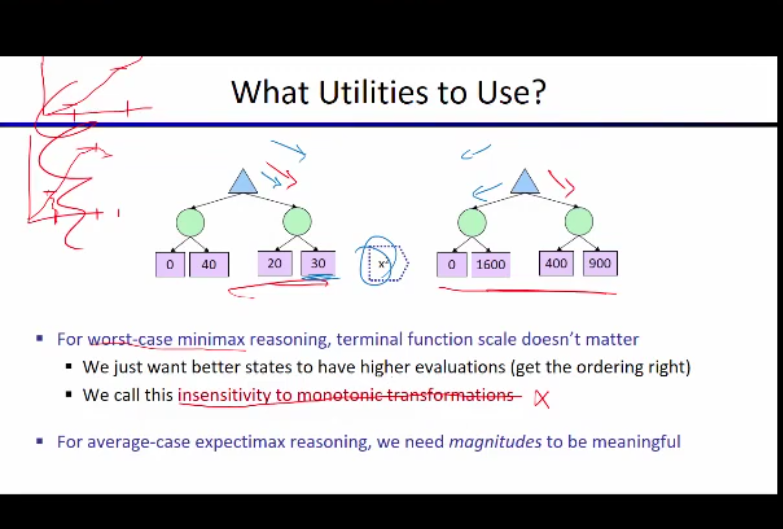

যেখানে আমরা, agent এর utilites(trees) ঠিক মতো বলতে পারতেছি না, যেখানে, agent এর  behaviour বলাটা অনেক কঠিন হবে । এইভাবে হাত, পা নাড়াতে হয়  etc.   

  

 

১টা খাবার পর আমার আস্তে আস্তে utilites কমতে থাকবে কারণ আমার পেট ভরতে থাকবে । যখন, আমার পেট ভরে যাবে তখন আমি যদি জোর করেও আইস্কিম খায়, আমি তেমন বেশি utilites পাবো না কারণ, আমার পেট ভরা। Utilites অনেক complex একটা জিনিস । আমি কোন কাজ করার পর, কেমন খুশি হচ্ছি সেইটায় হচ্ছে আমার utilites। এই complex জিনিসটা বুঝার জন্য আমরা Preferences সম্পকে জানবো । 

 

# `# Preferences `

 

কোন agent এই ধরনের prefference কে follow করলে তাকে rational agent বলে । 

Example: of not a rational agent.

 

 
 

# `#CHAPTER: 04`

 
 

আমাদের কাছে কোন utilites হবে কি না । তার উত্তর দেয় হচ্ছে এই  MEU principle . 

 

# `# MDP:`

আমরা এখন grid world নিয়ে কাজ করবো । যেখানে, আমাদের agent stocastic । আর আমাদের এই agent, grid এর বাইরে যেতে পারে না ।  Stocastic, agent যদি উপরে(north) যেতে চায় তাহলে তার north এ যাওয়ার  posibility 80%, আর left, right যাওয়ার probaility 10% করে । এখন, agent যতক্ষন বেচে থাকবে তখন যে একটা negetative rewarad পাবে,(কারণ আমরা চায় game টা যত তাড়াতাড়ি posible শেষ করবো ) ।  একদম শেষে আমাদের agent big reward  পাবে । And, our goal is maximize the sum of reward.

 

 

boxer মধ্যে box সেই গুলো হলো আমার termination state । এখানে, পৌছালে আমরা just একটায় move নিতে পারবো, সেইটা হলো গেম শেষ করা । 

 

কোন একটা agent এর আমরা current state জানলে তার future state কি হবে তা past state এর উপর নির্ভর করে না । এটা হচ্ছে,  Markov এর meaning । উপরের formula তে, p(S_(t+1) = S`) । এখানে, আমার immediate future state তার আগের state(S_t=s_t) এবং তার আগের action(A_t = a_t) এর উপর নির্ভর করতেছে । কিন্তু, আমি past history ব্যবহার  করতে পারি । If we have the history we can predict the future । কিন্তু আমরা হুট করেই কোন একটা  ঘটনার একটা state থেকে অন্য একটা state এ যেতে চাইলে, তখন যদি আমরা markov ব্যবহার করি, তাহলে সেইটা আমাদের ভালো  result দিবে না । কারণ,  markov এ  past independent করতে চাচ্ছি । যদি আমরা যেই particular ঘটনার শুরু থেকে markov apply করি তাহলে । এর জন্য আমরা বলতেছি, markov means independent of past । 

তুমি মূলত Markov Property-এর ধারণা ব্যাখ্যা করতে চাচ্ছো, এবং তোমার ব্যাখ্যাটা মোটামুটি ঠিক আছে, তবে কিছু জায়গায় আরও স্পষ্টতা প্রয়োজন। আমি একটু পরিষ্কার করে বুঝিয়ে দিচ্ছি।  

### **Markov Property এবং এর অর্থ: **  
Markov Property বলে যে, **"একটি সিস্টেমের ভবিষ্যত অবস্থা (future state) শুধুমাত্র বর্তমান অবস্থা (current state) এবং বর্তমান action-এর উপর নির্ভর করে, অতীতের কোনো ইতিহাস (past history) এর উপর নির্ভর করে না।"**  

এই ধারণাকে সাধারণত নিচেরভাবে প্রকাশ করা হয়:  

$P(S_{t+1} | S_t, A_t, S_{t-1}, A_{t-1}, S_{t-2}, A_{t-2}, ... ) = P(S_{t+1} | S_t, A_t)$

অর্থাৎ, ভবিষ্যত state $S_{t+1}$ নির্ধারিত হয় শুধুমাত্র বর্তমান state $S_t$ এবং বর্তমান action $A_t$ দ্বারা, পূর্বের states বা actions এর কোনো ভূমিকা থাকে না।  

#### `Remember, আমাদের সব প্রবলেম কিন্তু markov না  । আমাদের অনেক প্রবলেম আছে যেইগুলো কে আমরা markov বানিয়ে নিয় । `

 

আমরা , search problem এ দেখেছিলাম pacman plan বানাচ্ছে, এর এইদিকে game environment change  হচ্ছে ।   Plan হচ্ছে sequence of action, আমি এর পর এই কাজ করবো । তারপর এই কাজ করবো । কিন্তু, policies আমি বর্তমানে যেই state  এ আছি । এইটা থেকে কি action নিলে আমার জন্য ভালো হবে । যেইটা, reflex agent করে থাকে , কোন plan বানায় না । 

 

উপরের case গুলো আমরা ভালোভাবে খেলায় করি । আমরা যখন,  s থেকে s` এ যাচ্ছি তখন আমরা present state এর living reward পাচ্ছি R(S)। 1st case, এ আমাদের living reward কম, এর পর আস্তে আস্তে তা বেড়েছে । আমাদের living reward বাড়ার কারনে, agent তার policy change করতেছে । 1st case এ আমাদের একটা short cut road ছিলো কিন্তু আমরা যদি block state চলে যায় । তাহলে আমাদের episod এই খানে শেষ করতে হবে । তাই risk নেওইয়ার চেয়ে long path ফলো করা ভালো । কিন্তু,  4th case এ আমাদের living reward এত বেশি যে, আমাদের agent বেচে থাকার চেয়ে এই episod তাড়াতাড়ি শেষ করেছে -1 reward block এ গিয়ে  । 

 

## [RACING_CAR_EXAMPLE](https://github.com/yasin-arafat-05/jupyterNotebook/blob/main/Reinforcement_learning_Math/01_markove_process_math.md)

এখানে,  গাড়ি যখন warm তখন গাড়ি কি   action নিবে তার উপর ভিত্তি করে আমরা desition নিতে পারি future reward কি হবে । তাই এইটা markov । 

 

# `# Search Trees for MDP:`

**`Expectimax এর মতো আমাদের MDP এর search tree থাকে । যেইটা expectimax এর থেকে একটু আলাদা হয় ।`**

 

আমরা  state S থেকে একট  action নিব । তারপর অন্য একটা state  এ পৌছাবো । অন্য state এ একটা transistion function থাকবে । যেই বলবে আমরা আমাদের বর্তমান  state থেকে অন্য কত গুলো state এ যাওয়ার possibility আছে । 

**আমরা, আমাদের max node থেকে আমরা একটা action নেয় এর ফলে আমরা একটা state এ যায় । যাকে আমরা Q-State বলতেছি । এখন, আমি বামে যাবার জন্য button  press করেছি । কিন্তু, আমাদের এই environment হলো stocastic এর ফলে probility দিয়ে decide হবে আমি  পরবর্তী action শেষে  বামেই পৌছাবো ।** `আমরা যে নতুন state পৌছাচ্ছি তাকে আমরা বলতেছি Q-State । আমরা যে নতুন state পৌছাচ্ছি তাকে আমরা বলতেছি Q-State ।  `

 

### ` আমরা আগে দেখেছিলাম minimax এর expectimax এর search tree  infinitealy grow করতেছে । তো, এর জন্য আমরা dept limited serach, purning দেখেছি  । এখন, MDP এর জন্য আমরা আরেকটা tecnique দেখবো । Utilites of sequence . `

আমরা জানি utilites এমন একটা জিনিস যেইটা আমার agent চায় । এখন, কথা হচ্ছে , agent কে কীভাবে আমরা   utilites  দিব বেশি না কম (Case 1 )। আবার, সমান utilites আসলে আমরা কীভাবে দিব(Case 2) ? 

`We take an assumption that we take the utilites as early as possible.আমরা প্রথমে যে reward পাবো তাকে আমরা weight বেশি দিব । আর, পরের গুলোকে কম reward দিবো একে আমরা discounting বলতেছি । `

এখানে, Discount factor gamma এর মান ০ থেকে ১ এর মধ্যে হবে । আর, set theory তে আমরা এই range গুলো বিভিন্ন ভাবে প্রকাশ করা শিখেছিলাম যা highlight করে দেখানো হয়েছে ।  

 

Let's take an example: 

d থেকে reward 10 ভালো নাকি  1 । যদি আমাদের discount factor 0.1 হয় । সেইটা আমরা calculation করেছি  উপরের ছবিতে । 

gamma এর কোন মানের জন্য, দুই পাশের unility সমান হবে । 

 
 

---
---
--- 

 
 

1. **MDP (Markov Decision Process) দিয়ে RL Problem Formulation**: 
   - Reinforcement Learning (RL) সমস্যাগুলোকে সাধারণত MDP (Markov Decision Process) দিয়ে মডেল করা হয়। MDP হলো একটি গাণিতিক ফ্রেমওয়ার্ক যেখানে একটি এজেন্ট (agent) একটি এনভায়রনমেন্টে (environment) ইন্টারঅ্যাক্ট করে এবং স্টেট (state), অ্যাকশন (action), রিওয়ার্ড (reward), এবং ট্রানজিশন প্রোবাবিলিটি (transition probability) এর মাধ্যমে সমস্যাটি ফর্মুলেট করা হয়।

2. **Bellman Equation**:
   - RL সমস্যার সমাধান করার জন্য Bellman Equation একটি গুরুত্বপূর্ণ গাণিতিক টুল। এটি আমাদেরকে অপটিমাল ভ্যালু ফাংশন (optimal value function) এবং অপটিমাল পলিসি (optimal policy) খুঁজে পেতে সাহায্য করে। Bellman Equation মূলত ডায়নামিক প্রোগ্রামিং (dynamic programming) এর উপর ভিত্তি করে তৈরি।

3. **Real-World Stochasticity**:
   - Pac-Man গেমের মতো সিমুলেটেড এনভায়রনমেন্টে এজেন্টের অ্যাকশনগুলো deterministic  হয়, অর্থাৎ এজেন্ট যদি উপরে যেতে চায়, তাহলে সে উপরে যাবে। কিন্তু,বাস্তবে environment stochastic, অর্থাৎ এজেন্টের অ্যাকশনের ফলাফল অনিশ্চিত হয়। উদাহরণস্বরূপ, একটি রোবট যদি উপরে যেতে চায়, তাহলে তা নানা বাহ্যিক ফ্যাক্টরের কারণে (যেমন ঘর্ষণ, বাতাসের প্রভাব ইত্যাদি) সফল নাও হতে পারে।

4. **RL Solution Approaches**:
   - এই স্টোকাস্টিসিটি (stochasticity) এবং অনিশ্চয়তার কারণে আমরা RL সমস্যার সমাধান করার জন্য তিনটি প্রধান পদ্ধতি ব্যবহার করি:
     - **Value-Based Methods**: এই পদ্ধতিতে আমরা ভ্যালু ফাংশন (value function) অনুমান করার চেষ্টা করি, যেমন Q-Learning বা Deep Q-Networks (DQN)।
     - **Policy-Based Methods**: এই পদ্ধতিতে সরাসরি পলিসি (policy) অনুমান করা হয়, যেমন Policy Gradient methods।
     - **Actor-Critic Methods**: এই পদ্ধতিটি ভ্যালু-বেসড এবং পলিসি-বেসড পদ্ধতির সংমিশ্রণ, যেখানে একটি Actor (পলিসি) এবং একটি Critic (ভ্যালু ফাংশন) একসাথে কাজ করে।

 
 

#  ` # এখন আমরা, Value-Based Methods থেকে যদি DQN  শিখতে চাই যেইটা সবশেষে, Q-Learning এবং নিউরাল নেটওয়ার্কের সংমিশ্রণ। এর আগে আমাদের কিছু জানা থাকা লাগবে । সেগুলো নিচে একটু বিস্তারিত ব্যাখা করা হলোঃ`

 
 

# `# Bellman Equation:`

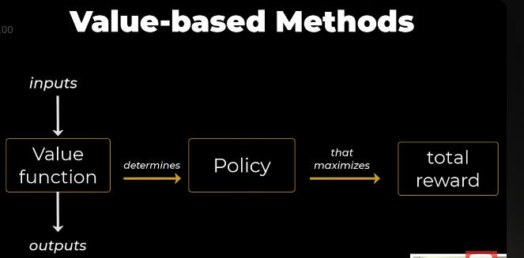

Value-based method এ একটা value function থাকে, value function থেকে আমরা policy determine করি । তারপর সেই Policy আমাদের total reward maximize করে । `Value function এ আমরা input দেই এবং output পাই । input এর  উপর ভিত্তি করে একে দুই ভাগে ভাগ করা হয়েছে ।` 

- State Value Functions V(s)
- State Action Value Functions Q(s,a)

---
**State is the snapshot of the environment.**  
**Action is the decision taken by agent on environment.**

 

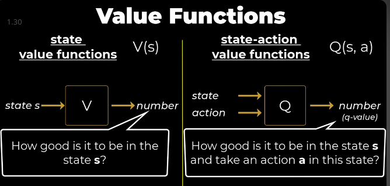

state value funciton একটা state s input হিসেবে নেয় আর output হিসেবে একটা number দেয়। যেইটা বলে দেয় যে, state s এ আমার agent এর কেমন লাগছে । 
অন্যদিকে  state-action value functions Q(s,a) takes state and action as input এবং একটা number output হিসেবে দেয় । যেইটা বলে দেয় যে, state s এ a action নিয়ে আসে আমার agent এর কেমন লাগছে । 

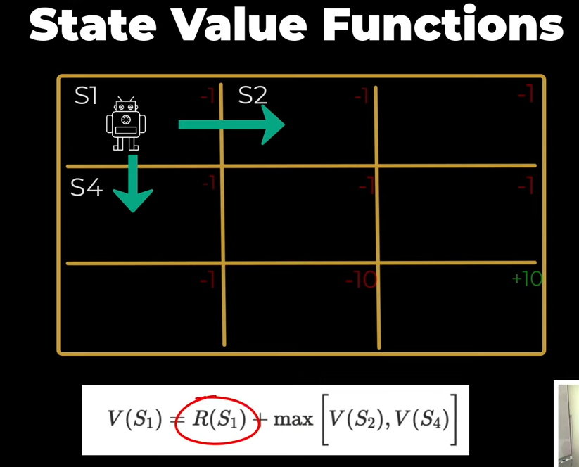

$R(S_1)$ reward when we transition to the state $(S_1)$ plus the maximum future value. But we know, in real world we have stochasticity. Let's introduce stochasticity in the formula, 

 

### 1. **Non-Stochastic Environment**:
   - নন-স্টোকাস্টিক এনভায়রনমেন্টে, এজেন্ট একটি স্টেট s থেকে একটি অ্যাকশন  a  নিলে, পরবর্তী স্টেট s' এবং reward(r) সম্পূর্ণভাবে deterministic হয়।
   - এই ক্ষেত্রে, স্টেট ভ্যালু ফাংশন V(s) এর ফর্মুলা হলো:
     
     $V(s) = R(s) + \max_a V(s')$
     - এখানে:
       - R(s) : স্টেট  s -এ প্রবেশ করার সময় প্রাপ্ত রিওয়ার্ড।
       - $\max_a V(s')$ : পরবর্তী স্টেট s' -এর ভ্যালু, যেখানে  s' নির্ধারিত।

### 2. **Stochastic Envirnoment**:
   - স্টোকাস্টিক এনভায়রনমেন্টে, এজেন্ট একটি স্টেট s থেকে একটি অ্যাকশন  a  নিলে, পরবর্তী স্টেট s' এবং রিওয়ার্ড r অনিশ্চিত (uncertain) হয়। এটি **ট্রানজিশন প্রোবাবিলিটি (transition probability)**  $P(s' \mid s, a)$ দ্বারা নির্ধারিত হয়।
   - এই অনিশ্চয়তা বিবেচনা করে, স্টেট ভ্যালু ফাংশন V(s) এর ফর্মুলা পরিবর্তিত হয়:
     
     $V(s) = R(s) + \max_a \left[ \sum_{s'} P(s' \mid s, a) \cdot V(s') \right]$
     - এখানে:
       - $P(s' \mid s, a)$ : স্টেট s এবং অ্যাকশন a -এর জন্য পরবর্তী স্টেট s' -এ যাওয়ার সম্ভাবনা।
       - $\sum_{s'} P(s' \mid s, a) \cdot V(s')$ : পরবর্তী সম্ভাব্য স্টেটগুলোর ভ্যালুর গড় (expected value)।

`See the MDP in details video that will clear the concept why Transitional probability. `
[link]()

### 3. **Discount factor $\gamma$ **:
   - **ডিসকাউন্ট ফ্যাক্টর $\gamma$** (যেখানে $0 \leq \gamma \leq 1 $) ভবিষ্যৎ রিওয়ার্ডের গুরুত্ব নির্ধারণ করে। এটি এজেন্টকে বর্তমান রিওয়ার্ডকে ভবিষ্যৎ রিওয়ার্ডের চেয়ে বেশি গুরুত্ব দেওয়ার সুযোগ দেয়।
   - ডিসকাউন্ট ফ্যাক্টর যোগ করার পর, স্টেট ভ্যালু ফাংশন \( V(s) \) এর ফর্মুলা হয়:
     $V(s) = R(s) + \max_a \left[ \sum_{s'} P(s' \mid s, a) \cdot \gamma V(s') \right]$
     - এখানে $\gamma V(s')$:  ভবিষ্যৎ স্টেটের ভ্যালুকে ডিসকাউন্ট করে বর্তমান ভ্যালুর সাথে যোগ করা হয়েছে।

### 4. **Joint Probability $p(s', r \mid s, a)$**:
   - স্টোকাস্টিক এনভায়রনমেন্টে, পরবর্তী স্টেট s' এবং রিওয়ার্ড r  উভয়ই অনিশ্চিত। তাই আমরা **যৌথ সম্ভাবনা (joint probability)** $p(s', r \mid s, a)$ ব্যবহার করি, যা স্টেট s  এবং অ্যাকশন  a -এর জন্য পরবর্তী স্টেট s'  এবং রিওয়ার্ড r -এর সম্ভাবনা নির্ধারণ করে।
   - এই যৌথ সম্ভাবনা ব্যবহার করে, অপটিমাল ভ্যালু ফাংশন $v_*(s)$ এর ফর্মুলা হয়:
     $v_*(s) = \max_a \sum_{s', r} p(s', r \mid s, a) \left[ r + \gamma v_*(s') \right]$
     - এখানে:
       - $p(s', r \mid s, a)$: স্টেট s  এবং অ্যাকশন a -এর জন্য পরবর্তী স্টেট  s'  এবং রিওয়ার্ড r -এর যৌথ সম্ভাবনা।
       -  $r + \gamma v_*(s')$ : বর্তমান রিওয়ার্ড r এবং ডিসকাউন্টেড ভবিষ্যৎ ভ্যালু $\gamma v_*(s')$ -এর যোগফল।

### 6. **কেন এই পরিবর্তন?**
   - **নন-স্টোকাস্টিক এনভায়রনমেন্ট**-এ সবকিছু নির্ধারিত, তাই ফর্মুলা সরল।
   - **স্টোকাস্টিক এনভায়রনমেন্ট**-এ অনিশ্চয়তা (uncertainty) যোগ হয়, তাই আমরা সম্ভাবনা (probability) এবং এক্সপেক্টেড ভ্যালু (expected value) ব্যবহার করি।
   - **ডিসকাউন্ট ফ্যাক্টর $\gamma$** যোগ করার মাধ্যমে আমরা ভবিষ্যৎ রিওয়ার্ডের গুরুত্ব কমিয়ে বর্তমান রিওয়ার্ডকে বেশি গুরুত্ব দিই।
   - **যৌথ সম্ভাবনা $p(s', r \mid s, a)$** ব্যবহার করার মাধ্যমে আমরা পরবর্তী স্টেট এবং রিওয়ার্ডের অনিশ্চয়তা একসাথে বিবেচনা করি।

 

 

### 1. **নন-স্টোকাস্টিক (Deterministic) এনভায়রনমেন্ট**:
   - নন-স্টোকাস্টিক এনভায়রনমেন্টে, এজেন্ট একটি স্টেট s  থেকে একটি অ্যাকশন a নিলে, পরবর্তী স্টেট s' এবং রিওয়ার্ড r  সম্পূর্ণভাবে নির্ধারিত (deterministic) হয়।
   - এই ক্ষেত্রে, **স্টেট-অ্যাকশন ভ্যালু ফাংশন $Q(s, a)$** এর ফর্মুলা হলো:
     
     $Q(s, a) = R(s, a) + \max_{a'} Q(s', a')$
     - এখানে:
       - $R(s, a)$ : স্টেট s -এ অ্যাকশন a -এর জন্য প্রাপ্ত রিওয়ার্ড।
       - $\max_{a'} Q(s', a')$ : পরবর্তী স্টেট s' -এ সর্বোচ্চ সম্ভাব্য অ্যাকশন a' -এর ভ্যালু।

### 2. **স্টোকাস্টিক (Stochastic) এনভায়রনমেন্ট**:
   - স্টোকাস্টিক এনভায়রনমেন্টে, এজেন্ট একটি স্টেট s থেকে একটি অ্যাকশন a  নিলে, পরবর্তী স্টেট s' এবং রিওয়ার্ড  r  অনিশ্চিত (uncertain) হয়। এটি **ট্রানজিশন প্রোবাবিলিটি (transition probability)** $P(s' \mid s, a)$ দ্বারা নির্ধারিত হয়।
   - এই অনিশ্চয়তা বিবেচনা করে, **স্টেট-অ্যাকশন ভ্যালু ফাংশন $Q(s, a)$** এর ফর্মুলা পরিবর্তিত হয়:
    
     $Q(s, a) = R(s, a) + \sum_{s'} P(s' \mid s, a) \cdot \max_{a'} Q(s', a')$
     - এখানে:
       - $P(s' \mid s, a)$ : স্টেট s এবং অ্যাকশন a -এর জন্য পরবর্তী স্টেট  s' -এ যাওয়ার সম্ভাবনা।
       - $\max_{a'} Q(s', a')$: পরবর্তী স্টেট s' -এ সর্বোচ্চ সম্ভাব্য অ্যাকশন  a' -এর ভ্যালু।

### 3. **ডিসকাউন্ট ফ্যাক্টর $\gamma$**:
   - **ডিসকাউন্ট ফ্যাক্টর $\gamma$** (যেখানে  $0 \leq \gamma \leq 1$ ভবিষ্যৎ রিওয়ার্ডের গুরুত্ব নির্ধারণ করে। এটি এজেন্টকে বর্তমান রিওয়ার্ডকে ভবিষ্যৎ রিওয়ার্ডের চেয়ে বেশি গুরুত্ব দেওয়ার সুযোগ দেয়।
   - ডিসকাউন্ট ফ্যাক্টর যোগ করার পর, **স্টেট-অ্যাকশন ভ্যালু ফাংশন $Q(s, a)$** এর ফর্মুলা হয়:
     $Q(s, a) = R(s, a) + \sum_{s'} P(s' \mid s, a) \cdot \gamma \max_{a'} Q(s', a')$
     - এখানে $\gamma \max_{a'} Q(s', a')$: ভবিষ্যৎ স্টেটের ভ্যালুকে ডিসকাউন্ট করে বর্তমান ভ্যালুর সাথে যোগ করা হয়েছে।

### 4. **Joint Probability $p(s', r \mid s, a)$**:
   - স্টোকাস্টিক এনভায়রনমেন্টে, পরবর্তী স্টেট s' এবং রিওয়ার্ড r উভয়ই অনিশ্চিত। তাই আমরা **যৌথ সম্ভাবনা (joint probability)** $p(s', r \mid s, a)$ ব্যবহার করি, যা স্টেট s এবং অ্যাকশন a -এর জন্য পরবর্তী স্টেট s' এবং রিওয়ার্ড r -এর সম্ভাবনা নির্ধারণ করে।
   - এই যৌথ সম্ভাবনা ব্যবহার করে, **স্টেট-অ্যাকশন ভ্যালু ফাংশন $Q(s, a)$** এর ফর্মুলা হয়:
    $Q(s, a) = \sum_{s', r} p(s', r \mid s, a) \left[ r + \gamma \max_{a'} Q(s', a') \right]$
     - এখানে:
       - $p(s', r \mid s, a)$ : স্টেট s  এবং অ্যাকশন a -এর জন্য পরবর্তী স্টেট s' এবং রিওয়ার্ড r -এর যৌথ সম্ভাবনা।
       - $r + \gamma \max_{a'} Q(s', a')$ : বর্তমান রিওয়ার্ড  r এবং ডিসকাউন্টেড ভবিষ্যৎ ভ্যালু $\gamma \max_{a'} Q(s', a')$ -এর যোগফল।

### 5. **কেন এই পরিবর্তন?**
   - **নন-স্টোকাস্টিক এনভায়রনমেন্ট**-এ সবকিছু নির্ধারিত, তাই ফর্মুলা সরল।
   - **স্টোকাস্টিক এনভায়রনমেন্ট**-এ অনিশ্চয়তা (uncertainty) যোগ হয়, তাই আমরা সম্ভাবনা (probability) এবং এক্সপেক্টেড ভ্যালু (expected value) ব্যবহার করি।
   - **ডিসকাউন্ট ফ্যাক্টর $\gamma$** যোগ করার মাধ্যমে আমরা ভবিষ্যৎ রিওয়ার্ডের গুরুত্ব কমিয়ে বর্তমান রিওয়ার্ডকে বেশি গুরুত্ব দিই।
   - **যৌথ সম্ভাবনা $p(s', r \mid s, a)$** ব্যবহার করার মাধ্যমে আমরা পরবর্তী স্টেট এবং রিওয়ার্ডের অনিশ্চয়তা একসাথে বিবেচনা করি।

 

# `# Temporal Difference:`

## `আমরা temporal difference দিয়ে, bellman equation কে কাজে লাগিয়ে একটা agent এর জন্য  state value function এর মান গুলো বের করবো ।`

Value-Based Methods-এ Bellman Equation এবং Temporal Difference (TD) Learning উভয়ই ব্যবহার করা হয়।
**Temporal Difference Learning is a method that value-based reinforcement learning algorithms, use to iteratively learn state value functions or state-action value functions.**

### 1. **Temporal Difference (TD) Learning কি?**
   - **TD Learning** হলো Reinforcement Learning (RL)-এর একটি অ্যালগরিদম, যা এজেন্টকে প্রতিটি টাইম স্টেপে (time step) ভ্যালু ফাংশন (Value Function) বা Q-ফাংশন (Q-Function) আপডেট করতে সাহায্য করে।
   - এটি **Bellman Equation**-এর উপর ভিত্তি করে কাজ করে এবং **বুটস্ট্র্যাপিং (bootstrapping)** ব্যবহার করে, অর্থাৎ এজেন্ট তার বর্তমান ভ্যালু অনুমানকে আপডেট করার জন্য ভবিষ্যৎ ভ্যালুর অনুমান ব্যবহার করে।
   - TD Learning-এর মূল উদ্দেশ্য হলো ভ্যালু ফাংশন বা Q-ফাংশনকে এমনভাবে আপডেট করা যাতে এটি **Total Expected Reward**-কে ম্যাক্সিমাইজ করে।

### 2. **TD Learning-এর মূল ধারণা**:
   - TD Learning এজেন্টকে প্রতিটি টাইম স্টেপে একটি **TD Error** গণনা করতে সাহায্য করে, যা হলো বর্তমান ভ্যালু অনুমান এবং TD টার্গেট (target) এর মধ্যে পার্থক্য।
   - **TD Error**-এর ফর্মুলা হলো:
     $\text{TD Error} = R_{t+1} + \gamma V(S_{t+1}) - V(S_t)$
     - এখানে:
       - $R_{t+1}$: পরবর্তী টাইম স্টেপে প্রাপ্ত রিওয়ার্ড।
       - $\gamma$ : ডিসকাউন্ট ফ্যাক্টর (ভবিষ্যৎ রিওয়ার্ডের গুরুত্ব নির্ধারণ করে)।
       - $V(S_{t+1})$ : পরবর্তী স্টেটের ভ্যালু অনুমান।
       - $V(S_t)$ : বর্তমান স্টেটের ভ্যালু অনুমান।
       - **V(s) State Value Function, উপরে আমরা, non-stochastic, stochastic and এর জন্য bellman eqution দেখেছিলাম তার সব গুলো প্রযোয্য ।**

   - এই TD Error ব্যবহার করে, এজেন্ট তার ভ্যালু ফাংশনকে আপডেট করে:
     $V(S_t) \leftarrow V(S_t) + \alpha \cdot \text{TD Error}$
     - এখানে $\alpha$ হলো লার্নিং রেট (learning rate)।

 

# 3. **Example of Temporal Difference :**

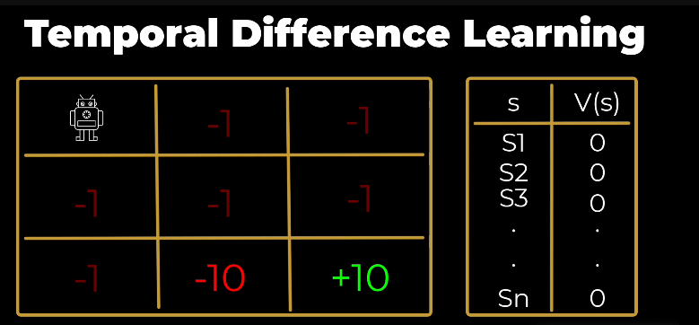

   - আপনার টেবিলে একটি স্টেট $S_1$ এবং তার ভ্যালু $V(S_1)$ দেওয়া আছে। এখানে  $V(S_1)$ হলো স্টেট $S_1$ -এর ভ্যালু অনুমান।
   - টেবিলে কিছু রিওয়ার্ড (-1, -1, -1, -10, +10) দেওয়া আছে, যা এজেন্ট বিভিন্ন টাইম স্টেপে পেতে পারে।
   - পাশের টেবিলটা হচ্ছে  state value function . 
 

ধরা যাক, এজেন্ট স্টেট $S_1$ -এ আছে এবং পরবর্তী স্টেটে যাওয়ার সময় রিওয়ার্ড $R(S_2) = -1$ পায়। তারপর এজেন্ট পরবর্তী স্টেটের ভ্যালু $V(S_2)$ ব্যবহার করে TD Error গণনা করে এবং তার ভ্যালু ফাংশন  $V(S_1)$ কে আপডেট করে।

`উপরের ছবিতে,এজেন্ট স্টেট $S_1$ -এ আছে এবং পরবর্তী স্টেটে যাওয়ার সময়,  আমরা প্রথমে, $V(S_1)_observed$ = R(S2) + V(S2) যেখানে, state 2 এর মান পাশের টেবিলে দেওয়া আছে । আর শুরুতে আমরা সব ভ্যালু গুলো শূন্য ধরে নিয়েছি । `

-  এর পর আমরা উপরের মতো, Temporal difference error বের করবো । 

- state 1 থেকে state 2 তে আসার ফলে, V(s1) state 1 এর ভ্যালু change হবে । আর, এই value উপরের মতো হবে । যেখানে, $\alpha$ হলো  learning rate . 

`আমরা একটা time step এর জন্য agent তার state value function update করলো । এইভাবে যদি +10 reward পেয়ে যায় তখন, আমার একটা episoid complete হবে । এইভাবে multiple episod এর জন্য আমরা state value function এর মান বের করে update করবো, যেই পযন্ত না state value function গুলো stable হচ্ছে । এরপর এই value গুলোকে কাজে লাগিয়ে আমাদের agent, policy make করে decetion নিয়ে তার প্রবলেম solve করে ।   । `

### 5. **TD Learning-এর সুবিধা**:
   - **অনলাইন লার্নিং**: TD Learning এজেন্টকে প্রতিটি টাইম স্টেপে আপডেট করতে সাহায্য করে, সম্পূর্ণ এপিসোড শেষ হওয়ার আগেই।
   - **কম ভ্যারিয়েন্স**: Monte Carlo Methods-এর চেয়ে TD Learning-এর ভ্যারিয়েন্স কম, কারণ এটি প্রতিটি টাইম স্টেপে আপডেট করে।
   - **বুটস্ট্র্যাপিং**: TD Learning ভবিষ্যৎ ভ্যালুর অনুমান ব্যবহার করে, যা এটিকে দ্রুত শেখার সুযোগ দেয়।

 
 

# `# Q-learning: `

## `আমরা temporal difference দিয়ে, bellman equation কে কাজে লাগিয়ে একটা agent এর জন্য  state value function এর মান গুলো বের করেছিলাম । আর, bellman equation এ আমরা, state value function and state action value function পড়েছিলাম । আমরা এখন, Q-learning এ state action value function বা q-value এর এর মান বের করবো । `

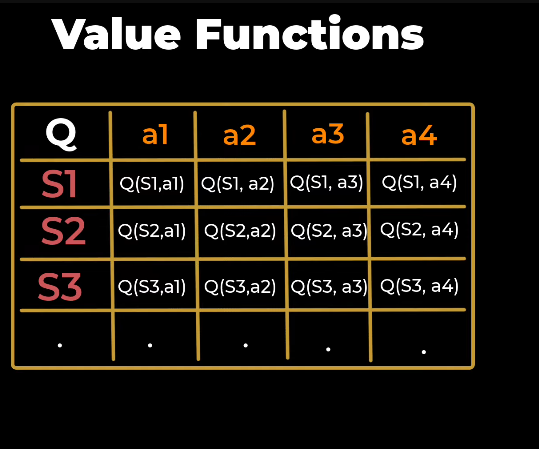

- We can image the q-values of an enviroment like a matrix, where in column we represtion, a state and in row we represent an action . And the cell value represent the Q-Value for that given state and action . 

## `Let consider a grid world:` 

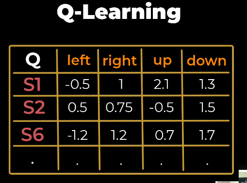

`আমাদের agent এর target হচ্ছে, best possible way তে +10 reward collect করা । বা আমরা চাচ্ছি, আমাদের agent একটা optimum policy শিখুক। আমরা যাকে target policy বলতেছি । target policy বের করার জন্য আমাদের কাছে একটা Q-table আছে  ।  Q-table এর ভ্যালু গুলোকে আমরা (Arbitrary Value হলো গণিতে একটি ইচ্ছামূলক মান) দিয়ে পূরণ করেছি । অথবা,  অন্য কোন agent আগে যদি আমাদের এই environment visit করে থাকে, তার ভ্যালু গুলো পূরণ করা হয়েছে ।  `

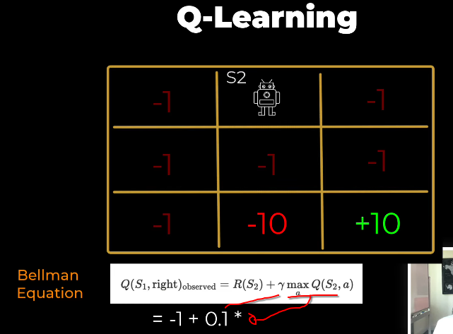
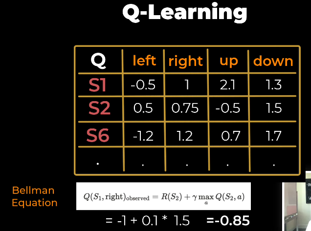

$\gamma \max_{a} Q(s2, a)$ discounted maxmimum Q-value from the State6. 

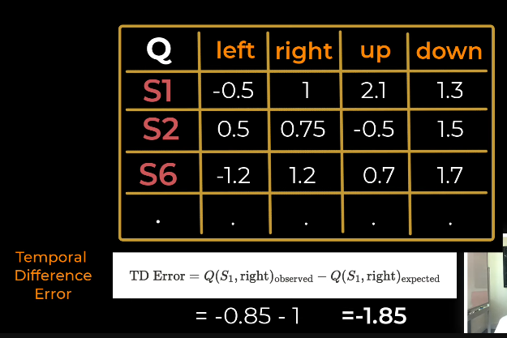
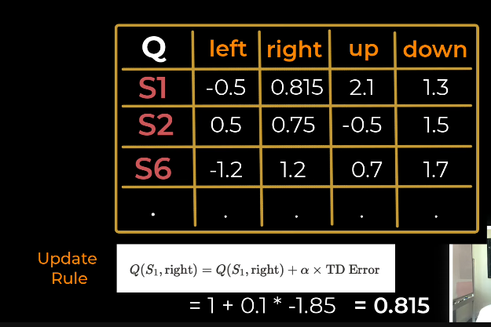

`TimeStep: 1 is done !. এইভাবে যদি +10 reward পেয়ে যায় তখন, আমার একটা episoid complete হবে । এইভাবে multiple episod এর জন্য আমরা state action value function এর মান বের করে update করবো, যেই পযন্ত না  value action value function গুলোর মান stable হচ্ছে । এখানে, Target Policy হচ্ছে যেইটা আমরা শিখতেছি । আর, behavior policy হচ্ছে সেই policy যা দিয়ে agent, target policy learn করতেছে । `

 

# `Q-learning is an off-policy algorithrm.`

আমরা q-learning দেখেছিলাম, দুইধরনের policy আছে, একটা behavior policy and target policy । OFF-POLICY is the type of algorithrm where  BEHAVIOR POLICY is different from TARGET POLICY. BUT IN ON-POLICY they are same. 

**Why Q-learning is an off-policy algorithrm?**

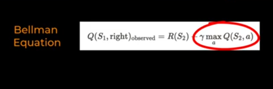

Bellman Equation এ আমরা maximum বের করেছি  । আমরা, target policy চাচ্ছে আমি যেন  maximum Q value যেদিকে পাবো সেইদিকেই যাবো ।  কিন্তু, behavior policy দিয়ে আমরা environment terverse করতেছি । 

এখানে, 
- target policy  হচ্ছে greedy ।  
অন্যদিকে, 
- Behavior policy  হতে পারে random, e-greedy, greedy 

# `# SARSA: `

**If we apply q-learning with on-policy then it is called SARSA.**

**Summary:**
- Policy is a function that maps a state to action.
- Q-learning is an RL algorithm that learns a policy that maximizes total reward.
- Behavior Policy is used to take actions in environment.
- Target Policy is used to optimize decision making.
- Off Policy RL Algorithms can have different ehavior and target policies. They can decouple data collection and training.
- Off Policy RL Algorithms has the same policy for behavior and target policies. The agent takes actions and learns using the same policy.

 
 

# `# Monte Carlo in Reinforcement Learning:`

 

Monte carlo methods use simulations solve problems that may e difficult or impossible to solve analytically. 

### [see_this_video](https://www.youtube.com/watch?v=7ESK5SaP-bc)

keypoints from this video:
- Unbias
- Bias

Monte Carlo Technique হলো একটি সম্ভাবনাভিত্তিক গণনামূলক পদ্ধতি যেটি random sampling এবং পরিসংখ্যান (statistics) ব্যবহার করে বিভিন্ন জটিল সমস্যার সমাধান করে। এই পদ্ধতির নামকরণ করা হয়েছে মোনাকোর বিখ্যাত ক্যাসিনো শহরের নামানুসারে, কারণ এতে randomness বা সম্ভাবনার ব্যবহার রয়েছে, যা জুয়া বা গেমিং-এর সাথে সম্পর্কিত।

**Advantage**                 **Disadvantage**
1. Versatile                   1. Computational Expensive

**Monte Carlo Technique used in RL mainly based on two purpouse:**
- Evaluate a policy 
- Imporove a policy 

