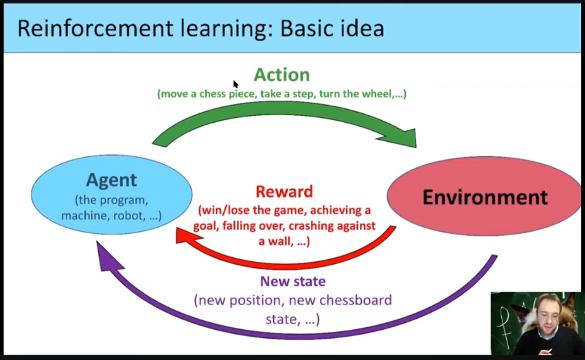
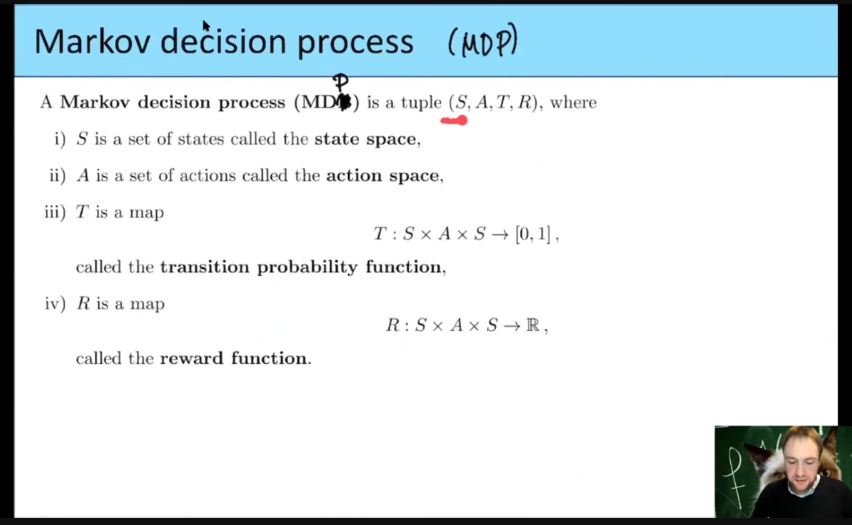
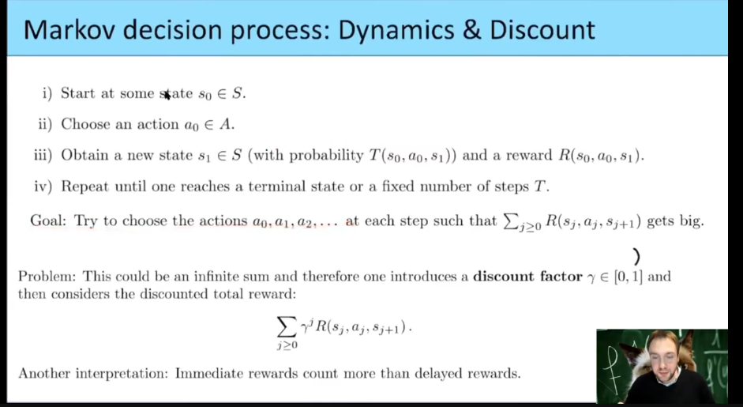
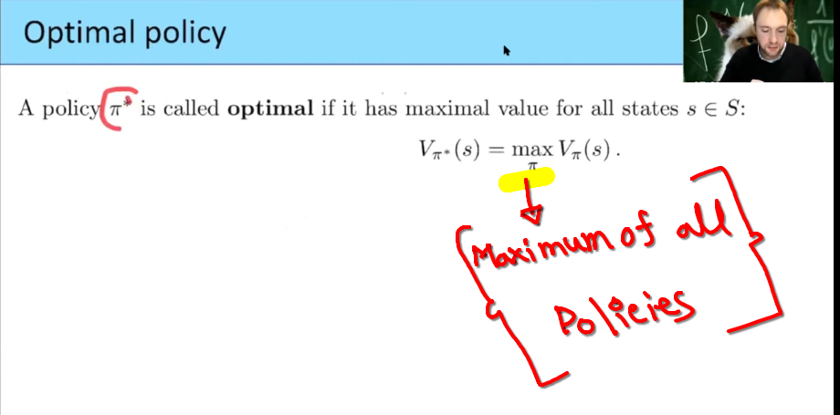

 
 

 
 

### **Markov Decision Process: Dynamics & Discount (ব্যাখ্যা)**  

এই ছবিটি **Markov Decision Process (MDP)**-এর **ডায়নামিক্স এবং ডিসকাউন্ট ফ্যাক্টর (γ)** ব্যাখ্যা করছে।  

### **ধাপগুলো বিশ্লেষণ**  

1️⃣ **শুরু (Initial State):**  
   - এজেন্ট (Agent) **s₀** নামের একটি স্টেট থেকে শুরু করে, যা **S (State Space)**-এর অংশ।  

2️⃣ **অ্যাকশন নির্বাচন (Choosing an Action):**  
   - এজেন্ট **a₀** নামের একটি অ্যাকশন নেয়, যা **A (Action Space)**-এর অংশ।  

3️⃣ **নতুন স্টেটে পরিবর্তন (State Transition):**  
   - এজেন্ট **s₁** নামের একটি নতুন স্টেটে চলে যায়, যা **S**-এর মধ্যেই আছে।  
   - এই পরিবর্তন একটি **Transition Probability** দ্বারা নির্ধারিত হয়:  
     T(s₀, a₀, s₁)

   - নতুন স্টেটে যাওয়ার সময় এজেন্ট কিছু **পুরস্কার (Reward)** পায়:  
     R(s₀, a₀, s₁)

4️⃣ **প্রক্রিয়া চলতে থাকে (Repeat Until Termination):**  
   - এই চক্র (loop) চলতে থাকে যতক্ষণ না এজেন্ট একটি **Terminal State**-এ পৌঁছে বা নির্দিষ্ট সংখ্যক ধাপ **T** পূর্ণ হয়।  

### **গোল (Goal of the Agent)**  
এজেন্ট এমনভাবে **a₀, a₁, a₂, ...** অ্যাকশন নেবে, যাতে তার মোট পুরস্কার সর্বোচ্চ হয়:  

$\sum_{j \geq 0} R(s_j, a_j, s_{j+1})$
অর্থাৎ, এজেন্ট ভবিষ্যতে যত বেশি পুরস্কার পাবে, তার জন্য তত ভালো সিদ্ধান্ত নিতে চায়।  

### **সমস্যা (Problem of Infinite Sum)**  
- এখানে একটি সমস্যা হলো, এই **পুরস্কারের যোগফল অসীম (infinite sum) হতে পারে**।  
- তাই, ভবিষ্যতের পুরস্কারকে ধাপে ধাপে **কমিয়ে আনা (discounted)** হয়।  
- এক্ষেত্রে **Discount Factor (γ)** ব্যবহার করা হয়, যা **0 থেকে 1** এর মধ্যে থাকে।  

### **Discounted Total Reward ফর্মুলা**  

$\sum_{j \geq 0} \gamma^j R(s_j, a_j, s_{j+1})$

এখানে,  
✅ **γ (Discount Factor)** → 0 এবং 1 এর মধ্যে একটি মান, যা ভবিষ্যতের পুরস্কারের গুরুত্ব ঠিক করে।  
✅ **γ বেশি হলে (γ ≈ 1)** → এজেন্ট ভবিষ্যতের পুরস্কারকে বেশি গুরুত্ব দেবে।  
✅ **γ কম হলে (γ ≈ 0)** → এজেন্ট শুধুমাত্র তাৎক্ষণিক পুরস্কারকে গুরুত্ব দেবে।  

### **উদাহরণ (Example)**  
ধরি, একজন স্টুডেন্ট প্রতিদিন পড়াশোনা করলে **ভবিষ্যতে ভালো চাকরি পাবে (High Reward in Future)**।  
- যদি সে **শুধু বর্তমান আরাম দেখে (γ ≈ 0)**, তাহলে পড়াশোনায় ফোকাস করবে না।  
- যদি সে **ভবিষ্যতের লাভ দেখে (γ ≈ 1)**, তাহলে দীর্ঘমেয়াদী লাভের জন্য পরিশ্রম করবে।  

### **সংক্ষেপে:**  
✅ **Markov Decision Process (MDP)** এজেন্টের **অ্যাকশন এবং রিওয়ার্ড** নির্ধারণ করে।  
✅ **Transition Probability** বলে দেয়, এক স্টেট থেকে অন্য স্টেটে যাওয়ার সম্ভাবনা।  
✅ **Discount Factor (γ)** ভবিষ্যতের পুরস্কারের গুরুত্ব নির্ধারণ করে।  
✅ **γ ≈ 1 হলে** এজেন্ট দীর্ঘমেয়াদী সিদ্ধান্ত নেয়, **γ ≈ 0 হলে** তাৎক্ষণিক পুরস্কারকে গুরুত্ব দেয়।  

### **γ (গামা) এবং j কী?**  

#### **γ (গামা) কী?**  
গামা $\gamma$ হল **discount factor** (ছাড়ের হার), যা নির্ধারণ করে ভবিষ্যতের পুরস্কার (reward) বর্তমানের তুলনায় কতটা গুরুত্বপূর্ণ হবে।  

- **$\gamma$ এর মান 0 থেকে 1 এর মধ্যে থাকে $0 \leq \gamma \leq 1$**  
- যদি **$\gamma$ বেশি হয় $\gamma \approx 1$**, তাহলে ভবিষ্যতের পুরস্কারকে বর্তমানের মতোই গুরুত্বপূর্ণ ধরা হয়।  
- যদি **$\gamma$ কম হয় $\gamma \approx 0$**, তাহলে ভবিষ্যতের পুরস্কারকে কম গুরুত্বপূর্ণ ধরা হয় এবং তা দ্রুত হারিয়ে যায়।  

#### **j কী?**  
**j হলো টাইম স্টেপ (Time Step) বা পর্যায়**। এটি নির্দেশ করে **কত নম্বর সময়ে পুরস্কার (reward) পাওয়া হচ্ছে**।  

- j = 0 → প্রথম সময়ের পুরস্কার (immediate reward) → **$\gamma^0 = 1$** (কোন ছাড় নেই)  
- j = 1  → পরের সময়ের পুরস্কার → **$\gamma^1$** দ্বারা ছাড় প্রাপ্ত  
- j = 2  → তার পরের সময়ের পুরস্কার → **$\gamma^2$** দ্বারা ছাড় প্রাপ্ত  
- j = 3  → আরও পরের পুরস্কার → **$\gamma^3$** দ্বারা ছাড় প্রাপ্ত  
- এইভাবে **প্রত্যেক ধাপে পুরস্কারের মূল্য কমতে থাকে**  

#### **কেন γ^j ব্যবহার করা হয়?**  
আমরা ডিসকাউন্ট করা টোটাল রিওয়ার্ড (Discounted Total Reward) হিসাব করি:  

$\sum_{j \geq 0} \gamma^j R(s_j, a_j, s_{j+1})$

এখানে:  
✅ **$\gamma^j$ ভবিষ্যতের পুরস্কারকে ধাপে ধাপে ছোট করে দেয়**, যাতে পুরস্কারের অবদান ধীরে ধীরে কমতে থাকে।  
✅ **j যত বড় হয়, $\gamma^j$ তত ছোট হয়**, অর্থাৎ অনেক দূরের পুরস্কার কম গুরুত্বপূর্ণ হয়ে যায়।  
✅ **এটি ইনফিনিট (অসীম) রিওয়ার্ড অ্যাকুমুলেশন রোধ করে**, যাতে রিওয়ার্ডের হিসাব সীমিত থাকে।  

---

#### **উদাহরণ**  
ধরুন, প্রতিটি ধাপে এজেন্ট **১০ পয়েন্ট** পুরস্কার পাচ্ছে, এবং **গামা $\gamma$ = ০.৯**। তাহলে:  

$R_{total} = 10 \times (0.9^0) + 10 \times (0.9^1) + 10 \times (0.9^2) + 10 \times (0.9^3)$ + ...

= 10 + 9 + 8.1 + 7.29 + 6.56 + ...

এখানে দেখা যাচ্ছে যে, **পুরস্কারের পরিমাণ ধাপে ধাপে কমছে কারণ $\gamma^j$ ছোট হয়ে যাচ্ছে**।

 

---

 

---

 

### **পলিসি $\pi$ কীভাবে এলো এবং কেন দরকার?**  

#### **📌 ১. আগের ফর্মুলা কী ছিল এবং এতে কী বোঝানো হয়েছে?**  
আগের ফর্মুলাটি ছিল—  

$\sum_{j \geq 0} \gamma^j R(s_j, a_j, s_{j+1})$

- **এই ফর্মুলা বলে, যদি আমরা \(s_0\) থেকে শুরু করি, তাহলে মোট কত পুরস্কার (reward) আশা করা যায়।**  

কিন্তু সমস্যা হলো, **এজেন্ট কীভাবে অ্যাকশন নেবে, সেটি এখানে নির্ধারণ করা হয়নি!**  

#### **📌 ২. তাহলে পলিসির $\pi$ দরকার কেন?**  
আমরা জানি, **reinforcement learning-এর মূল কাজ হলো সঠিক অ্যাকশন নেওয়া, যাতে সর্বোচ্চ পুরস্কার পাওয়া যায়।** কিন্তু আগের ফর্মুলায় action $a_j$ কীভাবে নেওয়া হবে, তা বলা হয়নি।  

এজেন্টকে যদি **একটি নির্দিষ্ট নিয়ম অনুসারে অ্যাকশন নিতে বলা হয়**, তাহলে সেটাই **পলিসি (Policy, $\pi$**!  

$\pi : S \rightarrow A$

মানে, **পলিসি একটি ফাংশন, যা বলে দেয় প্রতিটি state-এ কোন action নেওয়া হবে।**  

যেমনঃ  
- যদি **s = ক্ষুধার্ত (hungry)** হয়, তাহলে **$\pi(s)$ = খাও (eat)**।  
- যদি **s = ট্রাফিক লাইট লাল (red light)** হয়, তাহলে **$\pi(s)$ = দাঁড়াও (stop)**।  

📌 **সোজা ভাষায়, পলিসি হলো এমন একটি নিয়ম, যা state অনুযায়ী action নির্ধারণ করে।**  

#### **📌 ৩. পলিসির জন্য নতুন ফর্মুলা কী?**  

যেহেতু পলিসি **প্রতিটি state-এর জন্য action নির্ধারণ করে**, তাই আগের ফর্মুলাকে আপডেট করে **policy-based equation** বানানো হয়—  

$V_{\pi}(s) = E \left[ \sum_{j \geq 0} \gamma^j R(s_j, \pi(s_j), s_{j+1}) | s_0 = s \right]$

এখানে,  
- **$\pi(s_j)$** → এখন আমরা আলাদা করে action $a_j$ লিখছি না, কারণ **পলিসি আগে থেকেই বলে দিচ্ছে, প্রতিটি state-এ কোন action নিতে হবে!**  
- **$V_{\pi}(s)$** → এর মানে, **এই নির্দিষ্ট policy $\pi$ অনুসরণ করলে, state (s) থেকে শুরু করে মোট কত পুরস্কার (reward) পাওয়া যাবে**।  

📌 **মূল পার্থক্য:**  
- আগের ফর্মুলায় action ছিল **$a_j$**, যেটি আমরা নিজেরা ঠিক করিনি।  
- এখন **$a_j = \pi(s_j)$**, মানে **policy স্বয়ংক্রিয়ভাবে action নির্ধারণ করছে।**  
 
 

# `## Conditional Expectation (E) vs Conditional Probability (P):`

`In the formula:`

P(A | B) = $\text{B ঘটেছে, তখন A ঘটার সম্ভাবনা}$
এখন, আমাদের ফর্মুলাটি:  

$E \left[ \sum_{j \geq 0} \gamma^j R(s_j, \pi(s_j), s_{j+1}) \mid s_0 = s \right]$

এখানে, **" $\mid s_0 = s$ "** অংশটা আসলে শর্ত (condition) বোঝাচ্ছে। তাই আমরা বলতে পারি,  

📌 **আমরা এমন প্রত্যাশিত মান (Expected Value) বের করছি যেখানে $s_0 = s $ এই শর্তটি মেনে নেওয়া হয়েছে।**  

# **📌 তাহলে, এখানে শর্তাধীন সম্ভাবনার (Conditional Probability) সম্পর্ক কী?**  

## **✅ শর্তাধীন প্রত্যাশা (Conditional Expectation) বনাম শর্তাধীন সম্ভাবনা (Conditional Probability)**
 
Reinforcement Learning (RL)-এ আমরা মূলত **শর্তাধীন প্রত্যাশা** ব্যবহার করি, কিন্তু এর পিছনে **শর্তাধীন সম্ভাবনার** ধারণা রয়েছে।  

### **🔹 শর্তাধীন সম্ভাবনা (Conditional Probability)**

P(A | B) = $\frac{P(A \cap B)}{P(B)}$
🔹 এটি বোঝায় যে, **B ঘটনা ঘটে গেছে, তখন A ঘটার সম্ভাবনা কত?**  
🔹 Reinforcement Learning-এ **পরবর্তী স্টেটে যাওয়ার সম্ভাবনা** বোঝাতে ব্যবহার করা হয়।  
🔹 উদাহরণ:  
   - তুমি যদি এখন **$s_t$** স্টেটে থাকো এবং **$a_t$** অ্যাকশন নাও, তাহলে **পরবর্তী স্টেটে $s_{t+1}$ যাওয়ার সম্ভাবনা কত?**  
   - অর্থাৎ, $P(s_{t+1} | s_t, a_t)$

### **🔹 শর্তাধীন প্রত্যাশা (Conditional Expectation)**

$E[X | Y] = \sum_{x} x P(X = x | Y)$
🔹 এটি বলে যে, **Y ঘটে যাওয়ার পর X এর গড় মান (expected value) কত?**  
🔹 Reinforcement Learning-এ **ভ্যালু ফাংশন** নির্ধারণে ব্যবহার করা হয়।  
🔹 উদাহরণ:  
   - যদি $s_0$ = s  ঘটে থাকে, তাহলে **ভবিষ্যতে প্রাপ্ত সমস্ত পুরস্কারের গড় মান** কী হবে?  
   - অর্থাৎ,  
     
    $V_\pi(s) = E \left[ \sum_{j \geq 0} \gamma^j R(s_j, \pi(s_j), s_{j+1}) \mid s_0 = s \right]$
   - এখানে **$s_0 = s$** ধরে নিয়ে ভবিষ্যৎ পুরস্কারের প্রত্যাশিত মান বের করা হচ্ছে।  

## **✅ Reinforcement Learning-এ Policy নির্ধারণের সূত্র**
### **📌 Policy $\pi$ মানে কী?**  
🔹 Policy হলো একটি ফাংশন যা বলে **"প্রত্যেক স্টেটে কোন অ্যাকশন নেওয়া উচিত?"**  
🔹 অর্থাৎ,  

   $\pi : S \to A$
   **যেখানে,**  
   - S = স্টেট স্পেস  
   - A = অ্যাকশন স্পেস  

### **📌 Policy নির্ধারণের ফর্মুলা**
$V_\pi(s) = E \left[ \sum_{j \geq 0} \gamma^j R(s_j, \pi(s_j), s_{j+1}) \mid s_0 = s \right]$

🔹 **এখানে:**  
   -  $V_\pi(s)$ = **স্টেট s-এ থাকার মান (value function)**  
   - **$E[\cdot]$** = **প্রত্যাশিত মান (Expectation)**  
   - **$\gamma^j$** = **ডিসকাউন্ট ফ্যাক্টর** (ভবিষ্যতের রিওয়ার্ডের গুরুত্ব কমানোর জন্য)  
   - **$R(s_j, \pi(s_j), s_{j+1})$** = **বর্তমান রিওয়ার্ড**  
   - **$\pi(s_j)$** = **পলিসি অনুযায়ী অ্যাকশন নির্বাচন**  

✅ **এটি আসলে শর্তাধীন প্রত্যাশা** (Conditional Expectation), কারণ আমরা $s_0$ = s ধরে নিয়ে ভবিষ্যতের পুরস্কারের গড় মান হিসাব করছি।  

#### **📌 ৪. Reinforcement Learning-এ Policy কেন গুরুত্বপূর্ণ?**  
✅ **Policy $\pi$ ছাড়া এজেন্ট জানবে না, কোন action নিলে সর্বোচ্চ reward পাওয়া যাবে।**  
✅ **আমাদের মূল লক্ষ্য হলো optimal policy খুঁজে বের করা, যা সর্বোচ্চ পুরস্কার দেবে।**  
✅ **Policy নির্ধারণ করলে, এজেন্ট সহজেই সিদ্ধান্ত নিতে পারে এবং environment থেকে শেখার ক্ষমতা পায়।**  

### **📌 সংক্ষেপে:**  
✅ **আগের ফর্মুলা** → শুধুমাত্র reward এর ধারণা দেয়, কিন্তু action কীভাবে নেওয়া হবে তা বলে না।  
✅ **Policy $\pi$** → বলে দেয়, **state-এর ভিত্তিতে কী action নেওয়া হবে।**  
✅ **Policy Equation** → **এই policy অনুসরণ করলে মোট কত পুরস্কার (reward) পাওয়া যাবে তা নির্ণয় করে।**  
✅ **গোল (Goal)** → **একটি optimal policy খুঁজে বের করা, যা সর্বোচ্চ পুরস্কার দেবে।**  

 

 
