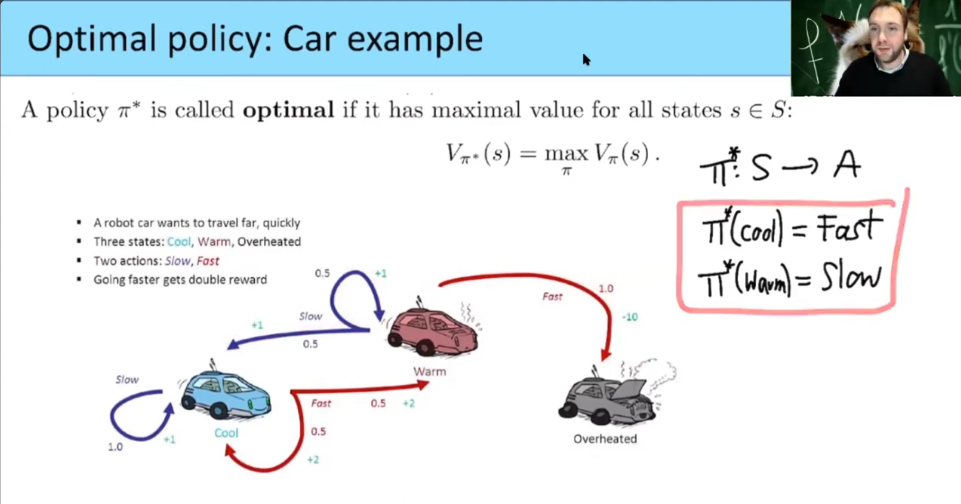
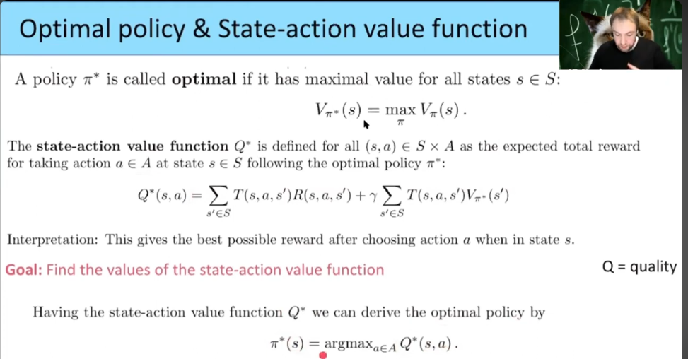
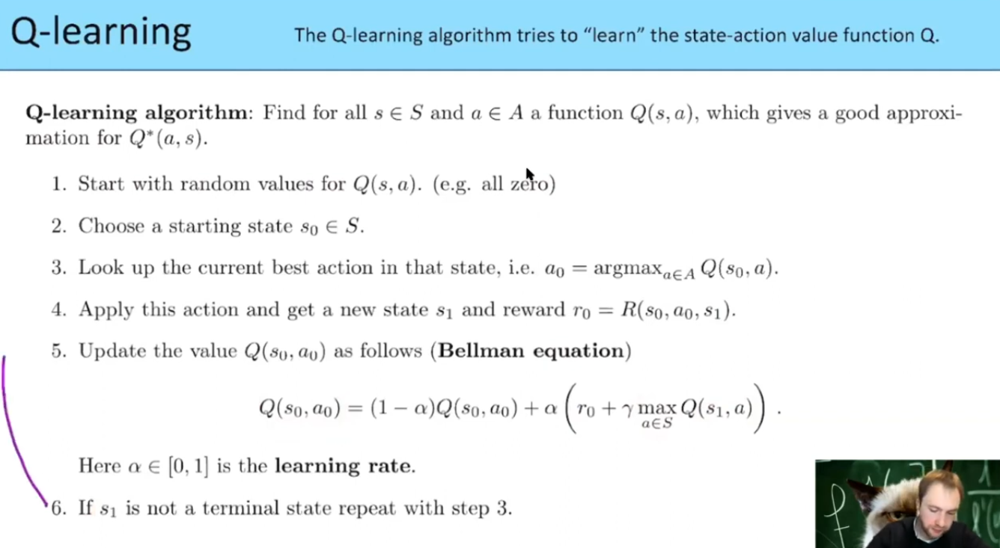
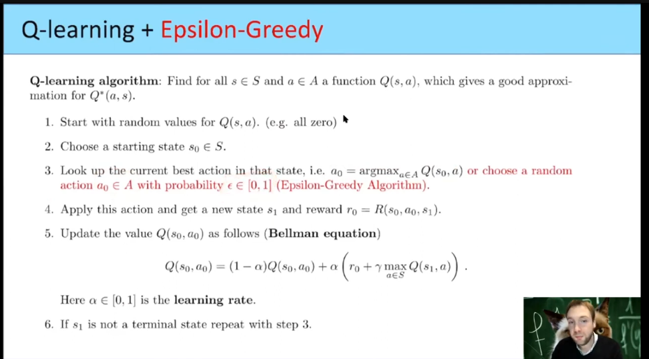

 
 
 
 

# `#01 Deep Learning VS Reinforcement Learning`

### `**(1) Optimizer vs Optimum Policy:**` 
🔹 **Deep Learning:**  
ফিড-ফরোয়ার্ড নিউরাল নেটওয়ার্ক (FFN) বা কনভোলিউশনাল নিউরাল নেটওয়ার্ক (CNN)-এ আমাদের **Optimizer** (SGD, Adam, RMSProp) থাকে, যা **Loss Function মিনিমাইজ করে এবং Weight আপডেট করে।**  

🔹 **Reinforcement Learning:**  
RL-এ **Optimizer-এর সমতুল্য হলো Optimum Policy।**   
আমরা এমন একটা **Policy $\pi^*$** খুঁজি, যা এজেন্টের জন্য **সর্বোচ্চ রিওয়ার্ড আনবে।**  

💡 **তাহলে:**  
FFN-এর **Optimizer** ≈ RL-এর **Optimum Policy Finding Methods (Q-learning, PPO, A2C, DQN, etc.)**  

### `**(2) Parameter Update কিভাবে হয়? (Gradient Descent vs Bellman Equation):**`  
🔹 **Deep Learning:**  
DL-এ **Loss Function** ব্যবহার করে আমরা **Gradient Descent বা Adam Optimizer** দিয়ে **Weight আপডেট করি।**  

🔹 **Reinforcement Learning:**  
RL-এ **Loss Function নেই, বরং আমরা "Bellman Equation" ব্যবহার করি।**   
Bellman Equation ব্যাকওয়ার্ড প্রপাগেশন-এর মতো কাজ করে, যা আগের Q-value আপডেট করে:  

$Q(s, a)$ = $(1 - \alpha) Q(s, a) + \alpha (r + \gamma \max_{a'} Q(s', a'))$

এটা Q-value কে আপডেট করে, যেটা এক ধরনের **"Parameter Update"**।

💡 **তাহলে:**  
FFN-এ **Backpropagation** ≈ RL-এ **Bellman Equation / Policy Gradient Update**  

### `**(3) Loss Function-এর সমতুল্য কী RL-এ?**`  
🔹 **Deep Learning:**  
DL-এ **Loss Function (MSE, Cross-Entropy)** থাকে, যা **Prediction vs Ground Truth** তুলনা করে।  

🔹 **Reinforcement Learning:**  
RL-এ **Loss Function-এর বদলে Reward Maximization কাজ করে।**  
আমরা এমন একটা **Q-value বা Policy** খুঁজছি, যা **সর্বোচ্চ কিউ-ভ্যালু বা সর্বোচ্চ রিওয়ার্ড আনবে।**  

✅ **Deep Q-Network (DQN)**: এখানে **Loss Function থাকে** →  

Loss = $(Q_{target} - Q(s, a))^2$
এটা MSE-এর মতো কাজ করে।  

✅ **Policy Gradient (PPO, A2C, REINFORCE)**: এখানে **Reward Maximization Loss Function** ব্যবহার করা হয়।  

💡 **তাহলে:**  
FFN-এর **Loss Function** ≈ RL-এ **Reward Maximization বা Q-value Approximation**  

#### **(4) CNN / RNN-এর মতো RL-এ কেন DQN, PPO, A2C শিখছি?**  
🔹 **Deep Learning:**  
DL-এ আমরা বুঝেছি,  
- **CNN → Image Processing এর জন্য**  
- **RNN → Sequential Data এর জন্য**  
- **Transformer → Long-term Dependency Capture এর জন্য**  

🔹 **Reinforcement Learning:**  
- **Q-learning → Discrete Action Space এর জন্য**  
- **DQN → Deep Neural Network ব্যবহার করে Q-learning**  
- **PPO, A2C → Continuous Action Space ও Policy-based Learning এর জন্য**  
- **DDPG, SAC → Continuous Action Control (রোবটিক্স, গেমস)**  

💡 **তাহলে:**  
DL-এ **CNN ≈ RL-এ DQN (Deep Q-Learning)**  
DL-এ **RNN ≈ RL-এ PPO (Policy Optimization for Sequential Actions)**  

 

---

---

---

---

 
 
 
 
 

 
 
এই চিত্রটি **Reinforcement Learning (RL)** এর মূল ধারণাকে ব্যাখ্যা করছে।  

### **বর্ণনা:**  
Reinforcement Learning একটি শিখন পদ্ধতি যেখানে একটি **Agent (এজেন্ট)** একটি **Environment (পরিবেশ)** এর সাথে ইন্টারঅ্যাক্ট করে এবং **Action (কর্ম)** গ্রহণ করে। এর মাধ্যমে এটি **Reward (পুরস্কার)** পায় এবং **New State (নতুন অবস্থা)** তে পরিবর্তিত হয়।    

### **প্রধান উপাদানসমূহ:**  
1️⃣ **Agent (এজেন্ট)**:  
   - এটি হল একটি **প্রোগ্রাম, মেশিন বা রোবট** যা শেখার চেষ্টা করে।  
   - এটি পরিবেশের সাথে ইন্টারঅ্যাক্ট করে এবং সিদ্ধান্ত নেয়।  

2️⃣ **Environment (পরিবেশ)**:  
   - এটি সেই স্থান যেখানে এজেন্ট কাজ করে।  
   - উদাহরণ: একটি গেম বোর্ড, রাস্তায় স্বয়ংক্রিয় গাড়ি, রোবটের চলার পথ ইত্যাদি।  

3️⃣ **Action (কর্ম)**:  
   - এজেন্ট কিছু কাজ করে, যেমন **চাল চালানো(game), একটি পদক্ষেপ নেওয়া(robot), গাড়ির চাকা ঘুরানো(EV)** ইত্যাদি।  
   - এজেন্ট বিভিন্ন **একশন** নিয়ে শিখে কোনটি সেরা।  

4️⃣ **Reward (পুরস্কার)**:  
   - যদি এজেন্ট সঠিক কাজ করে, এটি **পজিটিভ রিওয়ার্ড (+)** পায়।  
   - যদি ভুল কাজ করে, এটি **নেগেটিভ রিওয়ার্ড (-)** পায়।  
   - উদাহরণ:  
     - **গেম জেতা → + পুরস্কার**  
     - **গর্তে পড়ে যাওয়া → - শাস্তি**  

5️⃣ **New State (নতুন অবস্থা)**:  
   - এজেন্ট যখন কোনো কাজ করে, তখন এটি **নতুন অবস্থায়** চলে যায়।  
   - উদাহরণ: দাবার চাল দেওয়ার পর নতুন চেসবোর্ডের অবস্থা।  

 
 

### **Markov Decision Process: Dynamics & Discount (ব্যাখ্যা)**  

এই ছবিটি **Markov Decision Process (MDP)**-এর **ডায়নামিক্স এবং ডিসকাউন্ট ফ্যাক্টর (γ)** ব্যাখ্যা করছে।  

### **ধাপগুলো বিশ্লেষণ**  

1️⃣ **শুরু (Initial State):**  
   - এজেন্ট (Agent) **s₀** নামের একটি স্টেট থেকে শুরু করে, যা **S (State Space)**-এর অংশ।  

2️⃣ **অ্যাকশন নির্বাচন (Choosing an Action):**  
   - এজেন্ট **a₀** নামের একটি অ্যাকশন নেয়, যা **A (Action Space)**-এর অংশ।  

3️⃣ **নতুন স্টেটে পরিবর্তন (State Transition):**  
   - এজেন্ট **s₁** নামের একটি নতুন স্টেটে চলে যায়, যা **S**-এর মধ্যেই আছে।  
   - এই পরিবর্তন একটি **Transition Probability** দ্বারা নির্ধারিত হয়:  
     T(s₀, a₀, s₁)

   - নতুন স্টেটে যাওয়ার সময় এজেন্ট কিছু **পুরস্কার (Reward)** পায়:  
     R(s₀, a₀, s₁)

4️⃣ **প্রক্রিয়া চলতে থাকে (Repeat Until Termination):**  
   - এই চক্র (loop) চলতে থাকে যতক্ষণ না এজেন্ট একটি **Terminal State**-এ পৌঁছে বা নির্দিষ্ট সংখ্যক ধাপ **T** পূর্ণ হয়।  

### **গোল (Goal of the Agent)**  
এজেন্ট এমনভাবে **a₀, a₁, a₂, ...** অ্যাকশন নেবে, যাতে তার মোট পুরস্কার সর্বোচ্চ হয়:  

$\sum_{j \geq 0} R(s_j, a_j, s_{j+1})$
অর্থাৎ, এজেন্ট ভবিষ্যতে যত বেশি পুরস্কার পাবে, তার জন্য তত ভালো সিদ্ধান্ত নিতে চায়।  

### **সমস্যা (Problem of Infinite Sum)**  
- এখানে একটি সমস্যা হলো, এই **পুরস্কারের যোগফল অসীম (infinite sum) হতে পারে**।  
- তাই, ভবিষ্যতের পুরস্কারকে ধাপে ধাপে **কমিয়ে আনা (discounted)** হয়।  
- এক্ষেত্রে **Discount Factor (γ)** ব্যবহার করা হয়, যা **0 থেকে 1** এর মধ্যে থাকে।  

### **Discounted Total Reward ফর্মুলা**  

$\sum_{j \geq 0} \gamma^j R(s_j, a_j, s_{j+1})$

এখানে,  
✅ **γ (Discount Factor)** → 0 এবং 1 এর মধ্যে একটি মান, যা ভবিষ্যতের পুরস্কারের গুরুত্ব ঠিক করে।  
✅ **γ বেশি হলে (γ ≈ 1)** → এজেন্ট ভবিষ্যতের পুরস্কারকে বেশি গুরুত্ব দেবে।  
✅ **γ কম হলে (γ ≈ 0)** → এজেন্ট শুধুমাত্র তাৎক্ষণিক পুরস্কারকে গুরুত্ব দেবে।  

### **উদাহরণ (Example)**  
ধরি, একজন স্টুডেন্ট প্রতিদিন পড়াশোনা করলে **ভবিষ্যতে ভালো চাকরি পাবে (High Reward in Future)**।  
- যদি সে **শুধু বর্তমান আরাম দেখে (γ ≈ 0)**, তাহলে পড়াশোনায় ফোকাস করবে না।  
- যদি সে **ভবিষ্যতের লাভ দেখে (γ ≈ 1)**, তাহলে দীর্ঘমেয়াদী লাভের জন্য পরিশ্রম করবে।  

### **সংক্ষেপে:**  
✅ **Markov Decision Process (MDP)** এজেন্টের **অ্যাকশন এবং রিওয়ার্ড** নির্ধারণ করে।  
✅ **Transition Probability** বলে দেয়, এক স্টেট থেকে অন্য স্টেটে যাওয়ার সম্ভাবনা।  
✅ **Discount Factor (γ)** ভবিষ্যতের পুরস্কারের গুরুত্ব নির্ধারণ করে।  
✅ **γ ≈ 1 হলে** এজেন্ট দীর্ঘমেয়াদী সিদ্ধান্ত নেয়, **γ ≈ 0 হলে** তাৎক্ষণিক পুরস্কারকে গুরুত্ব দেয়।  

### **γ (গামা) এবং j কী?**  

#### **γ (গামা) কী?**  
গামা $\gamma$ হল **discount factor** (ছাড়ের হার), যা নির্ধারণ করে ভবিষ্যতের পুরস্কার (reward) বর্তমানের তুলনায় কতটা গুরুত্বপূর্ণ হবে।  

- **$\gamma$ এর মান 0 থেকে 1 এর মধ্যে থাকে $0 \leq \gamma \leq 1$**  
- যদি **$\gamma$ বেশি হয় $\gamma \approx 1$**, তাহলে ভবিষ্যতের পুরস্কারকে বর্তমানের মতোই গুরুত্বপূর্ণ ধরা হয়।  
- যদি **$\gamma$ কম হয় $\gamma \approx 0$**, তাহলে ভবিষ্যতের পুরস্কারকে কম গুরুত্বপূর্ণ ধরা হয় এবং তা দ্রুত হারিয়ে যায়।  

#### **j কী?**  
**j হলো টাইম স্টেপ (Time Step) বা পর্যায়**। এটি নির্দেশ করে **কত নম্বর সময়ে পুরস্কার (reward) পাওয়া হচ্ছে**।  

- j = 0 → প্রথম সময়ের পুরস্কার (immediate reward) → **$\gamma^0 = 1$** (কোন ছাড় নেই)  
- j = 1  → পরের সময়ের পুরস্কার → **$\gamma^1$** দ্বারা ছাড় প্রাপ্ত  
- j = 2  → তার পরের সময়ের পুরস্কার → **$\gamma^2$** দ্বারা ছাড় প্রাপ্ত  
- j = 3  → আরও পরের পুরস্কার → **$\gamma^3$** দ্বারা ছাড় প্রাপ্ত  
- এইভাবে **প্রত্যেক ধাপে পুরস্কারের মূল্য কমতে থাকে**  

#### **কেন γ^j ব্যবহার করা হয়?**  
আমরা ডিসকাউন্ট করা টোটাল রিওয়ার্ড (Discounted Total Reward) হিসাব করি:  

$\sum_{j \geq 0} \gamma^j R(s_j, a_j, s_{j+1})$

এখানে:  
✅ **$\gamma^j$ ভবিষ্যতের পুরস্কারকে ধাপে ধাপে ছোট করে দেয়**, যাতে পুরস্কারের অবদান ধীরে ধীরে কমতে থাকে।  
✅ **j যত বড় হয়, $\gamma^j$ তত ছোট হয়**, অর্থাৎ অনেক দূরের পুরস্কার কম গুরুত্বপূর্ণ হয়ে যায়।  
✅ **এটি ইনফিনিট (অসীম) রিওয়ার্ড অ্যাকুমুলেশন রোধ করে**, যাতে রিওয়ার্ডের হিসাব সীমিত থাকে।  

---

#### **উদাহরণ**  
ধরুন, প্রতিটি ধাপে এজেন্ট **১০ পয়েন্ট** পুরস্কার পাচ্ছে, এবং **গামা $\gamma$ = ০.৯**। তাহলে:  

$R_{total} = 10 \times (0.9^0) + 10 \times (0.9^1) + 10 \times (0.9^2) + 10 \times (0.9^3)$ + ...

= 10 + 9 + 8.1 + 7.29 + 6.56 + ...

এখানে দেখা যাচ্ছে যে, **পুরস্কারের পরিমাণ ধাপে ধাপে কমছে কারণ $\gamma^j$ ছোট হয়ে যাচ্ছে**।

 

---

 

---

 

### **পলিসি $\pi$ কীভাবে এলো এবং কেন দরকার?**  

#### **📌 ১. আগের ফর্মুলা কী ছিল এবং এতে কী বোঝানো হয়েছে?**  
আগের ফর্মুলাটি ছিল—  

$\sum_{j \geq 0} \gamma^j R(s_j, a_j, s_{j+1})$

- **এই ফর্মুলা বলে, যদি আমরা $s_0$ থেকে শুরু করি, তাহলে মোট কত পুরস্কার (reward) আশা করা যায়।**  

কিন্তু সমস্যা হলো, **এজেন্ট কীভাবে অ্যাকশন নেবে, সেটি এখানে নির্ধারণ করা হয়নি!**  

#### **📌 ২. তাহলে পলিসির $\pi$ দরকার কেন?**  
আমরা জানি, **reinforcement learning-এর মূল কাজ হলো সঠিক অ্যাকশন নেওয়া, যাতে সর্বোচ্চ পুরস্কার পাওয়া যায়।** কিন্তু আগের ফর্মুলায় action $a_j$ কীভাবে নেওয়া হবে, তা বলা হয়নি।  

এজেন্টকে যদি **একটি নির্দিষ্ট নিয়ম অনুসারে অ্যাকশন নিতে বলা হয়**, তাহলে সেটাই **পলিসি (Policy, $\pi$**!  

$\pi : S \rightarrow A$

মানে, **পলিসি একটি ফাংশন, যা বলে দেয় প্রতিটি state-এ কোন action নেওয়া হবে।**  

যেমনঃ  
- যদি **s = ক্ষুধার্ত (hungry)** হয়, তাহলে **$\pi(s)$ = খাও (eat)**।  
- যদি **s = ট্রাফিক লাইট লাল (red light)** হয়, তাহলে **$\pi(s)$ = দাঁড়াও (stop)**।  

📌 **সোজা ভাষায়, পলিসি হলো এমন একটি নিয়ম, যা state অনুযায়ী action নির্ধারণ করে।**  

#### **📌 ৩. পলিসির জন্য নতুন ফর্মুলা কী?**  

যেহেতু পলিসি **প্রতিটি state-এর জন্য action নির্ধারণ করে**, তাই আগের ফর্মুলাকে আপডেট করে **policy-based equation** বানানো হয়—  

$V_{\pi}(s) = E \left[ \sum_{j \geq 0} \gamma^j R(s_j, \pi(s_j), s_{j+1}) | s_0 = s \right]$

এখানে,  
- **$\pi(s_j)$** → এখন আমরা আলাদা করে action $a_j$ লিখছি না, কারণ **পলিসি আগে থেকেই বলে দিচ্ছে, প্রতিটি state-এ কোন action নিতে হবে!**  
- **$V_{\pi}(s)$** → এর মানে, **এই নির্দিষ্ট policy $\pi$ অনুসরণ করলে, state (s) থেকে শুরু করে মোট কত পুরস্কার (reward) পাওয়া যাবে**।  

📌 **মূল পার্থক্য:**  
- আগের ফর্মুলায় action ছিল **$a_j$**, যেটি আমরা নিজেরা ঠিক করিনি।  
- এখন **$a_j = \pi(s_j)$**, মানে **policy স্বয়ংক্রিয়ভাবে action নির্ধারণ করছে।**  
 
 

# `## Conditional Expectation (E) vs Conditional Probability (P):`

`In the formula:`

P(A | B) = $\text{B ঘটেছে, তখন A ঘটার সম্ভাবনা}$
এখন, আমাদের ফর্মুলাটি:  

$E \left[ \sum_{j \geq 0} \gamma^j R(s_j, \pi(s_j), s_{j+1}) \mid s_0 = s \right]$

এখানে, **" $\mid s_0 = s$ "** অংশটা আসলে শর্ত (condition) বোঝাচ্ছে। তাই আমরা বলতে পারি,  

📌 **আমরা এমন প্রত্যাশিত মান (Expected Value) বের করছি যেখানে $s_0 = s $ এই শর্তটি মেনে নেওয়া হয়েছে।**  

# **📌 তাহলে, এখানে শর্তাধীন সম্ভাবনার (Conditional Probability) সম্পর্ক কী?**  

## **✅ শর্তাধীন প্রত্যাশা (Conditional Expectation) বনাম শর্তাধীন সম্ভাবনা (Conditional Probability)**
 
Reinforcement Learning (RL)-এ আমরা মূলত **শর্তাধীন প্রত্যাশা** ব্যবহার করি, কিন্তু এর পিছনে **শর্তাধীন সম্ভাবনার** ধারণা রয়েছে।  

### **🔹 শর্তাধীন সম্ভাবনা (Conditional Probability)**

P(A | B) = $\frac{P(A \cap B)}{P(B)}$
🔹 এটি বোঝায় যে, **B ঘটনা ঘটে গেছে, তখন A ঘটার সম্ভাবনা কত?**  
🔹 Reinforcement Learning-এ **পরবর্তী স্টেটে যাওয়ার সম্ভাবনা** বোঝাতে ব্যবহার করা হয়।  
🔹 উদাহরণ:  
   - তুমি যদি এখন **$s_t$** স্টেটে থাকো এবং **$a_t$** অ্যাকশন নাও, তাহলে **পরবর্তী স্টেটে $s_{t+1}$ যাওয়ার সম্ভাবনা কত?**  
   - অর্থাৎ, $P(s_{t+1} | s_t, a_t)$

### **🔹 শর্তাধীন প্রত্যাশা (Conditional Expectation)**

$E[X | Y] = \sum_{x} x P(X = x | Y)$
🔹 এটি বলে যে, **Y ঘটে যাওয়ার পর X এর গড় মান (expected value) কত?**  
🔹 Reinforcement Learning-এ **ভ্যালু ফাংশন** নির্ধারণে ব্যবহার করা হয়।  
🔹 উদাহরণ:  
   - যদি $s_0$ = s  ঘটে থাকে, তাহলে **ভবিষ্যতে প্রাপ্ত সমস্ত পুরস্কারের গড় মান** কী হবে?  
   - অর্থাৎ,  
     
   $V_\pi(s)$ = $E \left[ \sum_{j \geq 0} \gamma^j R(s_j, \pi(s_j), s_{j+1}) \mid s_0 = s \right]$

   - এখানে **$s_0 = s$** ধরে নিয়ে ভবিষ্যৎ পুরস্কারের প্রত্যাশিত মান বের করা হচ্ছে।  

## **✅ Reinforcement Learning-এ Policy নির্ধারণের সূত্র**
### **📌 Policy $\pi$ মানে কী?**  
🔹 Policy হলো একটি ফাংশন যা বলে **"প্রত্যেক স্টেটে কোন অ্যাকশন নেওয়া উচিত?"**  
🔹 অর্থাৎ,  

   $\pi : S \to A$
   **যেখানে,**  
   - S = স্টেট স্পেস  
   - A = অ্যাকশন স্পেস  

### **📌 Policy নির্ধারণের ফর্মুলা**

$V_\pi(s) = E \left[ \sum_{j \geq 0} \gamma^j R(s_j, \pi(s_j), s_{j+1}) \mid s_0 = s \right]$

🔹 **এখানে:**  
   -  $V_\pi(s)$ = **স্টেট s-এ থাকার মান (value function)**  
   - **$E[\cdot]$** = **প্রত্যাশিত মান (Expectation)**  
   - **$\gamma^j$** = **ডিসকাউন্ট ফ্যাক্টর** (ভবিষ্যতের রিওয়ার্ডের গুরুত্ব কমানোর জন্য)  
   - **$R(s_j, \pi(s_j), s_{j+1})$** = **বর্তমান রিওয়ার্ড**  
   - **$\pi(s_j)$** = **পলিসি অনুযায়ী অ্যাকশন নির্বাচন**  

✅ **এটি আসলে শর্তাধীন প্রত্যাশা** (Conditional Expectation), কারণ আমরা $s_0$ = s ধরে নিয়ে ভবিষ্যতের পুরস্কারের গড় মান হিসাব করছি।  

#### **📌 ৪. Reinforcement Learning-এ Policy কেন গুরুত্বপূর্ণ?**  
✅ **Policy $\pi$ ছাড়া এজেন্ট জানবে না, কোন action নিলে সর্বোচ্চ reward পাওয়া যাবে।**  
✅ **আমাদের মূল লক্ষ্য হলো optimal policy খুঁজে বের করা, যা সর্বোচ্চ পুরস্কার দেবে।**  
✅ **Policy নির্ধারণ করলে, এজেন্ট সহজেই সিদ্ধান্ত নিতে পারে এবং environment থেকে শেখার ক্ষমতা পায়।**  

  

### Important: 
Optimal Policy(একটা কাজ তো অনেক ভাবে করা যাবে, তার মধ্যে সবচেয়ে সহজ যেইভাবে করা যাবে সেইটা হচ্ছে optimal policy)

 

 

In our car example, our optimal policy will be like below: 

  

  

# **স্টেট-অ্যাকশন ভ্যালু ফাংশন (State-Action Value Function) কী?**  

**রিইনফোর্সমেন্ট লার্নিং (RL) এবং মার্কভ ডিসিশন প্রসেস (MDP)-এ স্টেট-অ্যাকশন ভ্যালু ফাংশন** হলো এমন একটি ফাংশন যা নির্দিষ্ট **স্টেট (state) ও অ্যাকশন (action)** থেকে ভবিষ্যতে কী পরিমাণ পুরস্কার (reward) পাওয়া যেতে পারে তা অনুমান করে।  

### **📌 সংজ্ঞা:**  
স্টেট-অ্যাকশন ভ্যালু ফাংশনকে $Q(s, a)$  দ্বারা প্রকাশ করা হয়। এটি বোঝায়, যদি **$ s $** স্টেটে থেকে **$ a $** অ্যাকশন নেওয়া হয়, তাহলে ভবিষ্যতে কী পরিমাণ **expected reward** পাওয়া যেতে পারে।  

Q(s, a) = $\mathbb{E} [ R_t | S_t = s, A_t = a]$

এখানে,  
- s  = বর্তমান স্টেট  
- a  = নেওয়া অ্যাকশন  
- $R_t$ = ভবিষ্যতে সম্ভাব্য রিওয়ার্ডের যোগফল  
- $\mathbb{E}$  = প্রত্যাশিত মান (Expected Value)  

 

 

 

### **📌 1️⃣ State-Action Value Function $Q^*(s, a)$  কী?**  
- **$Q^*(s, a)$** হলো **state s -এ থেকে action a  নেওয়ার পর সর্বোচ্চ সম্ভাব্য reward এর মান**।  
- এটি **MDP (Markov Decision Process)** এর মধ্যে নির্ধারিত হয়।  
- সংজ্ঞা অনুসারে, $Q^*(s, a)$ নিম্নলিখিত সমীকরণ দ্বারা প্রকাশ করা হয়:

- Equation: 

$Q^*(s, a)$ = 

$\sum_{s' \in S}$ $T(s, a, s')$ $R(s, a, s')$ + $\gamma \sum_{s' \in S}$ $T(s, a, s')$ $V_{\pi^*}(s')$

এখানে,  
  - $T(s, a, s')$  → s state থেকে  a  action নেওয়ার পর  s' state-এ যাওয়ার সম্ভাবনা।  
  - **$R(s, a, s')$** → state s -এ action a নিলে  s' -এ যাওয়ার জন্য প্রাপ্ত reward।  
  - **$\gamma$** → **discount factor**, যা ভবিষ্যতের reward-এর গুরুত্ব নির্ধারণ করে।  
  - **$V_{\pi^*}(s')$** → **সেরা policy অনুসারে পরবর্তী state s'-এর জন্য value function।**  

### **📌 3️⃣ এই ফাংশন কী বোঝায়?**  
1️⃣ এটি বলে **কোনো নির্দিষ্ট state s থেকে একটি action  a নেওয়ার পর সর্বোচ্চ reward কী হতে পারে**।  
2️⃣ এটি **Bellman Equation** এর উপর ভিত্তি করে তৈরি এবং Reinforcement Learning-এ **Q-learning** এবং **Deep Q-Networks (DQN)** এর মতো অ্যালগরিদমের ভিত্তি।  
3️⃣ **Optimal Q-function $Q^*(s, a)$** আমাদের জানায় **সেরা সম্ভাব্য সিদ্ধান্ত কী হওয়া উচিত**।  

### **🔍 `argmax` মানে কী এখানে?**  

✅ এখানে **$\arg\max$** মানে হলো **"কোনো নির্দিষ্ট state \( s \)-এ, এমন action \( a \) বের করা যা state-action value function $Q^*(s,a)$ সর্বোচ্চ করে।"**  

### **📌 সহজভাবে বুঝি:**  
🔹 **`max`** বলে দেয় **সর্বোচ্চ মান কত**।  
🔹 **`argmax`** বলে দেয় **সর্বোচ্চ মান কোথায় আছে বা কোন `a` (action) নেওয়া উচিত**।  

👉 **তাহলে**  
$\pi^*(s) = \arg\max Q^*(s, a)$  মানে হলো:  
➡️ **কোন action \( a \) নেওয়া হলে Q-value সবচেয়ে বেশি হবে, সেটাই optimal policy \( \pi^*(s) \)** বেছে নেবে।  

### **🎯 সহজ উদাহরণ:**  
ধরো, তুমি **একটা রোবট** বানিয়েছো, যা **বিভিন্ন action নিয়ে reward পায়**।  

| Action (a) | Q-value $Q^*(s,a)$ |  
|--------------|----------------|  
| Move Left   | **3** |  
| Move Right  | **5** |  
| Jump        | **2** |  

এখন,  
🔹 $max(Q^*(s,a))$ 
 = 5 (সর্বোচ্চ Q-value)  
🔹 $argmax(Q^*(s,a))$ 
 = Move Right (যে action নিলে এই value পাওয়া যায়)  

📌 তাহলে **optimal policy $\pi^*(s)$ = Move Right**, কারণ এই action নিলে রোবট সবচেয়ে ভালো reward পাবে।  

### ✅ সংক্ষেপে মনে রাখার উপায়:**  
1️⃣ `max` → সর্বোচ্চ মান **কত?**  
2️⃣ `argmax` → **সর্বোচ্চ মান কোথায় বা কোন action নেওয়া উচিত?

 
 

# `# Q-learning: `

 

Q-learning হল একটি জনপ্রিয় রিইনফোর্সমেন্ট লার্নিং অ্যালগরিদম যা একটি অপটিমাল স্টেট-অ্যাকশন ভ্যালু ফাংশন $Q(s, a)$ শেখার চেষ্টা করে। উপরের ছবির তথ্য অনুযায়ী, Q-learning নিম্নলিখিত ধাপে কাজ করে:

 

 

### **Q-learning অ্যালগরিদম**:
1. **শুরুতে** $Q(s, a)$ এর জন্য র‍্যান্ডম ভ্যালু নির্ধারণ করা হয় (যেমন, সব শূন্য)।
2. **একটি প্রাথমিক অবস্থা $s_0$ নির্বাচন করা হয়**।
3. **সর্বোত্তম অ্যাকশন নির্বাচন করা হয়**:  
   $a_0$ = $\arg\max_{a \in A} Q(s_0, a)$
   অর্থাৎ, বর্তমান অবস্থার জন্য যেই অ্যাকশনের $Q(s, a)$ মান সর্বোচ্চ, সেটি বেছে নেওয়া হয়।
4. **নির্বাচিত অ্যাকশন প্রয়োগ করে নতুন অবস্থা $s_1$ ও পুরস্কার $r_0$ পাওয়া যায়**:

   $r_0$ = $R(s_0, a_0, s_1)$
5. **Q-মান আপডেট করা হয় (Bellman Equation অনুযায়ী)**:
   
   $Q(s_0, a_0)$ = $(1 - \alpha) Q(s_0, a_0) + \alpha \left( r_0 + \gamma \max_{a \in A} Q(s_1, a) \right)$

   - এখানে, $\alpha$ হল **লার্নিং রেট**, যা নির্ধারণ করে পুরোনো মান ও নতুন মানের weight ।
   - $\gamma$ হল **ডিসকাউন্ট ফ্যাক্টর**, যা ভবিষ্যতের পুরস্কারের গুরুত্ব নির্ধারণ করে।
6. **যদি $s_1$ টার্মিনাল স্টেট না হয়**, তাহলে ধাপ ৩ থেকে পুনরাবৃত্তি করা হয়।

 

---

---

 

---

---

 

# **Q-learning with Epsilon-Greedy**:

`ছবিতে Q-learning এর মৌলিক ধাপগুলো দেখানো হয়েছে,  
এখানে, প্রথম ধাপে আমরা  $Q(s, a)$ এর জন্য র‍্যান্ডম ভ্যালু (সব শূন্য) নির্ধারণ করে তৃতীয় ধাপে আমরা সেই (সব শূন্য) ভ্যালু গুলো থেকে, $Q(s_0, a)$ মান করি । এখন, আমরা যদি র‍্যান্ডম ভ্যালু (সব শূন্য) এর উপর ভিত্তি না করে আমরা একটা random action নেই, তাহলে আমরা সেইটাকে বলতেছি Epsilon-Greedy যোগ করা ।`

 

 

