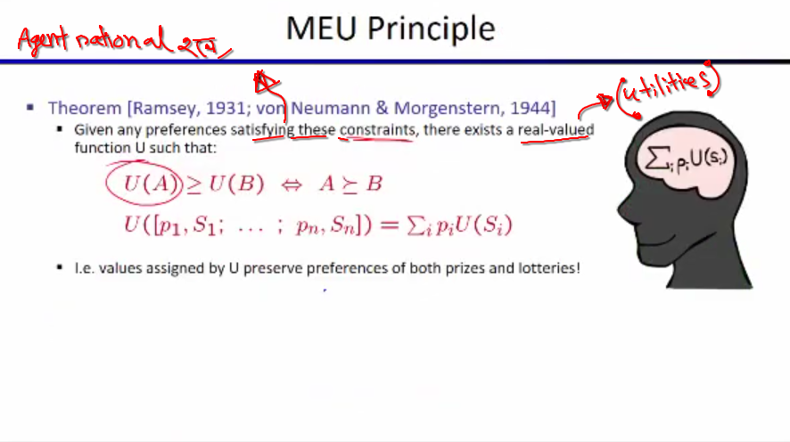
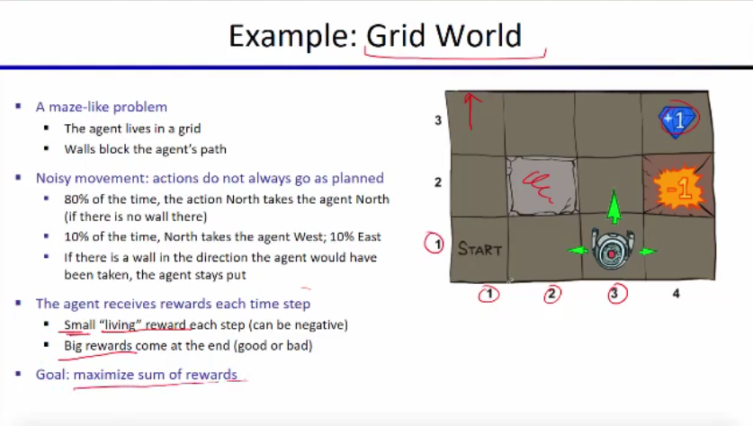
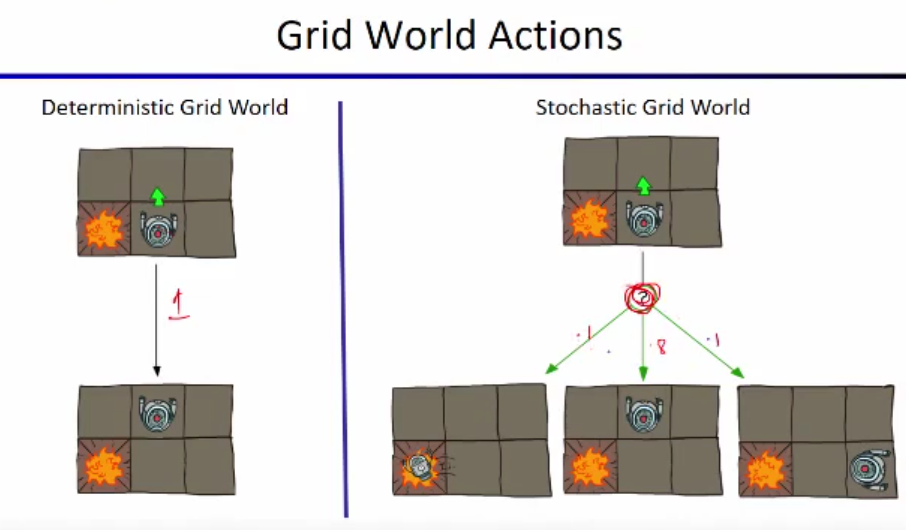
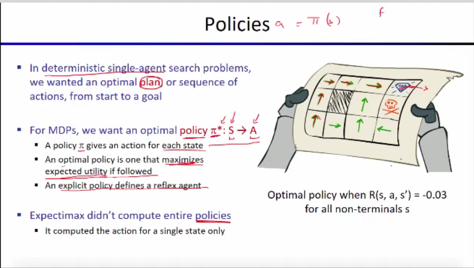
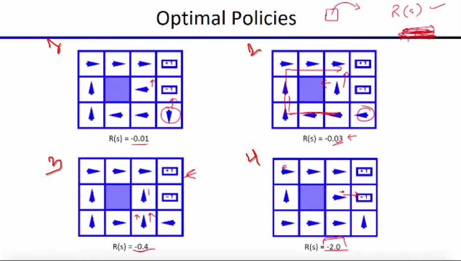
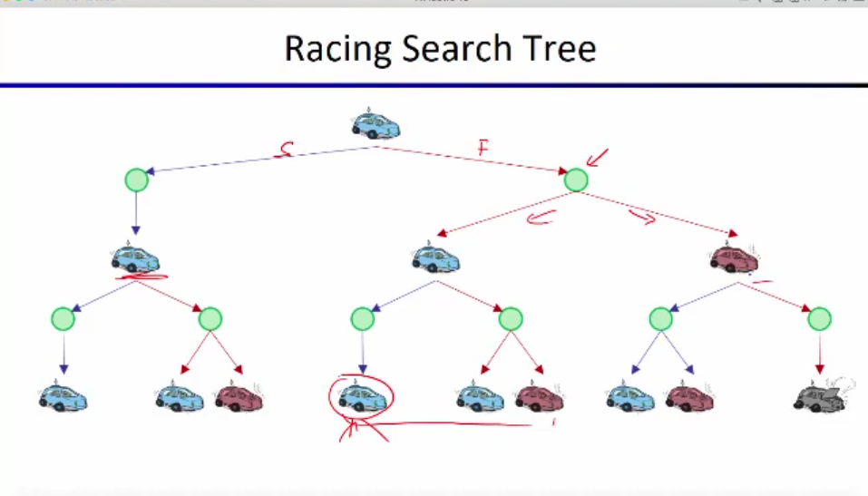
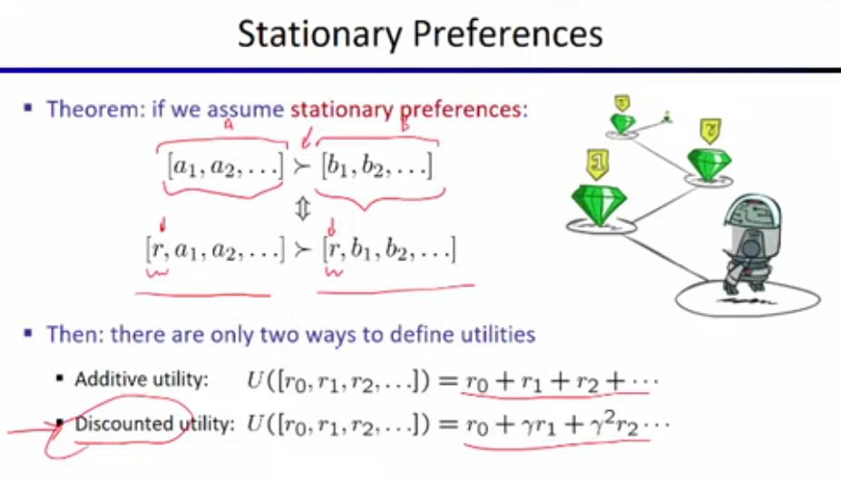

# `# MDP:`

আমরা এখন grid world নিয়ে কাজ করবো । যেখানে, আমাদের agent stocastic । আর আমাদের এই agent, grid এর বাইরে যেতে পারে না ।  Stocastic, agent যদি উপরে(north) যেতে চায় তাহলে তার north এ যাওয়ার  posibility 80%, আর left, right যাওয়ার probaility 10% করে । এখন, agent যতক্ষন বেচে থাকবে তখন যে একটা negetative rewarad পাবে,(কারণ আমরা চায় game টা যত তাড়াতাড়ি posible শেষ করবো ) ।  একদম শেষে আমাদের agent big reward  পাবে । And, our goal is maximize the sum of reward.

 

 

boxer মধ্যে box সেই গুলো হলো আমার termination state । এখানে, পৌছালে আমরা just একটায় move নিতে পারবো, সেইটা হলো গেম শেষ করা । 

 

কোন একটা agent এর আমরা current state জানলে তার future state কি হবে তা past state এর উপর নির্ভর করে না । এটা হচ্ছে,  Markov এর meaning । উপরের formula তে, p(S_(t+1) = S`) । এখানে, আমার immediate future state তার আগের state(S_t=s_t) এবং তার আগের action(A_t = a_t) এর উপর নির্ভর করতেছে । কিন্তু, আমি past history ব্যবহার  করতে পারি । If we have the history we can predict the future । কিন্তু আমরা হুট করেই কোন একটা  ঘটনার একটা state থেকে অন্য একটা state এ যেতে চাইলে, তখন যদি আমরা markov ব্যবহার করি, তাহলে সেইটা আমাদের ভালো  result দিবে না । কারণ,  markov এ  past independent করতে চাচ্ছি । যদি আমরা যেই particular ঘটনার শুরু থেকে markov apply করি তাহলে । এর জন্য আমরা বলতেছি, markov means independent of past । 

তুমি মূলত Markov Property-এর ধারণা ব্যাখ্যা করতে চাচ্ছো, এবং তোমার ব্যাখ্যাটা মোটামুটি ঠিক আছে, তবে কিছু জায়গায় আরও স্পষ্টতা প্রয়োজন। আমি একটু পরিষ্কার করে বুঝিয়ে দিচ্ছি।  

### **Markov Property এবং এর অর্থ: **  
Markov Property বলে যে, **"একটি সিস্টেমের ভবিষ্যত অবস্থা (future state) শুধুমাত্র বর্তমান অবস্থা (current state) এবং বর্তমান action-এর উপর নির্ভর করে, অতীতের কোনো ইতিহাস (past history) এর উপর নির্ভর করে না।"**  

এই ধারণাকে সাধারণত নিচেরভাবে প্রকাশ করা হয়:  

$P(S_{t+1} | S_t, A_t, S_{t-1}, A_{t-1}, S_{t-2}, A_{t-2}, ... ) = P(S_{t+1} | S_t, A_t)$

অর্থাৎ, ভবিষ্যত state $S_{t+1}$ নির্ধারিত হয় শুধুমাত্র বর্তমান state $S_t$ এবং বর্তমান action $A_t$ দ্বারা, পূর্বের states বা actions এর কোনো ভূমিকা থাকে না।  

#### `Remember, আমাদের সব প্রবলেম কিন্তু markov না  । আমাদের অনেক প্রবলেম আছে যেইগুলো কে আমরা markov বানিয়ে নিয় । `

 

আমরা , search problem এ দেখেছিলাম pacman plan বানাচ্ছে, এর এইদিকে game environment change  হচ্ছে ।   Plan হচ্ছে sequence of action, আমি এর পর এই কাজ করবো । তারপর এই কাজ করবো । কিন্তু, policies আমি বর্তমানে যেই state  এ আছি । এইটা থেকে কি action নিলে আমার জন্য ভালো হবে । যেইটা, reflex agent করে থাকে , কোন plan বানায় না । 

 

উপরের case গুলো আমরা ভালোভাবে খেলায় করি । আমরা যখন,  s থেকে s` এ যাচ্ছি তখন আমরা present state এর living reward পাচ্ছি R(S)। 1st case, এ আমাদের living reward কম, এর পর আস্তে আস্তে তা বেড়েছে । আমাদের living reward বাড়ার কারনে, agent তার policy change করতেছে । 1st case এ আমাদের একটা short cut road ছিলো কিন্তু আমরা যদি block state চলে যায় । তাহলে আমাদের episod এই খানে শেষ করতে হবে । তাই risk নেওইয়ার চেয়ে long path ফলো করা ভালো । কিন্তু,  4th case এ আমাদের living reward এত বেশি যে, আমাদের agent বেচে থাকার চেয়ে এই episod তাড়াতাড়ি শেষ করেছে -1 reward block এ গিয়ে  । 

 

## [RACING_CAR_EXAMPLE](https://github.com/yasin-arafat-05/jupyterNotebook/blob/main/Reinforcement_learning_Math/01_markove_process_math.md)

এখানে,  গাড়ি যখন warm তখন গাড়ি কি   action নিবে তার উপর ভিত্তি করে আমরা desition নিতে পারি future reward কি হবে । তাই এইটা markov । 

 

# `# Search Trees for MDP:`

**`Expectimax এর মতো আমাদের MDP এর search tree থাকে । যেইটা expectimax এর থেকে একটু আলাদা হয় ।`**

 

আমরা  state S থেকে একট  action নিব । তারপর অন্য একটা state  এ পৌছাবো । অন্য state এ একটা transistion function থাকবে । যেই বলবে আমরা আমাদের বর্তমান  state থেকে অন্য কত গুলো state এ যাওয়ার possibility আছে । 

**আমরা, আমাদের max node থেকে আমরা একটা action নেয় এর ফলে আমরা একটা state এ যায় । যাকে আমরা Q-State বলতেছি । এখন, আমি বামে যাবার জন্য button  press করেছি । কিন্তু, আমাদের এই environment হলো stocastic এর ফলে probility দিয়ে decide হবে আমি  পরবর্তী action শেষে  বামেই পৌছাবো ।** `আমরা যে নতুন state পৌছাচ্ছি তাকে আমরা বলতেছি Q-State । আমরা যে নতুন state পৌছাচ্ছি তাকে আমরা বলতেছি Q-State ।  `

 

### ` আমরা আগে দেখেছিলাম minimax এর expectimax এর search tree  infinitealy grow করতেছে । তো, এর জন্য আমরা dept limited serach, purning দেখেছি  । এখন, MDP এর জন্য আমরা আরেকটা tecnique দেখবো । Utilites of sequence . `

আমরা জানি utilites এমন একটা জিনিস যেইটা আমার agent চায় । এখন, কথা হচ্ছে , agent কে কীভাবে আমরা   utilites  দিব বেশি না কম (Case 1 )। আবার, সমান utilites আসলে আমরা কীভাবে দিব(Case 2) ? 

`We take an assumption that we take the utilites as early as possible.আমরা প্রথমে যে reward পাবো তাকে আমরা weight বেশি দিব । আর, পরের গুলোকে কম reward দিবো একে আমরা discounting বলতেছি । `

এখানে, Discount factor gamma এর মান ০ থেকে ১ এর মধ্যে হবে । আর, set theory তে আমরা এই range গুলো বিভিন্ন ভাবে প্রকাশ করা শিখেছিলাম যা highlight করে দেখানো হয়েছে ।  

 

Let's take an example: 

d থেকে reward 10 ভালো নাকি  1 । যদি আমাদের discount factor 0.1 হয় । সেইটা আমরা calculation করেছি  উপরের ছবিতে । 

gamma এর কোন মানের জন্য, দুই পাশের unility সমান হবে । 

